<div align="center">

<br>

<!-- replace with spendsense logo -->


<br><br>


<br><br>


&nbsp;&nbsp;&nbsp;&nbsp;


</div>


---

<div align="center">

# SpendSense

</div>

**A gamified financial tracking platform for students and young adults.**

_COS 301 Capstone 2026 · Team MARK2 · EPI-USE Labs & Advance · University of Pretoria_

<br>

[](https://github.com/COS301-SE-2026/SpendSense/actions/workflows/pr-checks.yml)
[](https://github.com/COS301-SE-2026/SpendSense/actions/workflows/docker-check.yml)
[](https://github.com/COS301-SE-2026/SpendSense/actions/workflows/docs-check.yml)

<br>

[](https://github.com/COS301-SE-2026/SpendSense/issues)
[](https://github.com/COS301-SE-2026/SpendSense/commits/dev)
[](https://nodejs.org/)
[](https://github.com/orgs/COS301-SE-2026/projects/83)

<br>

## Live Demo

**[https://d33z1c39vjhkej.cloudfront.net](https://d33z1c39vjhkej.cloudfront.net)**


<br>

---

# Table of contents

- [Live Demo](#live-demo)
- [What Is SpendSense?](#what-is-spendsense)
- [Documentation](#documentation)
- [Features](#features)
- [Technology Stack](#technology-stack)
- [Repository Structure](#repository-structure)
- [Getting Started](#getting-started)
- [Git Workflow](#git-workflow)
- [Environment and Secrets](#environment-and-secrets)
- [Team MARK2](#team-mark2)


---

<div align="center">

## What Is SpendSense?

</div>

Students juggle rent, subscriptions, BNPL instalments, and informal IOUs scattered across memory, bank apps, chats, and calendar reminders. SpendSense brings all of that into one place.

Track what you owe and when it is due. See exactly how your payment behaviour would affect a simulated credit score, without any real-world risk. Get rewarded for paying on time through streaks, badges, coins, and a mascot that visibly reflects your financial health.

> _"Make the invisible visible, simulate real-world consequences safely, and make good financial habits worth pursuing."_

---

<div align="center">

## Documentation

</div>

<details>
<summary> <b> Demo 1</b> </summary>

* [Software Requirements Specification (SRS)](<./docs/Demo1/SRS (Software Requirements and Design Specification).md>)
* [Architecture Document](./docs/Demo1/Architecture.md)
* [Database ERD](./docs/Demo1/database/erd.md)
* [Database Schema Reference](./docs/Demo1/database/schema-reference.md)
* [API Contract](./docs/Demo1/srs/api-contract.md)
* [Use Cases](./docs/Demo1/srs/Use%20Cases.md)
* [User Stories](./docs/Demo1/srs/User%20Stories.md)
* [Functional Requirements](<./docs/Demo1/srs/Functional Requirements.md>)
* [Quality Requirements](<./docs/Demo1/srs/Quality Requirements.md>)
* [Wireframes](./docs/Demo1/wireframes/Spendsense.pdf)

</details>

<details>
<summary> <b> Demo 2</b> </summary>

* [Software Requirements Specification (SRS)](./docs/Demo2/SRS.md)
* [Software Architecture Specification (SAS)](./docs/Demo2/SAS.md)
* [Updated Brand Style Guide PDF]()
* [Coding Standards Document](./docs/Demo2/Coding-Standards-Document.md)
* [User Manual Document](./docs/Demo2/User-Manual-Document.md)
* [Testing Policy Document](./docs/Demo2/Testing-Policy-Document.md)
* [Demo 2 Video](https://drive.google.com/drive/folders/1RXFea81VvkyAPmqBhXl9xXfcXl81wNEq?usp=sharing)

</details>

<details>
<summary> <b> Demo 3</b> </summary>

* [Software Requirements Specification (SRS)](./docs/Demo3/SRS.md)
* [Software Architecture Specification (SAS)](./docs/Demo3/SAS.md)
* [Updated Brand Style Guide](https://cos301-se-2026.github.io/SpendSense/)
* [Coding Standards Document](./docs/Demo3/Coding-Standards-Document.md)
* [User Manual Document](./docs/Demo3/User-Manual-Document.md)
* [Testing Policy Document](./docs/Demo3/Testing-Policy-Document.md)
* [Demo 3 Video](https://drive.google.com/drive/folders/1RXFea81VvkyAPmqBhXl9xXfcXl81wNEq?usp=sharing)


</details>

<details>
<summary> <b> Demo 4</b> </summary>
Watch this space !
</details>

---

<div align="center">

## Features

</div>

**Core Tracking**

- Manual and receipt-scanned expense tracking
- Calendar and timeline view of all upcoming payments
- Simulated credit system with interest, penalties, and a live 0-850 financial health score
- Smart reminders via push notification, email, or SMS
- Automatic detection of recurring payment patterns

**Gamification**

- Badges, achievements, and multi-step challenges
- Payment and knowledge streaks
- In-app currency earned through good financial behaviour
- A mascot that reacts to your financial health in real time
- Cosmetics shop to personalise your mascot with earned coins

**Intelligence**

- AI-driven spending insights and anomaly detection
- Predictive cash flow forecasting
- Receipt OCR: photograph a till slip to auto-fill expenses

**Social**

- Friends leaderboard ranked by financial health score
- 1v1 and group challenges with optional coin stakes
- Knowledge leaderboard for the financial literacy quiz
- Anonymised global tier rankings

**Monthly Wrapped**

- A Spotify-Wrapped-style monthly summary with swipeable story cards covering your biggest expenses, score movement, streaks, badges, and financial personality archetype
- A shareable end card designed to be posted to social media

---

<div align="center">

## Technology Stack

</div>

**Frontend**


**Backend**


**AI Microservice**


**Database & Storage**


**DevOps & Infrastructure**


**Testing**


---

<div align="center">

## Repository Structure

</div>

```text
SpendSense/
├── frontend/         # React + TypeScript (Vite)
├── backend/          # NestJS API
├── ai/               # Python FastAPI AI microservice
├── docs/             # Project documentation
│   ├── Demo1/        # Demo 1 Documentation
|   ├── Demo2/        # Demo 2 Documentation
│   ├── assets/       # logo images and animations
│   └── team/         # team images
├── scripts/          # Helper scripts for local development
└── docker-compose.yml
```


---

<div align="center">

## Getting Started

</div>

**Prerequisites:** Git, Node.js (>=20), Docker Desktop (must be running before you start the stack).

```bash
# Clone and switch to the dev branch
git clone https://github.com/COS301-SE-2026/SpendSense.git
cd SpendSense
git checkout dev

# Create your local environment file
cp .env.example .env          # Linux / Mac / WSL
# Copy-Item .env.example .env  # PowerShell

# Start the full stack
npm run dev:up
```

If you need Docker to rebuild images first:

```bash
npm run dev:up:build
```

After a fresh local database is created, apply the Prisma migration and seed the database:

```bash
docker compose exec backend npx prisma migrate deploy
docker compose exec backend npm run prisma:seed
docker compose exec backend npm run prisma:seed:demo
```
---


The backend dev container generates Prisma Client on startup, so teammates do not need to run `prisma generate` manually after normal Docker starts.

Initially Docker may take a minute to get up and running but once complete check the services that run locally at:

| Service | URL |
|---|---|
| Frontend | `http://localhost:5173` |
| Backend | `http://localhost:3000` |
| AI service | `http://localhost:8000` |
| PostgreSQL | `localhost:5432` |
| MinIO | `http://localhost:9001` |


<br>

<details>
<summary><strong>All available commands</strong></summary>
<br>

| Command | Description |
|---|---|
| `npm run dev:up` | Start the stack in the background |
| `npm run dev:up:build` | Rebuild images, then start the stack |
| `npm run dev:down` | Stop the stack |
| `npm run dev:down:volumes` | Stop the stack and remove Docker volumes (including local DB data) |
| `npm run dev:logs` | Follow all container logs |
| `npm run dev:logs:back` | Follow backend logs |
| `npm run dev:logs:front` | Follow frontend logs |
| `npm run dev:logs:ai` | Follow AI service logs |
| `npm run dev:restart` | Stop and restart with rebuild |
| `npm run dev:shell:back` | Shell into the backend container |
| `npm run dev:shell:front` | Shell into the frontend container |
| `npm run dev:shell:ai` | Shell into the AI container |
| `npm run test:ci` | Run linting, tests, and builds inside Docker |
| `npm run local:lint` | Lint locally (requires local Node/Python deps) |
| `npm run local:test` | Test locally |
| `npm run local:build` | Build locally |

</details>

<details>
<summary><strong>Database commands</strong></summary>
<br>

| Command | Description |
|---|---|
| `docker compose exec backend npx prisma migrate status` | Show migration status |
| `docker compose exec backend npx prisma migrate deploy` | Apply committed migrations to the local database |
| `docker compose exec backend npm run prisma:seed` | Seed required reference data |
| `docker compose exec backend npm run prisma:seed:demo` | Seed demo walkthrough data |
| `docker compose exec backend npm run prisma:smoke` | Verify the core Prisma relation chain |
| `docker compose exec backend npm run prisma:studio` | Open Prisma Studio |

The required seed is safe to rerun without duplicating categories or badge definitions. The demo seed is also rerunnable and recreates only the local demo user's related data.

If a container starts with stale dependencies after switching branches, recreate only that service and its anonymous `node_modules` volume:

```bash
docker compose rm -sfv backend
docker compose up -d --build backend
```

Use `frontend` instead of `backend` for the frontend service. Avoid `npm run dev:down:volumes` unless you deliberately want to remove the local Postgres and MinIO data volumes too.

Prisma docs:

- Schema source of truth: `backend/prisma/schema.prisma`
- Demo 1 ERD: `docs/Demo1/database/erd.md`
- Schema reference: `docs/Demo1/database/schema-reference.md`

</details>


---

<div align="center">

## Git Workflow

</div>

All development happens from `dev`. Feature branches are merged into `dev` via pull request. `dev` merges into `release`, and `release` merges into `main` at milestones.

```text
feature/your-feature -> dev -> release -> main
```

Before opening a pull request into `dev`, run:

```bash
npm run test:ci
```

Pull requests into `dev` run GitHub Actions checks for secret scanning, linting, tests, and builds. Docker configuration is checked separately when Docker-related files change.

> **Note:** Never scaffold the frontend, backend, or AI service again on a fresh clone. Those project files are already tracked in this repository.

---

<div align="center">

## Environment and Secrets

</div>

- Commit `.env.example` with safe placeholder values only
- Never commit `.env` or `.env.*` files
- Replace `replace_me_*` values in your local `.env` only
- Pull requests run [Gitleaks](https://github.com/gitleaks/gitleaks) to scan for committed secrets

For Supabase Auth, each developer needs these values in their local `.env`:

| Key | Used by | Notes |
|---|---|---|
| `VITE_SUPABASE_URL` | Frontend | Supabase project URL |
| `VITE_SUPABASE_ANON_KEY` | Frontend | Public anon/publishable key |
| `SUPABASE_JWT_SECRET` | Backend | JWT secret used to verify Supabase access tokens |
| `VITE_API_URL` | Frontend | Local backend API base, normally `http://localhost:3000/api/v1` |
| `SUPABASE_TEST_EMAIL` | Tooling | Dedicated demo/test Supabase Auth account email |
| `SUPABASE_TEST_PASSWORD` | Tooling | Dedicated demo/test Supabase Auth account password |
| `DEMO_USER_EMAIL` | Seed | Must match the dedicated demo Supabase Auth account email |
| `DEMO_SUPABASE_AUTH_ID` | Seed | Must match the Supabase Auth user ID for the demo account |
| `DEMO_DISPLAY_NAME` | Seed | Display name shown by `/users/me` and `/dashboard` |

The frontend signs users in with Supabase Auth, then sends the Supabase access token to NestJS as `Authorization: Bearer <token>`. Protected backend routes use that token to identify the Supabase user.

The first protected endpoint to verify is:

```http
GET /api/v1/users/me
Authorization: Bearer <supabase_access_token>
```

On first call, the backend creates the internal SpendSense `User` plus default preferences, notification preferences, credit profile, and gamification profile. Later feature work should scope user-owned records by the internal `User.id`, not directly by the Supabase auth ID.

For a pre-populated walkthrough account, create or choose a dedicated Supabase Auth user, put its email in `DEMO_USER_EMAIL`, put its Supabase Auth user ID in `DEMO_SUPABASE_AUTH_ID`, then run `docker compose exec backend npm run prisma:seed:demo`. See `docs/Demo1/backend/demo-seeding.md` for the full runbook.

---

<div align="center">

## Team MARK2

</div>

<table>
  <tr>
    <td width="130" valign="top">
      
    </td>
    <td valign="top">
      <strong>Allyson Andre</strong> &nbsp; Full-Stack / Auth & Integration<br><br>
      <details>
        <summary>About</summary>
        <br>
        Final-year CS student with a strong track record in full-stack development, JWT-based authentication, and secure system design. Experienced across service and UI engineering roles, with systems-level proficiency demonstrated through a C++ real-time simulation engine. Brings a creative, detail-oriented approach to building scalable, user-centric software.
        <br><br>
        <em>Top languages: C++, Java, Next.js/NestJS, TypeScript/JavaScript, Python</em>
      </details>
      <br>
      <a href="https://github.com/Ally-Andre"></a>
      <a href="https://www.linkedin.com/in/allyson-andre"></a>
    </td>
  </tr>
</table>

---

<table>
  <tr>
    <td width="130" valign="top">
      
    </td>
    <td valign="top">
      <strong>Morgan Wattrus</strong> &nbsp; AI Microservice & Data Science<br><br>
      <details>
        <summary>About</summary>
        <br>
        Third-year CS student with a specialised data science background from Le Wagon training, proficient in Scikit-learn, NumPy, Pandas, and TensorFlow. Experienced in backend API development, rigorous testing with Jest, and object-oriented C++ system design. Bridges statistical modelling and high-performance practical implementation.
        <br><br>
        <em>Top languages: C++, Java, PHP/HTML/CSS, TypeScript/JavaScript/Node.js, Python</em>
      </details>
      <br>
      <a href="https://github.com/Morgan-Wat"></a>
      <a href="https://www.linkedin.com/in/morgan-wattrus-302711282/"></a>
    </td>
  </tr>
</table>

---

<table>
  <tr>
    <td width="130" valign="top">
      
    </td>
    <td valign="top">
      <strong>Kahlan Hagerman</strong> &nbsp; Backend API (NestJS) & Systems Programming<br><br>
      <details>
        <summary>About</summary>
        <br>
        Final-year CS student with hands-on experience in backend and service engineering, REST API design, Supabase, authentication, role-based access control, and end-to-end testing using Jest, Supertest, and Playwright. Demonstrated systems-level ability through a C++ raycasting engine built with Raylib. Brings a structured, detail-driven approach to secure and scalable backend development.
        <br><br>
        <em>Top languages: TypeScript/Node.js/Express, C++, Java, HTML/CSS, JavaScript</em>
      </details>
      <br>
      <a href="https://github.com/kahlanhgrmn"></a>
      <a href="https://www.linkedin.com/in/kahlan-hagerman"></a>
    </td>
  </tr>
</table>

---

<table>
  <tr>
    <td width="130" valign="top">
      
    </td>
    <td valign="top">
      <strong>Kyle McCalgan</strong> &nbsp; System Architect / Backend Infrastructure<br><br>
      <details>
        <summary>About</summary>
        <br>
        Third-year CS student with a holistic understanding of how systems connect, from low-level concurrent architecture and database design to backend APIs and deployment. Personal projects include a multiplayer blackjack game using WebSockets, peer-to-peer mini games, and Redis-based matchmaking, all directly relevant to SpendSense's technical challenges. Owns the Docker setup and deployment pipeline for the team.
        <br><br>
        <em>Top languages: C++, Python, Node.js/Express, Lua, Go</em>
      </details>
      <br>
      <a href="https://github.com/KyleMcCalgan"></a>
      <a href="https://www.linkedin.com/in/kyle-mccalgan"></a>
    </td>
  </tr>
</table>

---

<table>
  <tr>
    <td width="130" valign="top">
      
    </td>
    <td valign="top">
      <strong>Rachel Clifford</strong> &nbsp; Frontend (React) & API Integration<br><br>
      <details>
        <summary>About</summary>
        <br>
        Third-year CS student with a strong foundation in frontend development and system integration. Experienced in building responsive, accessible user interfaces across HTML, CSS, and PHP, with backend exposure through API endpoint development in Java. Bridges the gap between user-facing interfaces and underlying backend services, with additional breadth in Python and C++ for scripting and performance-sensitive components.
        <br><br>
        <em>Top languages: Java, C++, HTML/CSS, Python, JavaScript</em>
      </details>
      <br>
      <a href="https://github.com/rachelclifford27"></a>
      <a href="https://www.linkedin.com/in/rachel-clifford-368842401/"></a>
    </td>
  </tr>
</table>

<br>

---

**Team contact:** [mark2capstone@gmail.com](mailto:mark2capstone@gmail.com)

<div align="center">
<sub>Built by Team MARK2 in partnership with EPI-USE Labs & Advance &nbsp;·&nbsp; University of Pretoria &nbsp;·&nbsp; COS 301 Capstone 2026</sub>
</div>
