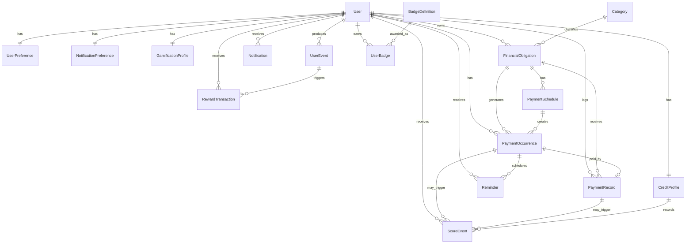

# SpendSense Demo 1 ERD

```mermaid
erDiagram
  User ||--|| UserPreference : has
  User ||--|| NotificationPreference : has
  User ||--|| CreditProfile : has
  User ||--|| GamificationProfile : has
  User ||--o{ FinancialObligation : owns
  User ||--o{ PaymentOccurrence : has
  User ||--o{ PaymentRecord : logs
  User ||--o{ Reminder : receives
  User ||--o{ Notification : receives
  User ||--o{ ScoreEvent : receives
  User ||--o{ UserEvent : produces
  User ||--o{ RewardTransaction : receives
  User ||--o{ UserBadge : earns

  Category ||--o{ FinancialObligation : classifies

  FinancialObligation ||--o{ PaymentSchedule : has
  FinancialObligation ||--o{ PaymentOccurrence : generates
  FinancialObligation ||--o{ PaymentRecord : receives

  PaymentSchedule ||--o{ PaymentOccurrence : creates
  PaymentOccurrence ||--o| PaymentRecord : paid_by
  PaymentOccurrence ||--o{ Reminder : schedules
  PaymentOccurrence ||--o{ ScoreEvent : may_trigger
  PaymentRecord ||--o{ ScoreEvent : may_trigger

  CreditProfile ||--o{ ScoreEvent : records
  UserEvent ||--o{ RewardTransaction : triggers
  BadgeDefinition ||--o{ UserBadge : awarded_as
```
