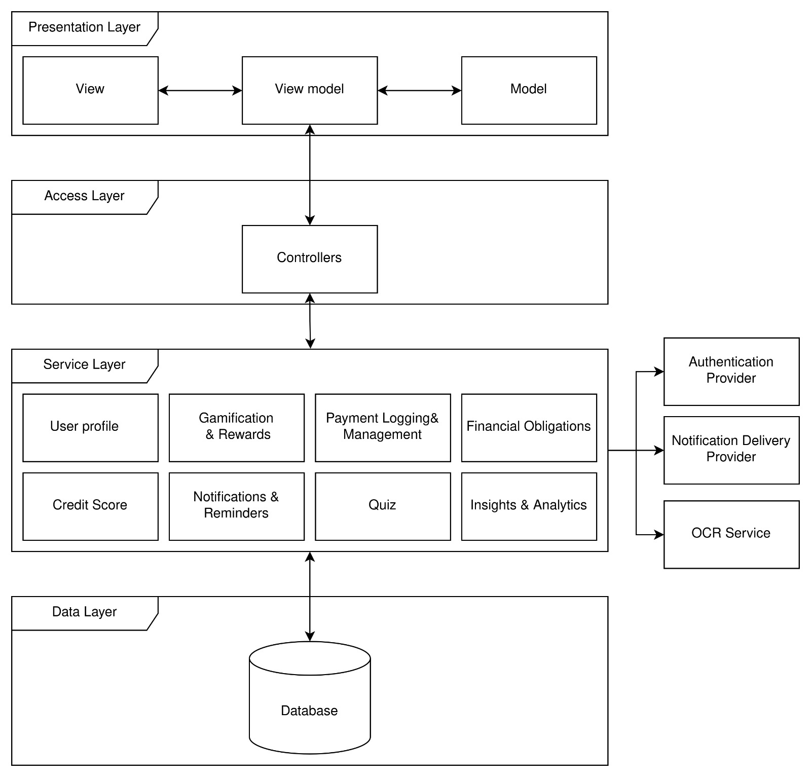

# SpendSense: Software Architecture Specification (SAS)

## 1. Table of Contents

* [2. Introduction](#2-introduction)
* [3. Architectural Requirements](#3-architectural-requirements)
  * [3.1 Architectural Patterns](#3-1-architectural-patterns)
    * [3.1.1 4-Tier Layered Architecture](#3-1-1-4-tier-layered-architecture)
    * [3.1.2 Client–Server Architecture](#3-1-2-client-server-architecture)
    * [3.1.3 Modular Monolith](#3-1-3-modular-monolith)
    * [3.1.4 Model–View–ViewModel](#3-1-4-model-view-viewmodel)
  * [3.2 Design Patterns](#3-2-design-patterns)
    * [3.2.1 Factory Method](#3-2-1-factory-method)
    * [3.2.2 Factory Method with Template Method](#3-2-2-factory-method-with-template-method)
    * [3.2.3 Observer](#3-2-3-observer)
    * [3.2.4 Adapter](#3-2-4-adapter)
    * [3.2.5 Facade](#3-2-5-facade)
  * [3.3 Constraints](#3-3-constraints)
  * [3.4 Architecture Diagram](#3-4-architecture-diagram)
  * [3.5 Mapping Quality Requirements to Architectural Decisions](#3-5-mapping-quality-requirements-to-architectural-decisions)
* [4. Technology Requirements](#4-technology-requirements)
* [5. API Contracts](#5-api-contracts)
  * [5.1 Authentication Services](#5-1-authentication-services)
    * [5.1.1 User Registration Service](#5-1-1-user-registration-service)
    * [5.1.2 User Login Service](#5-1-2-user-login-service)
    * [5.1.3 User Logout Service](#5-1-3-user-logout-service)
  * [5.2 User & Profile Services](#5-2-user-profile-services)
    * [5.2.1 Get Current User Service](#5-2-1-get-current-user-service)
    * [5.2.2 Update Current User Service](#5-2-2-update-current-user-service)
    * [5.2.3 Update User Preferences Service](#5-2-3-update-user-preferences-service)
    * [5.2.4 Deactivate Account Service](#5-2-4-deactivate-account-service)
    * [5.2.5 Export User Data Service](#5-2-5-export-user-data-service)
  * [5.3 Credit Score Services](#5-3-credit-score-services)
    * [5.3.1 Get Credit Score Service](#5-3-1-get-credit-score-service)
  * [5.4 Dashboard Services](#5-4-dashboard-services)
    * [5.4.1 Get Dashboard Data Service](#5-4-1-get-dashboard-data-service)
  * [5.5 Insights & Wrapped Services](#5-5-insights-wrapped-services)
    * [5.5.1 Get Insights Service](#5-5-1-get-insights-service)
    * [5.5.2 Get Latest Wrapped Summary Service](#5-5-2-get-latest-wrapped-summary-service)
  * [5.6 Gamification Services](#5-6-gamification-services)
    * [5.6.1 Get Gamification Profile Service](#5-6-1-get-gamification-profile-service)
    * [5.6.2 Get Rewards Service](#5-6-2-get-rewards-service)
    * [5.6.3 Get Badges Service](#5-6-3-get-badges-service)
  * [5.7 Category Services](#5-7-category-services)
    * [5.7.1 Get Categories Service](#5-7-1-get-categories-service)
  * [5.8 Reminder Preference Services](#5-8-reminder-preference-services)
    * [5.8.1 Get Reminder Preferences Service](#5-8-1-get-reminder-preferences-service)
    * [5.8.2 Update Reminder Preferences Service](#5-8-2-update-reminder-preferences-service)
  * [5.9 Notification Services](#5-9-notification-services)
    * [5.9.1 Create Notification Service (Internal)](#5-9-1-create-notification-service-internal)
    * [5.9.2 Get Notifications Service](#5-9-2-get-notifications-service)
    * [5.9.3 Mark Notification As Read Service](#5-9-3-mark-notification-as-read-service)
    * [5.9.4 Mark Multiple Notifications As Read Service](#5-9-4-mark-multiple-notifications-as-read-service)
    * [5.9.5 Delete Notification Service](#5-9-5-delete-notification-service)
    * [5.9.6 Delete Multiple Notifications Service](#5-9-6-delete-multiple-notifications-service)
  * [5.10 Quiz Services](#5-10-quiz-services)
    * [5.10.1 Get Daily Quiz State Service](#5-10-1-get-daily-quiz-state-service)
    * [5.10.2 Get Quiz Topics Service](#5-10-2-get-quiz-topics-service)
    * [5.10.3 Get Quiz Topic Detail Service](#5-10-3-get-quiz-topic-detail-service)
    * [5.10.4 Create Quiz Session Service](#5-10-4-create-quiz-session-service)
    * [5.10.5 Get Quiz Session Service](#5-10-5-get-quiz-session-service)
    * [5.10.6 Submit Quiz Answer Service](#5-10-6-submit-quiz-answer-service)
  * [5.11 Payment Services](#5-11-payment-services)
    * [5.11.1 Get Upcoming Payment Occurrences Service](#5-11-1-get-upcoming-payment-occurrences-service)
    * [5.11.2 Log Payment Service](#5-11-2-log-payment-service)
  * [5.12 Obligation Services](#5-12-obligation-services)
    * [5.12.1 Create Obligation Service](#5-12-1-create-obligation-service)
    * [5.12.2 Get Obligations Service](#5-12-2-get-obligations-service)
    * [5.12.3 Update Obligation Service](#5-12-3-update-obligation-service)
* [6. Deployment](#6-deployment)
  * [6.1 Deployment Requirements](#6-1-deployment-requirements)
    * [6.1.1 One-time setup](#6-1-1-one-time-setup)
    * [6.1.2 GitHub Actions secrets](#6-1-2-github-actions-secrets)
    * [6.1.3 First deployment and updates](#6-1-3-first-deployment-and-updates)
  * [6.2 Deployment Diagram](#6-2-deployment-diagram)
    * [6.2.1 Systems used](#6-2-1-systems-used)
    * [6.2.2 Deployment nodes](#6-2-2-deployment-nodes)
    * [6.2.3 Communication paths](#6-2-3-communication-paths)
  * [6.3 CI/CD Pipeline Diagram](#6-3-ci-cd-pipeline-diagram)
    * [6.3.1 Branching flow](#6-3-1-branching-flow)
    * [6.3.2 Development CI](#6-3-2-development-ci)
    * [6.3.3 Release qualification](#6-3-3-release-qualification)
    * [6.3.4 Production deployment](#6-3-4-production-deployment)
    * [6.3.5 Deployment artefacts and target environments](#6-3-5-deployment-artefacts-and-target-environments)
    * [6.3.6 Health checks and failure handling](#6-3-6-health-checks-and-failure-handling)

---

<a id="2-introduction"></a>

## 2. Introduction

This Software Architecture Specification serves the purpose of describing the architecture of SpendSense system along with its structure and component interactions. This specification documents the architecture of the system based on the architecture decisions that define the process of its development. The goal of this document is also to show how the selected architecture meets the functional and non-functional requirements specified in the Software Requirements Specification.

The current version of SpendSense is described in this document including its architectural styles and patterns, system components, technologies used in development of the system, interfaces and API contracts, data management, security, deployment environment, inter-subsystems communications and roles of the components.

Both of the specifications mentioned above need to be taken into account during the analysis of the project. Thus, the Software Requirements Specification specifies the goals of the system based on its scope, user stories, use cases, functional and non-functional requirements and domain model while the Software Architecture Specification describes its implementation.

<a id="3-architectural-requirements"></a>

## 3. Architectural Requirements

<a id="3-1-architectural-patterns"></a>

### 3.1 Architectural Patterns

Several architectural patterns are used in SpendSense. First of all, there is the use of an 4-Tier architecture for the entire system. The client-server pattern specifies the interaction pattern between the frontend and the backend layers. At the same time, there is a modular monolith that is used to structure the backend business functionality.
In the Presentation layer, the Model–View–ViewModel pattern is used.

<a id="3-1-1-4-tier-layered-architecture"></a>

#### 3.1.1 4-Tier Layered Architecture

**Purpose:** The intention behind the layered architecture is to split up the system into layers of distinct responsibility. The SpendSense system is based on the N-tier architecture with four layers: the Presentation Layer, Access Layer, Service Layer, and Data Layer. In addition, every layer takes care of performing a certain kind of task in cooperation with its neighboring layers.

**Why the pattern was selected:** SpendSense has its user interface functionality, request handling, financial business logic, and persistence tasks implemented in the system. The combination of all these aspects in a single component will complicate the system in terms of understanding, testing, and modification. Hence, the N-tier architectural pattern was chosen as it provides separation of concerns and minimizes the impact of changes in the system.
The N-tier pattern is also a good choice as SpendSense is an interactive system where the user initiates some action through the interface and gets a suitable response from the system for the performed request. Interactive systems are related to an N-tier architecture and client-server interaction model according to the lecture materials.

**Structure and application in SpendSense:** The four layers are used as follows:

* Presentation Layer presents information, receives user input, and processes frontend presentation states.
* Access Layer contains controllers that process frontend requests, check the correctness of input data, do access checks, and forward request to the Service Layer.
* Service Layer contains business logic components, including financial obligations, payment history processing, scoring, statistics and insights, quizzes, notifications and reminders, gamification and rewards, and user profiles management.
* Data Layer takes care of information persistence and retrieval for users, obligations, payments, quizzes, rewards, notifications, and user profiles.

A regular flow starts at Presentation Layer and proceeds to Access Layer controller. Access Layer controller forwards the operation to the appropriate Service Layer component. The service processes the business logic and uses Data Layer when information needs to be stored or retrieved.

**Quality attributes supported:** The following qualities are facilitated using the four-layer architecture approach:

* *Maintainability:* roles are segregated, thus making any changes possible locally at the particular layer level.
* *Modifiability:* any changes in the layer’s implementation details may be possible without affecting the other layers as long as their interfaces are left unchanged.
* *Testability:* controllers, services, and frontend features can be tested independently, while dependencies may be substituted with mocks.
* *Security:* authentication, authorization, validation, and business rules can be applied before persistent data access.
* *Scalability:* frontend, backend, and data hosting parts can be independently deployed and scaled in environments that support this.
* *Reusability:* functionality of the Service Layer may be used by different controllers and frontend processes.

**Trade-offs and limitations:** Adding layers adds to the number of components that the request needs to go through. This could lead to code and even more indirection and complexity of ideas. Simple actions might need the addition of a frontend component, API, a controller, a service action, data-access and finally the response model.
However, the pattern will work effectively when there is consistency in the application of its boundaries. For instance, when there are business rules in the frontend component, there is no use of services while accessing the database in controllers and one service accessing the other module’s inner workings.
This kind of abstraction increases maintainability and testability of the code, but also leads to overhead and makes the code harder to understand by new programmers. The separation and abstraction localize change but can add more layers and overhead.

<a id="3-1-2-client-server-architecture"></a>

#### 3.1.2 Client–Server Architecture

**Purpose:** The purpose of the client-server architecture is to separate the application, which deals with the client end, from the central server that will process all the business logic and security and manage all the accesses to data.

**Why the pattern was selected:** SpendSense is a web application in which the user interacts via the frontend and, at the same time, needs to have its financial rules and data controlled centrally. With the use of the client-server architecture, the frontend part can focus on the user interactions and rendering while the backend will take control of the authentication, validation, financial computations, payments, quiz settlement, notifications, and access to the storage data.
It is very important to centralize these operations to prevent rules implementation only in the client part.

**Structure and application in SpendSense:** React and TypeScript are used for the frontend of the system. This part shows the application screens to the user, processes user inputs, keeps track of presentation state, and performs HTTP requests to the backend API.
NestJS is used for the backend of the system. This part acts as the server that listens to the client requests and calls the corresponding services.
For example, when a user logs a payment, the frontend passes information about the payment to the backend. The backend then checks the request, adds a new payment, changes the payment frequency, computes new financial and gamification information, and returns the information back to the frontend.
Quality attributes supported:Quality Attributes supported by the client-server architecture include:

* *Security:* Financial and data access policies are contained on the server side, not the client.
* *Maintainability:* Frontend and backend components can be changed independently, provided the API agreement stays the same.
* *Scalability:* Client delivery and server processing can be scaled independently.
* *Consistency:* The client accesses consistent central business rules and data.
* *Usability:* The client can deliver responsive UI and the server deals with complex processing.
* *Integrability:* Outside systems deal with controlled backend interfaces, not with the frontend or database directly.

**Trade-offs and limitations:** Availability of the backend server and its connectivity to the frontend is required for proper functioning of the frontend. If the backend service is down, then most of the functions of SpendSense cannot be performed although the frontend application itself is available.
Latency and potential failures can occur through network communication. In order to ensure that the client and the server can continue communicating properly, the API contract needs to be managed appropriately.
The server could turn out to be a bottleneck in performance or single point of failure due to inadequate monitoring, replication, and scaling. There are some considerations that need to be kept in mind during separation of the client and server side applications.

<a id="3-1-3-modular-monolith"></a>

#### 3.1.3 Modular Monolith

**Purpose:** The purpose for a modular monolith is to split the backend into business capability-based modules but still have one backend application and one backend deployment. Each module is responsible for its area and has controlled interfaces to the rest of the application.

**Why the pattern was selected:** SpendSense has several functional blocks, including obligations, payments, credit scoring, notifications, quizzes, gamification, insights, and profiles. These blocks should have clearly defined boundaries to allow developers to work and test them separately from other backend functionality.
But at this point, the scope of the project and the size of the development team do not require the overhead of deploying microservices independently of each other. A modular monolith will provide separation of concerns but does not require multiple backend deployments, distributed transactions, service discovery, message brokers, and inter-service networking.

**Structure and application in SpendSense:** The SpendSense backend is created with the help of one NestJS application that includes modules for major business functionalities of the system. The major ones include:

* User Profile
* Financial Obligation
* Payment Logging and Management
* Credit Score
* Gamification and Rewards
* Notifications and Reminders
* Quiz
* Insights and Analytics

Each module holds all the controllers, services, data transfer objects, validators, and other logic needed for this functionality. Modules can interact via their service interfaces in case when one business process affects another.
For example, logging a payment requires Payment module, Credit Score module, Gamification module, and Notifications module. While the interaction takes place between those modules, they belong to one backend application and can participate in database operations together without any networking between different services.

**Quality attributes supported:** The quality attributes of the modular monolith include the following:

* *Maintainability:* related business capabilities are encapsulated in specific modules.
* *Modifiability:* modifications are limited to the affected module.
* *Testability:* each module can be tested separately.
* *Reliability:* multi-module operations can be managed through one application/database transaction.
* *Performance:* communication between the modules happens via local in-process method calls.
* *Deployability:* deployment of a single backend application replaces deployment of many distributed services.
* *Understandability:* module structure is based on business capabilities and use cases of SpendSense.

**Trade-offs and limitations:** All modules being one deployment for the backend, they cannot be independently deployed and scaled. Failure of the backend process can impact all modules instead of impacting just one business capability.
This architectural approach also assumes that internal boundaries are respected. If there are no well-defined module interfaces, developers will most likely end up building a tight coupling of a monolith.
With growing application size, build, test, and deployment processes will take more time. Shared database will let developers have access to the data of one module from the other, if they violate ownership principles.
Despite these downsides, this architecture consciously takes all those risks to gain an easier development, testing, deployment, transactions, and monitoring processes. If the current modules were split into microservices, then the developer would deal with a network failure, distributed-data consistency, authentication, deployment, and other problems, which are unnecessary now.

<a id="3-1-4-model-view-viewmodel"></a>

#### 3.1.4 Model–View–ViewModel

**Purpose:** The purpose of the Model-View-ViewModel design is to seperate the UI and its state from the logic of interaction and the models of data representation. Otherwise, the View will have to do both UI and all the other operations.

**Why the pattern was selected:** In SpendSense, there are interactive views with states of loading, user interaction, validation, filtering, navigation, API calls, and changing finance data. It would complicate the frontend greatly if that code were to be added to UI elements directly.
MVVM pattern was chosen to make the roles of the frontend clear where the View deals with rendering UI and handling user interaction and the ViewModel handles the frontend behavior and interaction with the Model.

**Structure and application in SpendSense:** The following are the MVVM responsibilities in practice:

* *The View* is made up of React pages and reusable view components. This part shows the data and passes user actions to the ViewModel.
* *The ViewModel* includes presentation logic, hooks, form management, validation, event handling, and coordination with the API. It prepares the data to be shown by the View.
* *The Model* contains frontend data types, domain models, API requests, and API responses sent by the backend.

The View doesn't communicate directly with the backend controllers. User actions are processed by the ViewModel, which performs the necessary frontend API calls and updates the presentation state based on the server's reply.
For example, on the Notifications page, the View shows the notifications list, the filters, the loading state, and the unread notifications status. The ViewModel is responsible for loading notifications, applying the type filter, reading notifications, handling errors, and updating the displayed data. The Model contains notification types, API responses, pagination info, and read status values.

**Quality attributes supported:** The MVVM approach enables the following quality attributes:

* *Maintainability:* presentation layer and visual layout can be changed independently.
* *Testability:* logic of ViewModels can be tested independently from rendered UI elements.
* *Modifiability:* coordination between APIs or state management logic can be modified without changing View.
* *Reusability:* ViewModels, hooks, models, and visual parts can be used repeatedly in different pages.
* *Usability:* predictable handling of presentation states makes possible proper loading, success, empty, and failure states.
* *Understandability:* developers find it easier to determine which part is responsible for visual aspects, behaviour, and data.

**Trade-offs and limitations:** With MVVM there is an extra level of abstraction between the View and the backend system. What was once a simple page will need separate pieces for hooks, components, models and API calls, making more files and abstractions.
It is also possible to have confusion between the View and the ViewModel when using React due to hooks and component code being written in the same file. For that reason, the MVVM architecture has to be strictly adhered to, not by using separate files, but through naming conventions and responsibilities.
Incorrectly developed ViewModels can grow too big and start including business rules which should stay in the backend Service Layer. The ViewModel on the client side is responsible for presentation logic only, while business rules and financial calculations should take place in the backend.

<a id="3-2-design-patterns"></a>

### 3.2 Design Patterns

<a id="3-2-1-factory-method"></a>

#### 3.2.1 Factory Method

The factory method is used in end-to-end testing infrastructure, specifically within the mock object test factories. The test setup utilized the dedicated factory files to instantiate and populate the standardised test objects on demand. This provides a clean,  standard mock object generation pipeline for testing without hardcoding objects across test suits. It simplifies test data setup, prevents duplication and ensures consistency across the test cases.

<a id="3-2-2-factory-method-with-template-method"></a>

#### 3.2.2 Factory Method with Template Method

The factory method combined with the template method is used for the users, if a user doesn't exist, the factory uses the template to create the user. This is done to centralize the multi-table initialization logic into a repeatable template structure. It ensures that when a new user is made all of its required entities are instantiated reliably without spreading the logic.

<a id="3-2-3-observer"></a>

#### 3.2.3 Observer

The observer design pattern is used in the notifications, since there is a notifications listener that continuously monitors the notifications endpoint for updates. when a new notification arrives, it automatically has a popup notification on the user interface. The purpose of this is to ensure that the user interface seamlessly reacts with real-time notifications and reminders in one central place without requiring manual page reloads or scattered event handling across components.

<a id="3-2-4-adapter"></a>

#### 3.2.4 Adapter

The `apiFetch` container acts as an adapter design pattern as it automatically unwraps the backend standard response containers into clean domain objects expected by the frontend. This is done to standardize the backend response structures and provides typed models to callers which isolates the details from the application logic.

<a id="3-2-5-facade"></a>

#### 3.2.5 Facade

The `use<Operation>Session` hooks operate as the facade design pattern, this encapsulates multiple API endpoints, internal state tracking and cancelled requests behind a single simplified API. This provides a unified interface for UI components without exposing the underlying API complexity to the UI layer.

<a id="3-3-constraints"></a>

### 3.3 Constraints

|Constraint|Architecutral Consequence|Why?|
|---|---|---|
|The project must be done with a zero-cost budget| Spendsense uses free services such as supabase, and the free AWS tier for deployment | Our client told us to use free services everywhere possible.|
|SpendSense cannot calulate a real credit score| Our simulated credit score is based on alot of research. | How banking institutions caluclate credit scores for customers is propriatary, and therefore we do not have access to that.|
|Notifications are limited to in-app delivery for demo 2| All notifications on our web app are shown through the in-app inbox.|This was done due to time constraints, but in future demos we do plan to include email notifications.|


<a id="3-4-architecture-diagram"></a>

### 3.4 Architecture Diagram



<a id="3-5-mapping-quality-requirements-to-architectural-decisions"></a>

### 3.5 Mapping Quality Requirements to Architectural Decisions

<a id="4-technology-requirements"></a>

## 4. Technology Requirements


<a id="5-api-contracts"></a>

## 5. API Contracts

<a id="5-1-authentication-services"></a>

### 5.1 Authentication Services

<a id="5-1-1-user-registration-service"></a>

#### 5.1.1 User Registration Service

**Service Name:** User Registration Service

**Description:** Registers a new user account.

**Inputs:**

| Name | Type | Required | Validation and description |
| --- | --- | --- | --- |
| `payload` | `object` | Yes | Registration payload. A detailed registration DTO was not included in the supplied files. |

**Outputs:**

| Name | Type | Description |
| --- | --- | --- |
| `registrationResult` | `object` | Authentication session or registration result. |

**Usage / Interaction Rules:**

- Clients must send a `POST` request to `/api/v1/auth/register`.
- The registration payload must be sent in JSON format.

---

<a id="5-1-2-user-login-service"></a>

#### 5.1.2 User Login Service

**Service Name:** User Login Service

**Description:** Authenticates an existing user.

**Inputs:**

| Name | Type | Required | Validation and description |
| --- | --- | --- | --- |
| `credentials` | `object` | Yes | User login credentials. A detailed login DTO was not included in the supplied files. |

**Outputs:**

| Name | Type | Description |
| --- | --- | --- |
| `authSession` | `object` | Authentication session or token payload. |

**Usage / Interaction Rules:**

- Clients must send a `POST` request to `/api/v1/auth/login`.
- The login credentials must be sent in JSON format.

---

<a id="5-1-3-user-logout-service"></a>

#### 5.1.3 User Logout Service

**Service Name:** User Logout Service

**Description:** Terminates the current authenticated session.

**Inputs:**

None.

**Outputs:**

None specified.

**Usage / Interaction Rules:**

- Clients must send a `POST` request to `/api/v1/auth/logout`.

---

<a id="5-2-user-profile-services"></a>

### 5.2 User & Profile Services

<a id="5-2-1-get-current-user-service"></a>

#### 5.2.1 Get Current User Service

**Service Name:** Get Current User Service

**Description:** Retrieves the current authenticated user's profile and creates the internal user record on the first call if it does not already exist.

**Inputs:**

None.

**Outputs:**

| Name | Type | Description |
| --- | --- | --- |
| `data` | `object` | User profile data. |

**Usage / Interaction Rules:**

- Clients must send a `GET` request to `/api/v1/users/me`.
- The caller must be authenticated.
- On the first call, the service creates the associated `User`, `CreditProfile`, `GamificationProfile`, `UserPreference`, and `NotificationPreference` records if they do not exist.

---

<a id="5-2-2-update-current-user-service"></a>

#### 5.2.2 Update Current User Service

**Service Name:** Update Current User Service

**Description:** Updates supported fields on the authenticated user's profile.

**Inputs:**

| Name | Type | Required | Validation and description |
| --- | --- | --- | --- |
| `displayName` | `string` | No | Must contain between `1` and `80` characters. |
| `avatarUrl` | `string or null` | No | Must be a valid URL when a string is supplied; `null` is allowed. |
| `monthlyBudget` | `number` | No | Must be between `0` and `9,999,999,999.99`, with no more than two decimal places. |
| `onboardingCompleted` | `boolean` | No | Indicates whether onboarding has been completed. |

**Outputs:**

| Name | Type | Description |
| --- | --- | --- |
| `data` | `object` | Updated user profile object. |

**Usage / Interaction Rules:**

- Clients must send a `PATCH` request to `/api/v1/users/me`.
- The request body may contain any supported subset of the profile fields.
- Unknown or protected fields such as `email`, `id`, `supabaseAuthId`, `deletedAt`, `currentScore`, and `xp` are rejected by validation.

---

<a id="5-2-3-update-user-preferences-service"></a>

#### 5.2.3 Update User Preferences Service

**Service Name:** Update User Preferences Service

**Description:** Updates the authenticated user's interface, localisation, currency, and motion preferences.

**Inputs:**

| Name | Type | Required | Validation and description |
| --- | --- | --- | --- |
| `theme` | `Theme` | No | Must be a member of the Prisma `Theme` enum. |
| `language` | `string` | No | Must be the supported value `en` and may not exceed `5` characters. |
| `currency` | `Currency` | No | Must be a member of the Prisma `Currency` enum. |
| `reducedMotion` | `boolean` | No | Enables or disables reduced-motion behaviour. |

**Outputs:**

| Name | Type | Description |
| --- | --- | --- |
| `data` | `object` | Updated user preferences object. |

**Usage / Interaction Rules:**

- Clients must send a `PATCH` request to `/api/v1/users/me/preferences`.
- The request body may contain any supported subset of the preference fields.
- Unknown fields and unsupported enum or language values are rejected by validation.

---

<a id="5-2-4-deactivate-account-service"></a>

#### 5.2.4 Deactivate Account Service

**Service Name:** Deactivate Account Service

**Description:** Deactivates the authenticated user's account.

**Inputs:**

None.

**Outputs:**

None specified.

**Usage / Interaction Rules:**

- Clients must send a `PATCH` request to `/api/v1/users/me/deactivate`.

---

<a id="5-2-5-export-user-data-service"></a>

#### 5.2.5 Export User Data Service

**Service Name:** Export User Data Service

**Description:** Generates an export of the authenticated user's data.

**Inputs:**

None.

**Outputs:**

| Name | Type | Description |
| --- | --- | --- |
| `data` | `object` | Exported user dataset. |

**Usage / Interaction Rules:**

- Clients must send a `GET` request to `/api/v1/users/me/export`.

---

<a id="5-3-credit-score-services"></a>

### 5.3 Credit Score Services

<a id="5-3-1-get-credit-score-service"></a>

#### 5.3.1 Get Credit Score Service

**Service Name:** Get Credit Score Service

**Description:** Retrieves the current user's simulated credit-score details.

**Inputs:**

None.

**Outputs:**

| Name | Type | Description |
| --- | --- | --- |
| `data` | `CreditScore` | The user's credit-score object. |

**Usage / Interaction Rules:**

- Clients must send a `GET` request to `/api/v1/credit-score`.

---

<a id="5-4-dashboard-services"></a>

### 5.4 Dashboard Services

<a id="5-4-1-get-dashboard-data-service"></a>

#### 5.4.1 Get Dashboard Data Service

**Service Name:** Get Dashboard Data Service

**Description:** Retrieves aggregated dashboard information, including the credit score, gamification summary, payment counts, overdue counts, and recent activity.

**Inputs:**

None.

**Outputs:**

| Name | Type | Description |
| --- | --- | --- |
| `data` | `DashboardData` | Aggregated dashboard view model. |

**Usage / Interaction Rules:**

- Clients must send a `GET` request to `/api/v1/dashboard`.
- The service must continue to function if optional dependent AI services are unavailable.

---

<a id="5-5-insights-wrapped-services"></a>

### 5.5 Insights & Wrapped Services

<a id="5-5-1-get-insights-service"></a>

#### 5.5.1 Get Insights Service

**Service Name:** Get Insights Service

**Description:** Retrieves financial performance insights and insight cards for the user.

**Inputs:**

None.

**Outputs:**

| Name | Type | Description |
| --- | --- | --- |
| `asOf` | `string` | ISO timestamp indicating when the insights were calculated. |
| `insights` | `List` | List of insight-card details. |

**Usage / Interaction Rules:**

- Clients must send a `GET` request to `/api/v1/insights`.

---

<a id="5-5-2-get-latest-wrapped-summary-service"></a>

#### 5.5.2 Get Latest Wrapped Summary Service

**Service Name:** Get Latest Wrapped Summary Service

**Description:** Retrieves the user's latest monthly wrapped summary.

**Inputs:**

None.

**Outputs:**

| Name | Type | Description |
| --- | --- | --- |
| `month` | `string` | Month identifier. |
| `totalSaved` | `number` | Total amount saved. |
| `transactions` | `number` | Total transaction count. |
| `topCategory` | `string` | Top spending category. |
| `noSpendDays` | `number` | Number of no-spend days. |

**Usage / Interaction Rules:**

- Clients must send a `GET` request to `/api/v1/wrapped/latest`.

---

<a id="5-6-gamification-services"></a>

### 5.6 Gamification Services

<a id="5-6-1-get-gamification-profile-service"></a>

#### 5.6.1 Get Gamification Profile Service

**Service Name:** Get Gamification Profile Service

**Description:** Retrieves the current user's coins, experience points, streak information, and mascot state.

**Inputs:**

None.

**Outputs:**

| Name | Type | Description |
| --- | --- | --- |
| `data` | `object` | Gamification profile details. |

**Usage / Interaction Rules:**

- Clients must send a `GET` request to `/api/v1/gamification/profile`.
- Profile updates occur automatically on the server after relevant actions, such as logging a payment.
- Coins do not alter credit scores or remove financial penalties.

---

<a id="5-6-2-get-rewards-service"></a>

#### 5.6.2 Get Rewards Service

**Service Name:** Get Rewards Service

**Description:** Retrieves a paginated list of available gamification rewards.

**Inputs:**

| Name | Type | Required | Validation and description |
| --- | --- | --- | --- |
| `page` | `integer` | No | Query parameter; defaults to `1` and must be at least `1`. |
| `perPage` | `integer` | No | Query parameter; defaults to `20`, must be at least `1`, and may not exceed `100`. |

**Outputs:**

| Name | Type | Description |
| --- | --- | --- |
| `data` | `List` | List of reward items. |

**Usage / Interaction Rules:**

- Clients must send a `GET` request to `/api/v1/gamification/rewards`.
- Pagination values must be supplied as query parameters.

---

<a id="5-6-3-get-badges-service"></a>

#### 5.6.3 Get Badges Service

**Service Name:** Get Badges Service

**Description:** Retrieves all gamification badges.

**Inputs:**

None.

**Outputs:**

| Name | Type | Description |
| --- | --- | --- |
| `data` | `List` | List of available and earned badges. |

**Usage / Interaction Rules:**

- Clients must send a `GET` request to `/api/v1/gamification/badges`.

---

<a id="5-7-category-services"></a>

### 5.7 Category Services

<a id="5-7-1-get-categories-service"></a>

#### 5.7.1 Get Categories Service

**Service Name:** Get Categories Service

**Description:** Retrieves seeded global category options used by application forms.

**Inputs:**

| Name | Type | Required | Validation and description |
| --- | --- | --- | --- |
| `type` | `CategoryFilterValue` | No | Query parameter accepting `OBLIGATION`, `EXPENSE`, `BOTH`, or `ALL`; defaults to `ALL`. |

**Outputs:**

| Name | Type | Description |
| --- | --- | --- |
| `data` | `List` | List of global category options. |

**Usage / Interaction Rules:**

- Clients must send a `GET` request to `/api/v1/categories?type={type}`.
- The `type` value is validated against the supported category-filter values.
- The categories are global lookup values and are not owned by an individual user.

---

<a id="5-8-reminder-preference-services"></a>

### 5.8 Reminder Preference Services

<a id="5-8-1-get-reminder-preferences-service"></a>

#### 5.8.1 Get Reminder Preferences Service

**Service Name:** Get Reminder Preferences Service

**Description:** Retrieves the user's global reminder preferences.

**Inputs:**

None.

**Outputs:**

| Name | Type | Description |
| --- | --- | --- |
| `data` | `object` | Reminder configuration preferences. |

**Usage / Interaction Rules:**

- Clients must send a `GET` request to `/api/v1/reminder-preferences`.

---

<a id="5-8-2-update-reminder-preferences-service"></a>

#### 5.8.2 Update Reminder Preferences Service

**Service Name:** Update Reminder Preferences Service

**Description:** Updates the user's supported reminder preferences.

**Inputs:**

| Name | Type | Required | Validation and description |
| --- | --- | --- | --- |
| `defaultReminderDaysBefore` | `integer` | No | Must be one of `1`, `3`, `5`, or `7`. |
| `inAppEnabled` | `boolean` | No | Enables or disables in-app notifications. |

**Outputs:**

| Name | Type | Description |
| --- | --- | --- |
| `data` | `object` | Updated reminder preferences object. |

**Usage / Interaction Rules:**

- Clients must send a `PATCH` request to `/api/v1/reminder-preferences`.
- Only the two fields defined by `UpdateReminderPreferencesDto` are accepted by the supplied request contract.

---

<a id="5-9-notification-services"></a>

### 5.9 Notification Services

<a id="5-9-1-create-notification-service-internal"></a>

#### 5.9.1 Create Notification Service (Internal)

**Service Name:** Create Notification Service (Internal)

**Description:** Creates a notification from another backend component.

**Inputs:**

| Name | Type | Required | Validation and description |
| --- | --- | --- | --- |
| `userId` | `string` | Yes | Identifier of the user who will receive the notification. |
| `type` | `NotificationType` | Yes | Notification type defined by the Prisma `NotificationType` enum. |
| `title` | `string` | Yes | Notification title. |
| `message` | `string` | Yes | Notification message. |
| `sourceType` | `UserEventSourceType or null` | No | Optional type of the source event. |
| `sourceId` | `string or null` | No | Optional identifier of the source record. |

**Outputs:**

None specified.

**Usage / Interaction Rules:**

- This is an internal component contract represented by `CreateNotificationInput`; it is not identified as a public REST endpoint in the supplied file.
- The supplied interface defines the input shape but does not define the return type.

---

<a id="5-9-2-get-notifications-service"></a>

#### 5.9.2 Get Notifications Service

**Service Name:** Get Notifications Service

**Description:** Retrieves the authenticated user's in-app notification inbox.

**Inputs:**

| Name | Type | Required | Validation and description |
| --- | --- | --- | --- |
| `unreadOnly` | `boolean` | No | Query parameter. The string values `true` and `false` are transformed into booleans; other values are rejected. |
| `type` | `NotificationType` | No | Query parameter validated against the Prisma `NotificationType` enum. |
| `page` | `integer` | No | Defaults to `1` and must be an integer of at least `1`. |
| `perPage` | `integer` | No | Defaults to `20`, must be an integer of at least `1`, and may not exceed `100`. |

**Outputs:**

| Name | Type | Description |
| --- | --- | --- |
| `data` | `List` | List of notification items. |

**Usage / Interaction Rules:**

- Clients must send a `GET` request to `/api/v1/notifications`.
- Filters and pagination values must be supplied as query parameters.

---

<a id="5-9-3-mark-notification-as-read-service"></a>

#### 5.9.3 Mark Notification As Read Service

**Service Name:** Mark Notification As Read Service

**Description:** Marks a single notification as read.

**Inputs:**

| Name | Type | Required | Validation and description |
| --- | --- | --- | --- |
| `id` | `string` | Yes | Path parameter identifying the notification. |

**Outputs:**

| Name | Type | Description |
| --- | --- | --- |
| `data` | `Notification` | Updated notification record. |

**Usage / Interaction Rules:**

- Clients must send a `PATCH` request to `/api/v1/notifications/{id}/read`.
- The `{id}` path parameter must identify a notification belonging to the caller.

---

<a id="5-9-4-mark-multiple-notifications-as-read-service"></a>

#### 5.9.4 Mark Multiple Notifications As Read Service

**Service Name:** Mark Multiple Notifications As Read Service

**Description:** Marks multiple notifications as read in one request.

**Inputs:**

| Name | Type | Required | Validation and description |
| --- | --- | --- | --- |
| `ids` | `string[]` | Yes | Must be a non-empty array in which every value is a version 4 UUID. |

**Outputs:**

| Name | Type | Description |
| --- | --- | --- |
| `data.updated` | `integer` | Number of notifications updated. |

**Usage / Interaction Rules:**

- Clients must send a `PATCH` request to `/api/v1/notifications/read`.
- The JSON request body must have the form `{ "ids": [...] }`.
- An empty array, a non-array value, a non-UUID value, or a UUID that is not version 4 is rejected.

---

<a id="5-9-5-delete-notification-service"></a>

#### 5.9.5 Delete Notification Service

**Service Name:** Delete Notification Service

**Description:** Deletes a single notification.

**Inputs:**

| Name | Type | Required | Validation and description |
| --- | --- | --- | --- |
| `id` | `string` | Yes | Path parameter identifying the notification. |

**Outputs:**

| Name | Type | Description |
| --- | --- | --- |
| `data.id` | `string` | Identifier of the deleted notification. |
| `data.deletedAt` | `string` | Timestamp indicating when the notification was deleted. |

**Usage / Interaction Rules:**

- Clients must send a `DELETE` request to `/api/v1/notifications/{id}`.
- The `{id}` path parameter must identify a notification belonging to the caller.

---

<a id="5-9-6-delete-multiple-notifications-service"></a>

#### 5.9.6 Delete Multiple Notifications Service

**Service Name:** Delete Multiple Notifications Service

**Description:** Deletes multiple notifications in one request.

**Inputs:**

| Name | Type | Required | Validation and description |
| --- | --- | --- | --- |
| `ids` | `string[]` | Yes | Must be a non-empty array in which every value is a version 4 UUID. |

**Outputs:**

| Name | Type | Description |
| --- | --- | --- |
| `data.deleted` | `integer` | Number of notifications deleted. |

**Usage / Interaction Rules:**

- Clients must send a `DELETE` request to `/api/v1/notifications`.
- The JSON request body must have the form `{ "ids": [...] }`.
- An empty array, a non-array value, a non-UUID value, or a UUID that is not version 4 is rejected.

---

<a id="5-10-quiz-services"></a>

### 5.10 Quiz Services

<a id="5-10-1-get-daily-quiz-state-service"></a>

#### 5.10.1 Get Daily Quiz State Service

**Service Name:** Get Daily Quiz State Service

**Description:** Retrieves the current state of the authenticated user's daily financial-literacy quiz.

**Inputs:**

None.

**Outputs:**

| Name | Type | Description |
| --- | --- | --- |
| `data` | `DailyQuizState` | Daily quiz state details. |

**Usage / Interaction Rules:**

- Clients must send a `GET` request to `/api/v1/quiz/daily`.

---

<a id="5-10-2-get-quiz-topics-service"></a>

#### 5.10.2 Get Quiz Topics Service

**Service Name:** Get Quiz Topics Service

**Description:** Retrieves summaries of all available financial-literacy quiz topics.

**Inputs:**

None.

**Outputs:**

| Name | Type | Description |
| --- | --- | --- |
| `data` | `List` | List of quiz-topic summaries. |

**Usage / Interaction Rules:**

- Clients must send a `GET` request to `/api/v1/quiz/topics`.

---

<a id="5-10-3-get-quiz-topic-detail-service"></a>

#### 5.10.3 Get Quiz Topic Detail Service

**Service Name:** Get Quiz Topic Detail Service

**Description:** Retrieves detailed information for a specific quiz topic.

**Inputs:**

| Name | Type | Required | Validation and description |
| --- | --- | --- | --- |
| `topic` | `QuizTopic` | Yes | Path parameter identifying a member of the Prisma `QuizTopic` enum. |

**Outputs:**

| Name | Type | Description |
| --- | --- | --- |
| `data` | `QuizTopicDetail` | Quiz-topic detail object. |

**Usage / Interaction Rules:**

- Clients must send a `GET` request to `/api/v1/quiz/topics/{topic}`.
- The `{topic}` path parameter must identify an available quiz topic.

---

<a id="5-10-4-create-quiz-session-service"></a>

#### 5.10.4 Create Quiz Session Service

**Service Name:** Create Quiz Session Service

**Description:** Starts a new backend-controlled quiz session.

**Inputs:**

| Name | Type | Required | Validation and description |
| --- | --- | --- | --- |
| `type` | `QuizSessionType` | Yes | Must be a member of the Prisma `QuizSessionType` enum. |
| `topic` | `QuizTopic` | Conditionally | Optional for non-topic sessions and required by the service when `type` is `TOPIC`. |

**Outputs:**

| Name | Type | Description |
| --- | --- | --- |
| `data` | `QuizSession` | Newly created quiz-session object. |

**Usage / Interaction Rules:**

- Clients must send a `POST` request to `/api/v1/quiz/sessions`.
- The session parameters must be sent in JSON format.
- The attached DTO describes `topic` as required when the selected session type is `TOPIC`.

---

<a id="5-10-5-get-quiz-session-service"></a>

#### 5.10.5 Get Quiz Session Service

**Service Name:** Get Quiz Session Service

**Description:** Retrieves an existing quiz session by its identifier.

**Inputs:**

| Name | Type | Required | Validation and description |
| --- | --- | --- | --- |
| `id` | `string` | Yes | Path parameter identifying the quiz session. |

**Outputs:**

| Name | Type | Description |
| --- | --- | --- |
| `data` | `QuizSession` | Quiz-session details. |

**Usage / Interaction Rules:**

- Clients must send a `GET` request to `/api/v1/quiz/sessions/{id}`.
- The `{id}` path parameter must identify the quiz session.

---

<a id="5-10-6-submit-quiz-answer-service"></a>

#### 5.10.6 Submit Quiz Answer Service

**Service Name:** Submit Quiz Answer Service

**Description:** Submits an answer for a quiz question and allows the backend to evaluate correctness, requeueing, completion rewards, and knowledge-streak updates.

**Inputs:**

| Name | Type | Required | Validation and description |
| --- | --- | --- | --- |
| `questionId` | `UUID string` | Yes | Must be a valid UUID. |
| `selectedOptionKey` | `string` | Yes | Must contain between `1` and `20` characters. |

**Outputs:**

| Name | Type | Description |
| --- | --- | --- |
| `data` | `SubmitQuizAnswerResponse` | Result of the answer submission. |

**Usage / Interaction Rules:**

- Clients must send a `POST` request to `/api/v1/quiz/sessions/{id}/answer`.
- The session identifier remains a path parameter, while `questionId` and `selectedOptionKey` are sent in the JSON request body.

---

<a id="5-11-payment-services"></a>

### 5.11 Payment Services

<a id="5-11-1-get-upcoming-payment-occurrences-service"></a>

#### 5.11.1 Get Upcoming Payment Occurrences Service

**Service Name:** Get Upcoming Payment Occurrences Service

**Description:** Retrieves upcoming payment-occurrence timeline entries for the authenticated user.

**Inputs:**

| Name | Type | Required | Validation and description |
| --- | --- | --- | --- |
| `from` | `ISO date string` | No | Start-date query parameter; defaults to the current date. |
| `to` | `ISO date string` | No | End-date query parameter; defaults to 30 days after the current date. |
| `status` | `string` | No | Comma-separated status values; defaults to `PENDING,OVERDUE`. |
| `obligationId` | `string` | No | Filters results by obligation identifier. |
| `page` | `integer` | No | Defaults to `1` and must be an integer of at least `1`. |
| `perPage` | `integer` | No | Defaults to `20`, must be an integer of at least `1`, and may not exceed `100`. |

**Outputs:**

| Name | Type | Description |
| --- | --- | --- |
| `data` | `List` | List of upcoming payment occurrences matching the supplied filters. |

**Usage / Interaction Rules:**

- Clients must send a `GET` request to `/api/v1/payment-occurrences/upcoming`.
- All input values are supplied as query parameters.

---

<a id="5-11-2-log-payment-service"></a>

#### 5.11.2 Log Payment Service

**Service Name:** Log Payment Service

**Description:** Logs a payment against an existing payment occurrence.

**Inputs:**

| Name | Type | Required | Validation and description |
| --- | --- | --- | --- |
| `occurrenceId` | `string` | Yes | Identifier of the target payment occurrence. |
| `paidDate` | `ISO date string` | Yes | Date on which the payment was made. |
| `amountPaid` | `number` | Yes | Must be greater than or equal to `0`. |
| `notes` | `string` | No | Optional payment notes. |

**Outputs:**

| Name | Type | Description |
| --- | --- | --- |
| `data` | `object` | Payment-log execution result. |

**Usage / Interaction Rules:**

- Clients must send a `POST` request to `/api/v1/payments/log`.
- The payment details must be sent in JSON format.
- The current `LogPaymentDto` does not contain a payment-method field.
- The client must not include `userId` in the request body because the backend derives it from the authentication token.

---

<a id="5-12-obligation-services"></a>

### 5.12 Obligation Services

<a id="5-12-1-create-obligation-service"></a>

#### 5.12.1 Create Obligation Service

**Service Name:** Create Obligation Service

**Description:** Creates a financial obligation together with its schedule and optional reminder configuration.

**Inputs:**

| Name | Type | Required | Validation and description |
| --- | --- | --- | --- |
| `name` | `string` | Yes | Must contain between `1` and `120` characters. |
| `description` | `string` | No | May not exceed `500` characters. |
| `type` | `ObligationType` | Yes | Must be a member of the Prisma `ObligationType` enum. |
| `categoryId` | `string` | Yes | Identifier of a valid linked category. |
| `amount` | `number` | Yes | Must be positive and contain no more than two decimal places. |
| `currency` | `Currency` | No | Must be a member of the Prisma `Currency` enum; defaults to `ZAR`. |
| `priority` | `ObligationPriority` | No | Must be a member of the Prisma `ObligationPriority` enum; defaults to `MEDIUM`. |
| `startDate` | `ISO date string` | Yes | Obligation start date. |
| `endDate` | `ISO date string` | No | Optional obligation end date. |
| `schedule.frequency` | `ScheduleFrequency` | Yes | Must be a member of the Prisma `ScheduleFrequency` enum. |
| `schedule.interval` | `integer` | No | Defaults to `1` and must be at least `1`. |
| `schedule.dayOfMonth` | `integer` | No | May be used for monthly schedules and must be between `1` and `28`. |
| `schedule.totalOccurrences` | `integer` | No | Must be at least `1`; described as required for fixed-instalment schedules. |
| `reminders.enabled` | `boolean` | No | Enables or disables reminders for the obligation. |
| `reminders.daysBefore` | `integer[]` | No | Every value must be a non-negative integer. |
| `reminders.channels` | `ReminderChannel[]` | No | Every value must be a member of the Prisma `ReminderChannel` enum. |

**Outputs:**

| Name | Type | Description |
| --- | --- | --- |
| `data` | `object` | Newly created obligation with its generated schedule and payment occurrences. |

**Usage / Interaction Rules:**

- Clients must send a `POST` request to `/api/v1/obligations`.
- Nested `schedule` and optional `reminders` objects must be sent in JSON format.
- The client must not include `userId` because the backend derives it from the authentication token.

---

<a id="5-12-2-get-obligations-service"></a>

#### 5.12.2 Get Obligations Service

**Service Name:** Get Obligations Service

**Description:** Retrieves obligations belonging to the authenticated user using optional filters

**Inputs:**

| Name | Type | Required | Validation and description |
| --- | --- | --- | --- |
| `page` | `integer` | No | Defaults to `1` and must be an integer of at least `1`. |
| `perPage` | `integer` | No | Defaults to `20`, must be an integer of at least `1`, and may not exceed `100`. |
| `status` | `ObligationStatus` | No | Filters by a member of the Prisma `ObligationStatus` enum. |
| `type` | `ObligationType` | No | Filters by a member of the Prisma `ObligationType` enum. |
| `categoryId` | `string` | No | Filters by category identifier. |
| `dueSoon` | `boolean` | No | When enabled, requests sorting by the soonest upcoming occurrence. |

**Outputs:**

| Name | Type | Description |
| --- | --- | --- |
| `data` | `List` | Paginated list of obligations matching the supplied filters. |

**Usage / Interaction Rules:**

- Clients must send a `GET` request to `/api/v1/obligations`.
- Filters and pagination values are supplied as query parameters.
- Only obligations belonging to the authenticated caller may be returned.

---

<a id="5-12-3-update-obligation-service"></a>

#### 5.12.3 Update Obligation Service

**Service Name:** Update Obligation Service

**Description:** Updates supported fields on an existing financial obligation.

**Inputs:**

| Name | Type | Required | Validation and description |
| --- | --- | --- | --- |
| `id` | `string` | Yes | Identifier of the obligation to update; supplied by the controller route. |
| `name` | `string` | No | Must contain between `1` and `120` characters. |
| `description` | `string` | No | May not exceed `500` characters. |
| `amount` | `number` | No | Must be positive and contain no more than two decimal places. |
| `priority` | `ObligationPriority` | No | Must be a member of the Prisma `ObligationPriority` enum. |
| `status` | `ObligationStatus` | No | Must be a member of the Prisma `ObligationStatus` enum. |
| `endDate` | `ISO date string` | No | Optional updated end date. |
| `schedule.frequency` | `ScheduleFrequency` | No | Must be a member of the Prisma `ScheduleFrequency` enum. |
| `schedule.interval` | `integer` | No | Must be at least `1`. |
| `schedule.dayOfMonth` | `integer` | No | Must be between `1` and `28`. |
| `regenerateFutureOccurrences` | `boolean` | No | Requests regeneration of future unpaid occurrences after a schedule change. |

**Outputs:**

| Name | Type | Description |
| --- | --- | --- |
| `data` | `object` | Updated obligation and any resulting schedule information. |

**Usage / Interaction Rules:**

- The supplied `UpdateObligationDto` defines the update body but does not itself define the controller's HTTP route.
- Only the supported optional fields should be sent in the JSON request body.
- The service must verify that the obligation belongs to the authenticated caller before applying changes.

---

<a id="6-deployment"></a>

## 6. Deployment

<a id="6-1-deployment-requirements"></a>

### 6.1 Deployment Requirements

<a id="6-1-1-one-time-setup"></a>

#### 6.1.1 One-time setup

1. Create a Supabase project. Copy its database connection string, project URL, anon key, and JWT secret. Configure the required sign-in methods in Supabase Auth.
2. In AWS, create a private S3 bucket for the frontend and a CloudFront distribution with the bucket as its origin. Configure CloudFront to return `/index.html` for 403 and 404 responses so React routes work on refresh.
3. Create an Ubuntu EC2 instance with a static public IP. Allow inbound ports 80 and 443 from the internet. Restrict SSH port 22 to the team network. Install Git, Docker Engine, and the Docker Compose plugin.
4. Point an API DNS record such as `api.example.com` to the EC2 public IP. If a custom frontend domain is used, add it to CloudFront and create the required DNS record and certificate.
5. Clone the repository on EC2 to `/app/spendsense`. Create `/app/spendsense/.env.production` with the server values below, then run `chmod 600 .env.production`.

```env
DATABASE_URL=<Supabase PostgreSQL connection string>
PORT=3000
AI_SERVICE_URL=http://ai:8000
SUPABASE_URL=<Supabase project URL>
SUPABASE_JWT_SECRET=<Supabase JWT secret>
ALLOWED_ORIGINS=<CloudFront or frontend domain URL>
CADDY_HOSTNAME=api.example.com
CADDY_ACME_EMAIL=<team contact email>
SCHEDULER_SECRET=<strong random value>
```

`SCHEDULER_SECRET` is needed only when the protected scheduled-job endpoint is used. Do not commit `.env.production` or any secret values.


<a id="6-1-2-github-actions-secrets"></a>

#### 6.1.2 GitHub Actions secrets

Add these repository secrets before the first deployment.

| Secret | Purpose |
|---|---|
| `AWS_ACCESS_KEY_ID` and `AWS_SECRET_ACCESS_KEY` | IAM credentials with access to the frontend S3 bucket and CloudFront invalidation. |
| `S3_BUCKET_FRONTEND` | Name of the frontend S3 bucket. |
| `CF_DISTRIBUTION_ID` | CloudFront distribution ID. |
| `VITE_API_URL` | Public API base URL, for example `https://api.example.com/api/v1`. |
| `VITE_SUPABASE_URL` and `VITE_SUPABASE_ANON_KEY` | Supabase values embedded in the frontend build. |
| `DATABASE_URL` | Supabase PostgreSQL connection string used for Prisma migrations. |
| `EC2_HOST` and `EC2_SSH_KEY` | EC2 public address and private SSH key used by the deployment workflow. |
| `GHCR_READ_TOKEN` | GitHub token with permission to pull the published container images on EC2. |
| `BACKEND_URL` | Public backend URL used by the post-deployment health check, for example `https://api.example.com`. |

<a id="6-1-3-first-deployment-and-updates"></a>

#### 6.1.3 First deployment and updates

1. On EC2, sign in to GitHub Container Registry, then start the production stack.

```bash
cd /app/spendsense
docker login ghcr.io
GHCR_OWNER=<GitHub-owner> IMAGE_TAG=latest docker compose -f docker-compose.prod.yml pull
GHCR_OWNER=<GitHub-owner> IMAGE_TAG=latest docker compose -f docker-compose.prod.yml up -d
```

When prompted by `docker login`, use the GitHub username and `GHCR_READ_TOKEN`.

2. Confirm `https://api.example.com/api/v1/health` responds successfully.
3. Push approved code to `main`. The deployment workflow builds the static frontend, uploads it to S3, invalidates CloudFront, publishes container images, runs `prisma migrate deploy`, and restarts the EC2 containers.
4. Test a frontend login and a protected API flow. This confirms the frontend URL is allowed by CORS and Supabase tokens are accepted by the backend.


<a id="6-2-deployment-diagram"></a>

### 6.2 Deployment Diagram


<a id="6-2-1-systems-used"></a>

#### 6.2.1 Systems used
- AWS S3 and CloudFront host the React(Vite) frontend.
- AWS EC2 runs the backend and AI containers with Docker Compose.
- GitHub Actions builds the frontend, publishes backend and AI images to GitHub Container Registry, applies database migrations, and updates EC2 after a push to `main`.
- Supabase provides PostgreSQL and user authentication.
- Caddy runs on EC2 and provides HTTPS for the backend API.

<a id="6-2-2-deployment-nodes"></a>

#### 6.2.2 Deployment nodes

- **User Device:** Has a web browser installed that is used for accessing SpendSense.
- **Amazon S3:** Stores the static frontend artifacts generated by React & Vite build.
- **Amazon CloudFront:** Distributes the frontend artifacts and provides the frontend endpoint.
- **AWS EC2 Instance:** Is configured with Ubuntu OS, Docker, and Docker Compose.
- **Caddy Container:** Has the reverse proxy configuration that directs the API calls to the backend.
- **NestJS Backend Container:** Has the SpendSense backend running on Node.js 20 on port 3000.
- **FastAPI AI Container:** Has the AI service running on Python 3.11 on port 8000.
- **Supabase Auth:** Provides user authentication management.
- **Supabase PostgreSQL:** Stores the data of the application.

<a id="6-2-3-communication-paths"></a>

#### 6.2.3 Communication paths

- SpendSense frontend is accessed by users via CloudFront over HTTPS port 443.
- CloudFront accesses the frontend files from the private S3 bucket via CloudFront Origin Access Control.
- API calls are made via HTTPS over port 443 to Caddy.
- Caddy accesses API calls to the NestJS backend via HTTP over port 3000 in the EC2 Docker network.
- NestJS backend accesses the FastAPI AI service via HTTP over port 8000 in the Docker network.
- Frontend accesses Supabase Auth via HTTPS port 443.
- NestJS backend accesses Supabase PostgreSQL via TCP over port 5432.

<a id="6-3-ci-cd-pipeline-diagram"></a>

### 6.3 CI/CD Pipeline Diagram


<a id="6-3-1-branching-flow"></a>

#### 6.3.1 Branching flow

The SpendSense repository uses the following branch flow:

`feature/*` → `dev` → `release` → `main`

Development is done on feature branches and pull requests into the `dev` branch are made. If the development test pass, a pull request is then made from the `dev` branch to the `release` branch. If the release passes human review and qualifies, a pull request is then made from `release` to the `main` branch.

<a id="6-3-2-development-ci"></a>

#### 6.3.2 Development CI

The CI pipeline for the development phase is triggered by the actions of a developer committing or creating a pull request in the `dev` branch.

Here are the checks:

- **Docs Check:** Checks the structure of the project documentation.
- **Backend PR Checks:** Linting, testing, and building the backend part.
- **Frontend PR Checks:** Linting, testing, and building the frontend part.
- **AI PR Checks:** Linting and testing of the AI service.
- **Secret Scan:** Scanning the code for credentials using Gitleaks.
- **Docker Check:** Executing `docker compose config` and `docker compose build`.

After the successful completion of all checks and a review from the team member, the pull request can be merged to `dev`.

<a id="6-3-3-release-qualification"></a>

#### 6.3.3 Release qualification

A pull request from `dev` to `release` triggers the release qualification phase.

The release validation consists of:

- Secret scanning
- Backend linting, testing, coverage and building
- Frontend linting, testing and building
- AI Service linting and testing
- Creation of the backend coverage artifact
- Validation of the readiness of the release

Additionally, the pipeline will prepare an end-to-end test environment, reset and seed the test data, run API end-to-end tests, Playwright user interface tests and clean up the test environment.

The pull request can be merged into the `release` branch only after successful release validation, end-to-end tests and manual validation.

<a id="6-3-4-production-deployment"></a>

#### 6.3.4 Production deployment

A pull request from `release` to `main` requires human review before it can be merged. A push to `main` triggers the GitHub Actions production deployment workflow.

The deployment workflow runs the following jobs:

- **deploy-frontend:** Builds the React and Vite frontend, synchronises the generated `frontend/dist` artefact to AWS S3, and invalidates the AWS CloudFront cache.
- **build-and-push-images:** Builds the backend and AI Docker images and publishes SHA-tagged images to GitHub Container Registry.
- **migrate-database:** Runs `npx prisma migrate deploy` against the Supabase PostgreSQL database.

These jobs must complete successfully before the EC2 deployment begins. The workflow then connects to the EC2 instance through SSH, retrieves the latest repository configuration, pulls the required container images, and restarts the production Docker Compose stack.

GitHub Actions is responsible for building the frontend, publishing the backend and AI images, applying database migrations, and updating the EC2 deployment after approved changes reach `main`.


<a id="6-3-5-deployment-artefacts-and-target-environments"></a>

#### 6.3.5 Deployment artefacts and target environments

The CI/CD pipeline will generate and deploy the following artefacts:

- Compiled React and Vite frontend is deployed to AWS S3 and delivered via CloudFront.
- Backend Docker image is pushed to GitHub Container Registry.
- AI Docker image is pushed to GitHub Container Registry.
- Backend test coverage report is saved as a workflow artefact.
- Prisma database migrations are executed in Supabase PostgreSQL.
- Backend service, AI service and Caddy reverse proxy run on the production EC2.

The `dev` branch is a development integration environment, the `release` branch is a release qualification environment, and the `main` branch is a production environment.

<a id="6-3-6-health-checks-and-failure-handling"></a>

#### 6.3.6 Health checks and failure handling

Once EC2 containers have been upgraded, the deployment workflow verifies the health of the backend endpoint:

`/api/v1/health`

The deployment to the production environment will be considered a success if the health check succeeds. The deployment plan also needs to test the front-end login and protected API endpoints post deployment.

In case of failure in either the front-end deployment, container image deployment, or database migration task, the EC2 deployment task will not run. There is currently no rollback in our CI pipeline, so any failed production deployment will need manual investigation and remediation.