# SpendSense User Manual

**Team MARK2 · COS 301 Capstone Project · University of Pretoria**
**Client: EPI-USE Labs and Advance**

This manual explains how to use the SpendSense website. It walks through every screen a user will encounter, what it is for, how to get to it, and what to do on those pages. There is no technical background needed to follow this guide.

---

## Table of Contents

1. [What is SpendSense](#1-what-is-spendsense)
2. [Getting Started: Account and Login](#2-getting-started-account-and-login)
3. [Finding Your Way Around](#3-finding-your-way-around)
4. [The Dashboard](#4-the-dashboard)
5. [Adding an Obligation](#5-adding-an-obligation)
6. [Logging a Payment](#6-logging-a-payment)
7. [The Calendar](#7-the-calendar)
8. [Insights](#8-insights)
9. [Quests and Your Knowledge Streak](#9-quests-and-your-knowledge-streak)
10. [Sticker Album](#10-sticker-album)
11. [Friends Hub](#11-friends-hub)
12. [Profile](#12-profile)
13. [Settings](#13-settings)
14. [Notifications](#14-notifications)
15. [Help and Support](#15-help-and-support)
16. [Glossary](#17-glossary)

---

## 1. What is SpendSense

SpendSense is a web application that helps you keep track of the money you owe and when you owe it, and also helps students and yonug adults learn about finances. Rent, subscriptions, loan instalments, "Buy Now, Pay Later" plans, and other repeating payments will all live in one place instead of being scattered across banking apps and reminders you set for yourself.

Every obligation you add will get its own payment schedule that SpendSense tracks automatically. When a payment is due, you'll get a reminder. When you log that you paid, SpendSense records that payment, updates a simulated credit score, and gives you small rewards such as coins, stickers, and XP for staying on track.

Paying on time should feel good and be easy to track, and falling behind should be easy to notice and work on before it becomes a bigger issue.

SpendSense is aimed at anyone managing their own money for the first time, such as students paying rent, subscriptions, and small loans, or even anyone that is unsure and wants to learn how to spend responsibly.

> **A note on the credit score:** real credit bureau algorithms are proprietary. SpendSense uses educational approximations based on published consumer guidance. It is great for learning how scoring behaves in general, but it is not the exact formula any bank or credit bureau uses.

---

## 2. Getting Started: Account and Login

### Creating an account

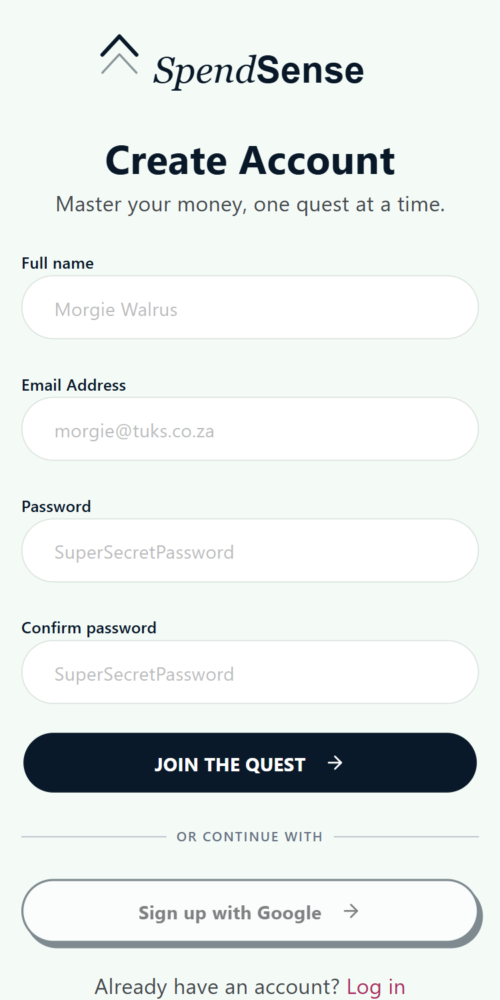

1. Open the SpendSense website and select **Get Started** on the top or bottom of the Landing page.
2. Enter your **Full name**, **Email Address**, and a **Password**, then type the same password again under **Confirm password**.
3. Tap **Join the quest** to create your account.
4. If you already have a SpendSense account, tap **Log in** at the bottom of the screen instead.

### Logging in

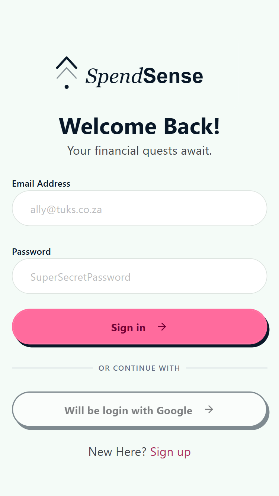

1. Open the SpendSense website and select **Get Started** on the top or bottom of the Landing page.
2. Tap **Log in** at the bottom of the screen of the Sign Up page.
3. Enter your **Email Address** and **Password**.
4. Tap **Sign in**.
5. If you do not have an account yet, tap **Sign up** at the bottom of the screen.

### Setting up your preferences

The first time you create an account, SpendSense asks a few quick questions so it can tailor itself to your needs before dropping you at the Dashboard.

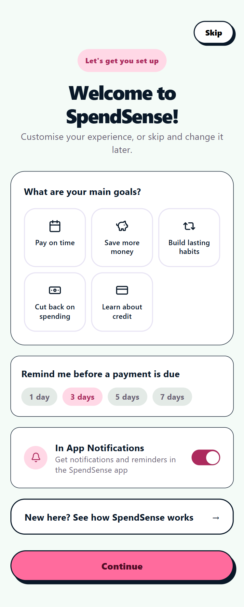

1. **What are your main goals?** Pick as many as apply: Pay on time, Save more money, Build lasting habits, Cut back on spending, or Learn about credit.
2. **Remind me before a payment is due.** Choose how much notice you want: 1, 3, 5, or 7 days.
3. **In App Notifications.** A toggle to turn in-app notifications and reminders on or off.
4. Tap **Continue** to finish setup and land on your Dashboard, or tap **Skip** in the top right at any point to go straight in and set these later from Settings.

If you want a walkthrough of how the app works before continuing, tap **New here? See how SpendSense works** to open the Getting Started guide (also covered in [Section 15](#15-help-and-support)).

Returning users who log in instead of signing up go straight to the Dashboard and will not see this setup screen again. These can, however, be changed in settings again.

---

## 3. Finding Your Way Around

Once you have logged in, a bottom navigation bar is available. It has five buttons:

| Icon | Name | What it does |
|---|---|---|
| House | Home | Takes you to the Dashboard |
| Calendar | Calendar | Opens the Calendar |
| Plus (centre, dark circle) | Add | Opens the menu to add a new obligation or log a new payment |
| Trophy | Quests | Opens your quests and quizzes |
| Person | Profile | Opens your profile, settings, and account tools |

Most of the screens also have a pink back arrow in the top left that returns you to the previous screen.

---

## 4. The Dashboard

The Dashboard is your home page. It's' the first thing you see when you log in, and it is reachable at any time by tapping **Home** in the bottom navigation.

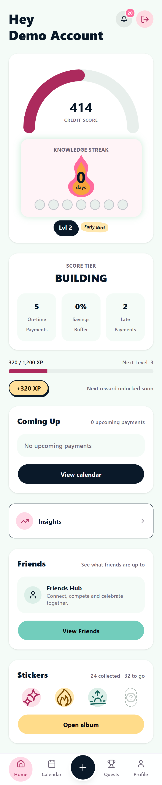

From the top of the screen down, the Dashboard shows:

- **A greeting** with your display name, a bell icon for notifications (with an unread count), and a logout button.
- **Your simulated credit score**, shown on a curved 0 to 850 gauge. This score reacts to your financial behaviour: payments that are on time push it up, late or missed payments bring it down.
- **Your Knowledge Streak**, which counts the number of days in a row you have checked in and engaged with the learning quizzes.
- **Your level and a tier badge** (for example "Early Bird").
- **A score tier card**, such as "Building", along with the number of payments on time, your savings buffer percentage, and the number of late payments.
- **Your XP progress bar**, showing progress toward the next level.
- **Coming Up**, a preview of your upcoming payments, with a button to go to the Calendar.
- **An Insights shortcut**, linking to a deeper breakdown of your spending.
- **A Friends shortcut**, linking to the Friends Hub.
- **A Stickers preview**, showing how many stickers you have collected out of the total, with a button to open the full album.

### How to get here

Tap **Home** in the bottom navigation from anywhere in the app.

---

## 5. Adding an Obligation

An obligation is anything you owe money on a repeating or scheduled basis: rent, a subscription, a utility bill, a "Buy Now, Pay Later" instalment, or a personal IOU. Adding one tells SpendSense to build a payment schedule for it and start reminding you about it.

### How to get here

Tap the circular **+** button in the centre of the bottom navigation, then choose to add a new obligation.

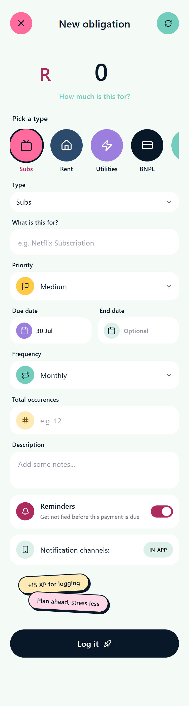

### What to fill in

1. **Amount**, the value of each payment.
2. **Type**, chosen from a row of icons: Subs, Rent, Utilities, BNPL, and some others. The Type field below the icons updates to match your choice.
3. **What is this for**, a short name such as "Showmax Subscription".
4. **Priority**, Low, Medium, High, or Critical.
5. **Due date**, when the next payment is due.
6. **End date** (optional), if the obligation has a known end.
7. **Frequency**, for example Monthly.
8. **Total occurrences** (optional), if you know how many payments there will be in total, such as with instalments.
9. **Description** (optional notes for yourself).
10. **Reminders**, a toggle to turn reminders on or off for this obligation.

Logging an obligation earns you a small amount of XP. Click **Log it** to save the obligation.

Once saved, the obligation appears on your Calendar with a payment schedule already worked out.

---

## 6. Logging a Payment

Once an obligation is due, or once you have actually paid it, you log the payment so SpendSense can update your record, your score, and your rewards.

### How to get here

There are two paths:

- Tap the **+** button in the bottom navigation and choose to log a payment.
- From the Calendar, tap an obligation that is due or overdue and select **Tap to pay**.

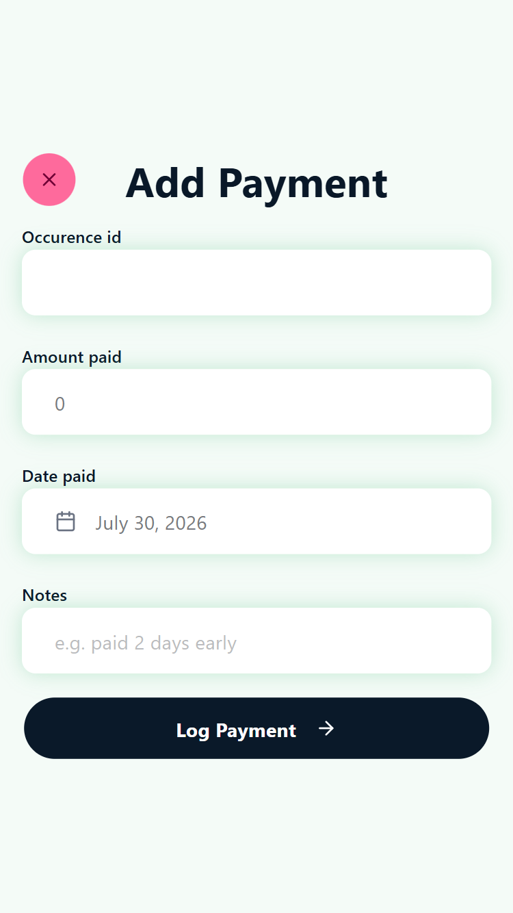

### What to fill in

1. **Occurrence ID**, which identifies which scheduled payment you are settling. This is already filled in for you when you log a payment from the Calendar page.
2. **Amount paid**.
3. **Date paid**.
4. **Notes** (optional), for example "paid 1 day early".

Tap **Log Payment** to save it.

### What happens after you log a payment

- If you paid on or before the due date, the payment is marked on time, your score can go up, your payment streak can grow, and you could earn coins, XP, or a badge.
- If you paid after the due date, the payment is marked late. SpendSense calculates a simulated interest cost so you can see the consequence of paying late, and your score is brought down based on how late it was.
- If a payment is not logged within a month of the due date, SpendSense automatically marks it as missed, which lowers your score and can break your payment streak.

---

## 7. The Calendar

The Calendar shows every payment you owe, laid out by day, so you can see at a glance what is paid, what is coming up, and what has been missed. You can also see all of your payments due for the month when there isn't a specific day selected.

### How to get here

Tap **Calendar** in the bottom navigation.

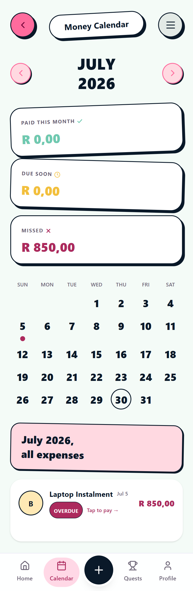

At the top of the page you can move between months using the arrows next to the name of the month. There are three summary cards taht show show:

- **Paid this month**, the total you have already settled.
- **Due soon**, upcoming payments that have not been paid yet.
- **Missed**, anything that went unpaid past the due date.

Below the summary cards is a month grid. Days with a payment due are marked with a coloured dot, and the current day is circled, while the day that you have clicked on is underlined. Underneath the calendar, a list shows every obligation that's active that month, including its due date and a status tag. Tapping **Tap to pay** on any item opens the Add Payment screen with that occurrence already selected.

### If a payment is overdue

Overdue items are clearly labelled in red. Tap the item and use **Tap to pay** to log the payment as soon as you can. Logging it stops further score damage from continuing to build up and starts your recovery.

---

## 8. Insights

Insights breaks down where your money is going and highlights patterns in your habits.

### How to get here

Tap **Insights** from the Dashboard, or navigate to it from Profile.

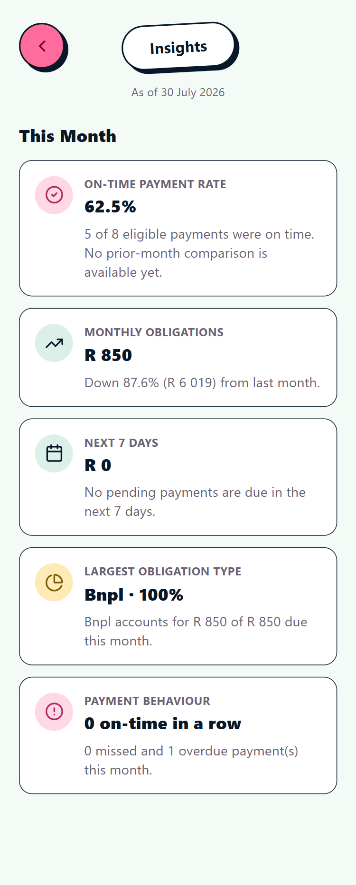

The Insights page is organised into cards covering the current month:

- **On-time payment rate**, the percentage of eligible payments made on time, with a comparison to the month before once enough history exists.
- **Monthly obligations**, your total amount due this month, with the percentage change from last month.
- **Next 7 days**, how much is due in the coming week.
- **Largest obligation type**, which category (for example BNPL) makes up the biggest share of what you owe.
- **Payment behaviour**, your current on-time streak in a row, along with a count of missed and overdue payments this month.

---

## 9. Quests and Your Knowledge Streak

Quests are how SpendSense turns good financial habits and financial literacy into a game. Completing them earns you XP, coins, and stickers.

### How to get here

Tap **Quests** in the bottom navigation.

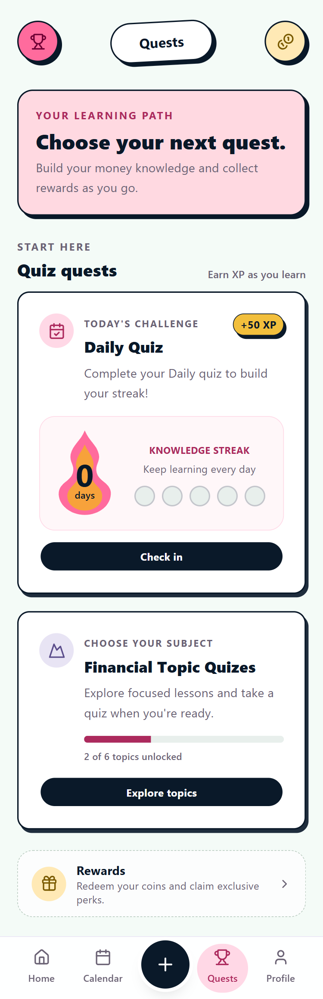

### What you will find

- **Today's Challenge**, a Daily Quiz worth XP that helps you build your Knowledge Streak. Tap **Check in** to complete it for the day.
- **Knowledge Streak**, a visual counter of how many days in a row you have checked in. Missing a day resets the counter.
- **Financial Topic Quizzes**, a set of focused lessons and quizzes grouped by topic. A progress bar shows how many topics you have unlocked. Tap **Explore topics** to open them.
- **Rewards**, where you can redeem coins you have earned for perks.

---

## 10. Sticker Album

The Sticker Album is your collection of earned badges. Every milestone in SpendSense, from logging your first obligation to hitting a payment streak, has a sticker attached to it.

### How to get here

Tap **Open album** on the Dashboard, or open it from Profile.

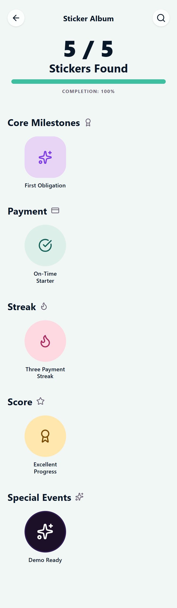

At the top, a counter shows how many stickers you have found out of the total, as well as a completion percentage bar. Below that, the stickers are grouped into categories:

- **Core Milestones**, for example First Obligation.
- **Payment**, for example On-Time Starter.
- **Streak**, for example Three Payment Streak.
- **Score**, for example Excellent Progress.
- **Special Events**, limited or seasonal stickers.

---

## 11. Friends Hub

Friends Hub is where the social side of SpendSense lives: connecting with friendsand comparing progress.

### How to get here

Tap **View Friends** on the Dashboard, or open **Friends & Social** from Profile.

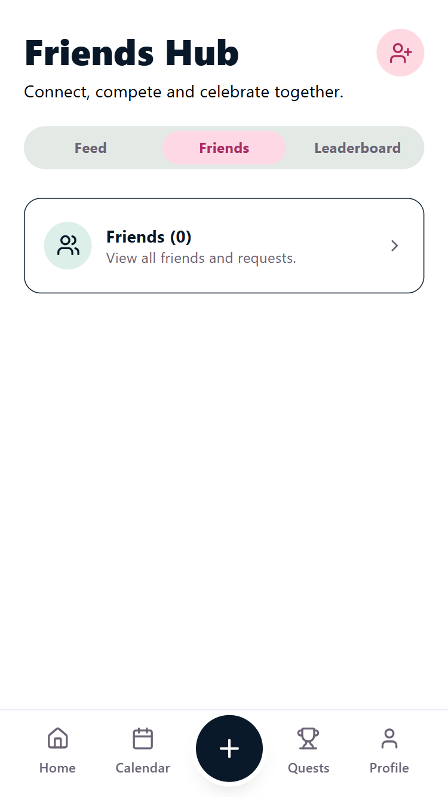

The Friends Hub has three tabs:

- **Feed**, updates from people you are connected with.
- **Friends**, the list of people you are currently connected to, along with a count.
- **Leaderboard**, a ranking of you and your friends based on progress.

Tap the person-plus icon in the top right to send a new friend request.

---

## 12. Profile

Profile is your personal identity and settings hub. It shows who you are in the app and links out to everything account related.

### How to get here

Tap **Profile** in the bottom navigation.

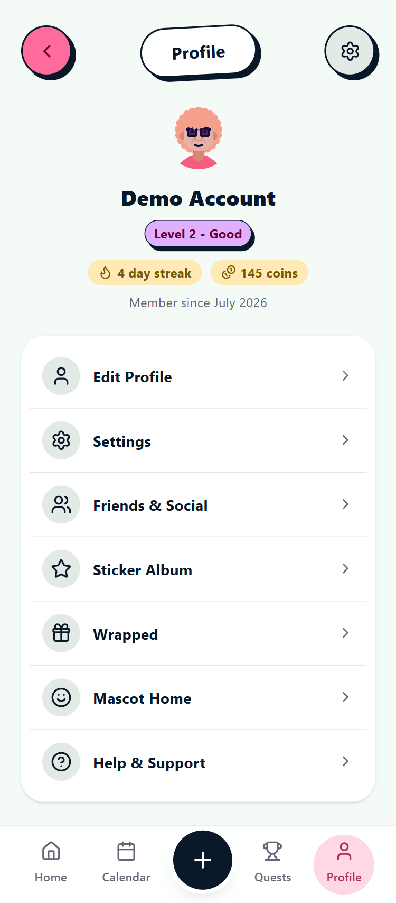

At the top you will see your avatar, display name, current level and tier (for example "Level 2, Good"), your streak in days, your coin balance, and the month and year you joined. Below that is a list of links:

- **Edit Profile**, update your display name and see basic account details.
- **Settings**, general preferences, notifications, and account tools.
- **Friends & Social**, opens the Friends Hub.
- **Sticker Album**, opens your badge collection.
- **Wrapped**, a summary look back at your activity.
- **Mascot Home**, your customisable in-app mascot.
- **Help & Support**, the in-app help centre.

### Editing your profile

Tap **Edit Profile** to open the edit screen.

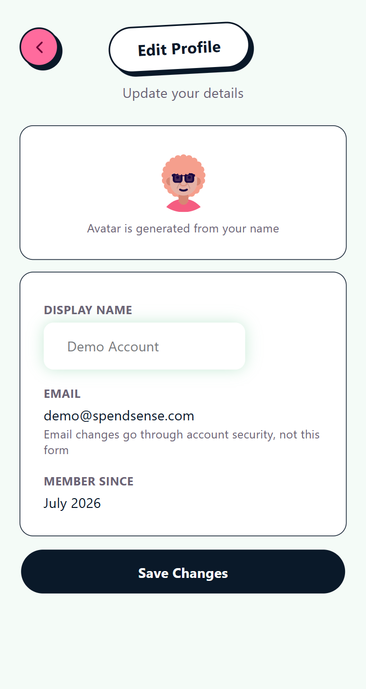

Your avatar is generated automatically from your display name. You can change your **Display Name** here. Your **Email** is shown for reference only. Changing it is not done on this screen, it goes through account security instead, since email changes affect how you log in. Your **Member Since** date is also shown for reference. Tap **Save Changes** once you are done.

---

## 13. Settings

Settings is where you control how SpendSense behaves for you: general preferences, what you get notified about, and account level actions.

### How to get here

Open **Profile**, then tap **Settings**, or tap the gear icon in the top right of the Profile screen.

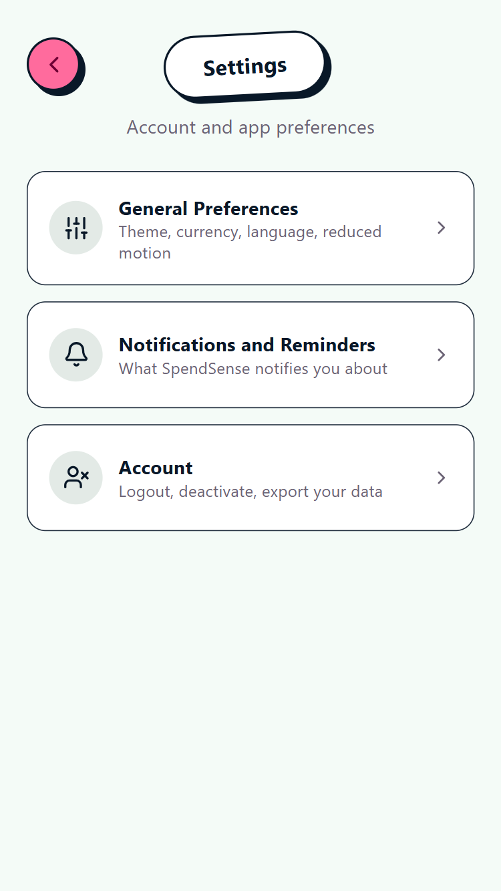

Settings is split into three sections:

- **General Preferences**, theme, currency, language, and reduced motion.
- **Notifications and Reminders**, turn on or off notifications and reminders, and choose when you want to receive them.
- **Account**, logout, deactivate your account, and export your data.

---

## 14. Notifications

Notifications keep you informed about payments coming up, payments that were missed, and anything else that needs your attention.

### How to get here

Tap the bell icon in the top right of the Dashboard. The number badge on the bell shows how many notifications are unread.

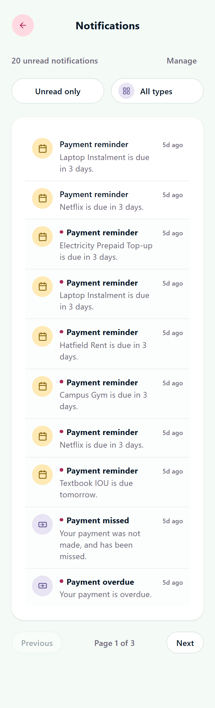

At the top of the page you can see how many notifications are unread, along with a **Manage** link. Two filters let you narrow the list: **Unread only** and **All types**. Notifications you have not read yet are marked with a small dot. Common notification types include:

- **Payment reminder**, telling you an obligation is due soon, for example "due in 3 days".
- **Payment missed**, telling you a payment was not made and has now been marked missed.
- **Payment overdue**, telling you a payment is now overdue.

The list is paginated, with **Previous** and **Next** buttons and a page indicator at the bottom.

---

## 15. Help and Support

Help and Support is the in-app help centre. It repeats the getting started walkthrough, and answers common questions.

### How to get here

Open **Profile**, then tap **Help & Support**.

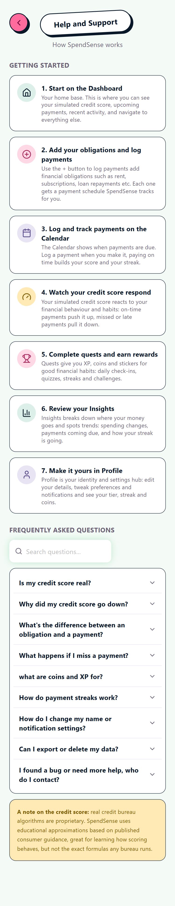

### Getting Started

The same seven step walkthrough shown to new users lives here permanently:

1. **Start on the Dashboard.** Your home base, where you see your simulated credit score, upcoming payments, recent activity, and links to everything else.
2. **Add your obligations and log payments.** Use the plus button to log payments and add financial obligations such as rent, subscriptions, and loan repayments. Each one gets a payment schedule SpendSense tracks for you.
3. **Log and track payments on the Calendar.** The Calendar shows when payments are due. Logging a payment when you make it, and paying on time, builds your score and your streak.
4. **Watch your credit score respond.** Your simulated credit score reacts to your financial behaviour and habits. On-time payments push it up, missed or late payments pull it down.
5. **Complete quests and earn rewards.** Quests give you XP, coins, and stickers for good financial habits: daily check-ins, quizzes, streaks, and challenges.
6. **Review your Insights.** Insights breaks down where your money goes and spots trends: spending changes, payments coming due, and how your streak is going.
7. **Make it yours in Profile.** Profile is your identity and settings hub: edit your details, tweak preferences and notifications, and see your tier, streak, and coins.

### Frequently Asked Questions

A searchable FAQ list is provided, covering questions such as:

- Is my credit score real?
- Why did my credit score go down?
- What is the difference between an obligation and a payment?
- What happens if I miss a payment?
- What are coins and XP for?
- How do payment streaks work?
- How do I change my name or notification settings?
- Can I export or delete my data?
- I found a bug or need more help, who do I contact?

Tap any question to expand its answer, or use the search box to jump straight to a topic.

---

## 16. Glossary

| Term | Meaning |
|---|---|
| Obligation | A recurring or scheduled amount you owe, such as rent, a subscription, or a loan instalment. |
| Occurrence | One specific scheduled instance of an obligation's payment, for example this month's rent. |
| Payment | A record that you actually paid an occurrence, including the date and amount paid. |
| Simulated credit score | An educational, 0 to 850 score that reacts to your payment behaviour. It is not a real credit bureau score. |
| Score tier | A band your score falls into, such as Building, Fair, Good, Excellent, or Elite. |
| Payment streak | The number of on-time payments in a row you have made. |
| Knowledge streak | The number of days in a row you have checked in and engaged with quizzes. |
| XP | Experience points earned from good habits, which contribute to your level. |
| Coins | An in-app currency earned from good habits, which can be spent on rewards. |
| Sticker / badge | A collectible reward unlocked by reaching a milestone. |

---

*This manual reflects the current state of the SpendSense application.
