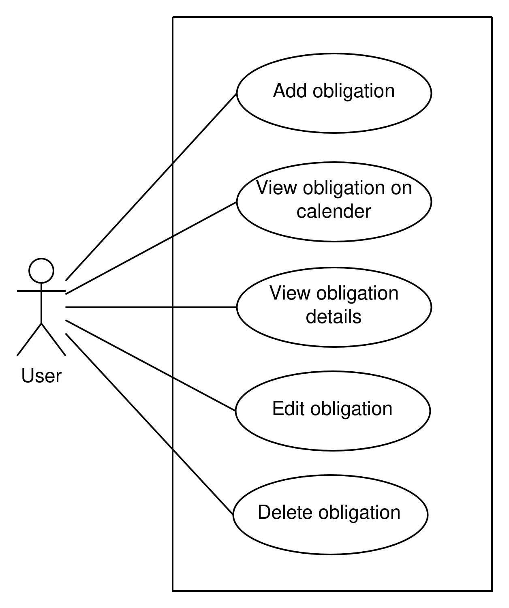
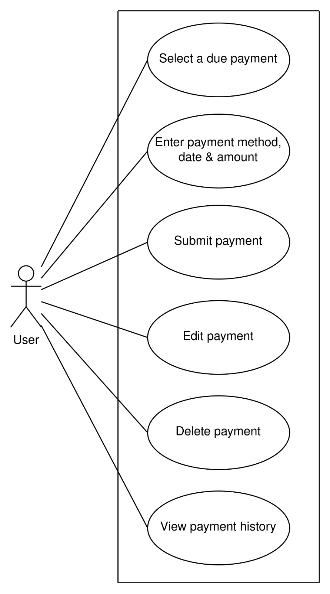
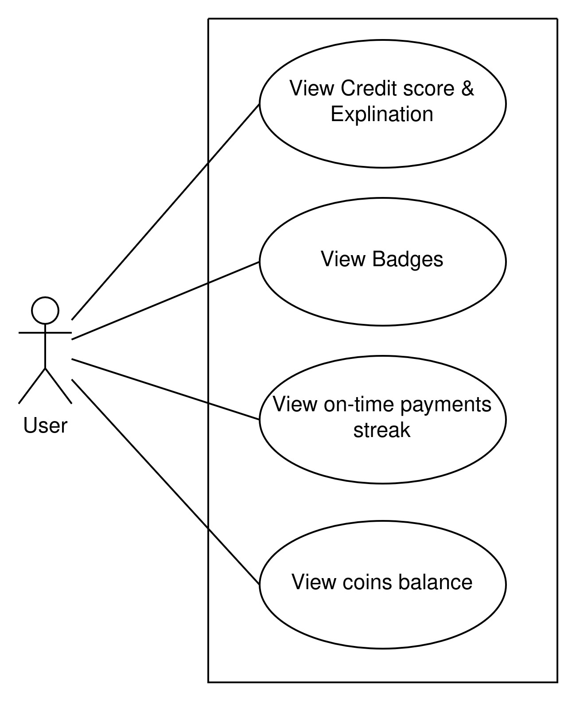
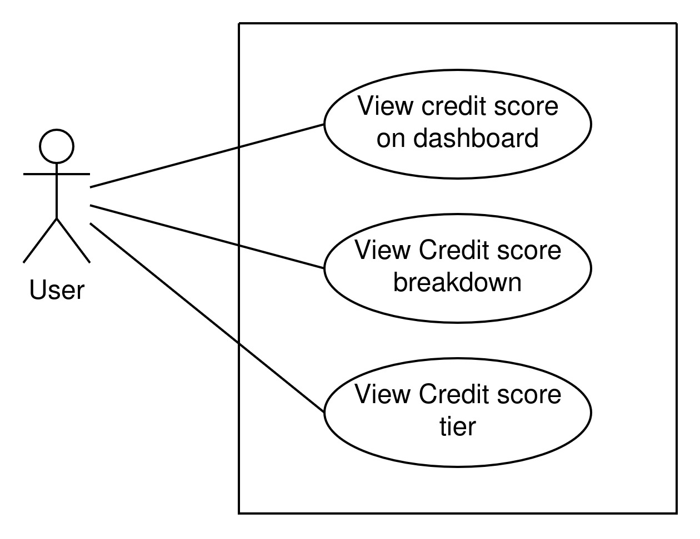
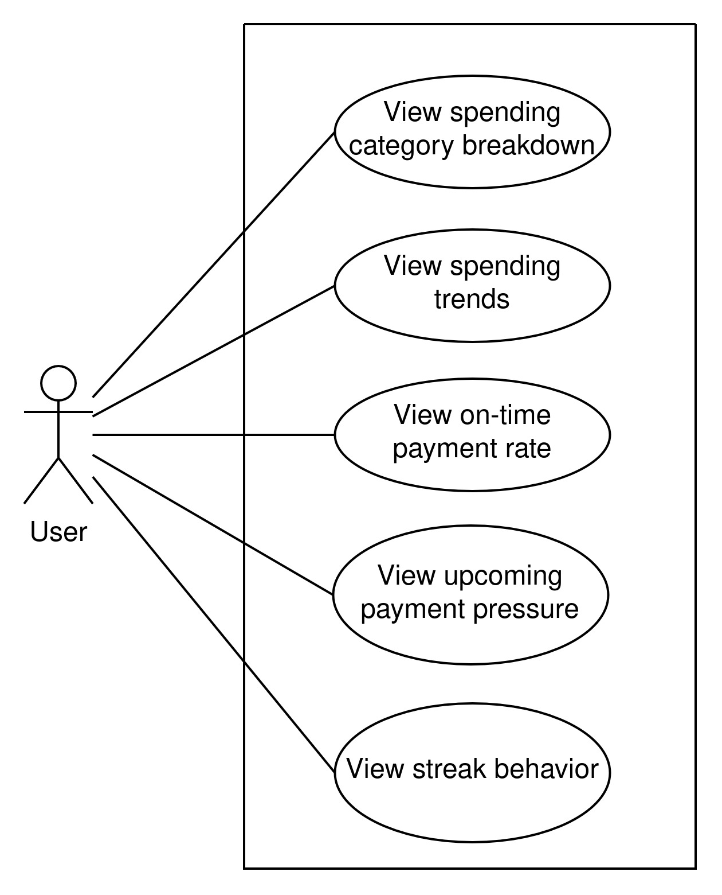
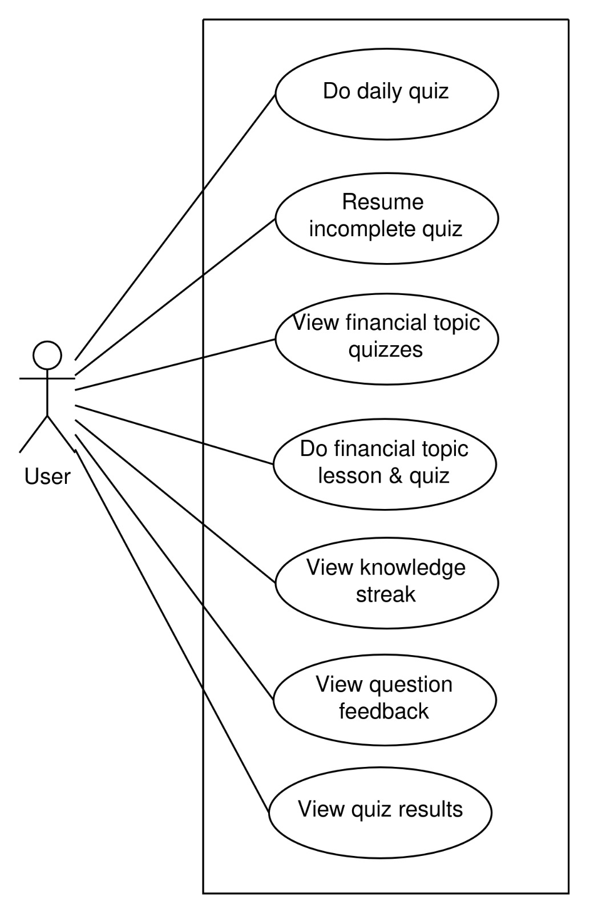
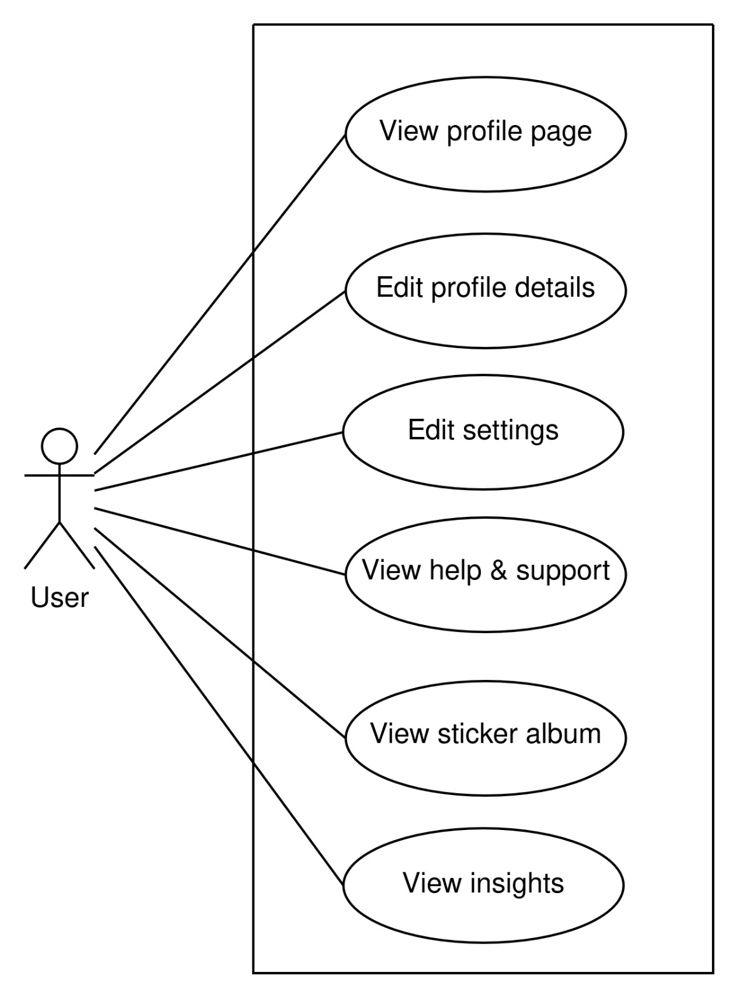
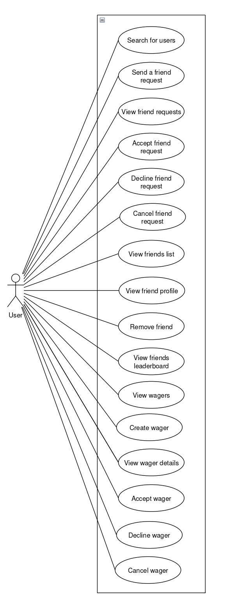
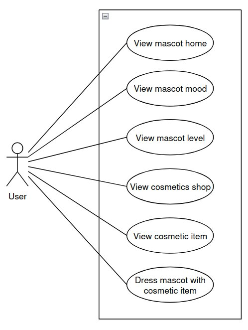
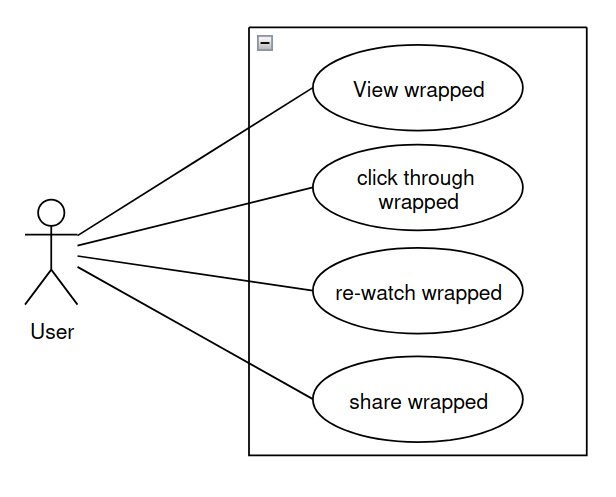

# SpendSense: Software Requirements Specification (SRS)

## Table of Contents

- [1. Introduction](#1-introduction)
- [2. User Stories](#2-user-stories)
- [3. Use Cases](#3-use-cases)
- [4. Functional Requirements](#4-funtional-requirements)
- [5. Non-Functional Requirements](#5-non-functional-requirements)
  - [NFR1 Security](#nfr1-security)
  - [NFR2 Portability](#nfr2-portability)
  - [NFR3 Maintainability](#nfr3-maintainability)
  - [NFR4 Availability](#nfr4-availability)
  - [NFR5 Usability](#nfr5-usability)
  - [Quantified Non-Functional Requirements](#quantified-non-functional-requirements)
  - [Traceability Matrix](#tracability-matrix)
- [6. Domain Model](#6-domain-model)

## 1. Introduction
SpendSense is a gamified financial management and financial literacy system intended to assist individuals to manage their financial commitments, learn about their payment behavior, and create better financial habits.

Most users, especially students and young people, find it challenging to keep up with their financial obligations, payment deadlines, and the impact their non-payment or delays will have on their financial health. Information about finances is scattered over various platforms, and therefore users do not always have a clear idea of what financial obligations they have, when the deadlines are coming, and what aspects of their financial behavior they should be worried about. As a consequence, users may miss the payments, plan poorly their finances, experience unnecessary financial stress, and lack financial knowledge.

The business need for SpendSense is driven by the need for an accessible and fun financial management system that will do more than just keep a record of the transactions. Users require a centralized system that will remind them about their future financial obligations, explain the impact of their payments, and motivate them to behave in a responsible manner regarding finance. Users also need comprehensible financial insights and educational materials to enhance their financial literacy.

SpendSense overcomes these problems by integrating the features of financial obligations management, payment monitoring, notifications, financial health score, rule-based insights, financial literacy quiz, and gamification in one single web application. The platform allows users to manage financial obligations, view future payments in a financial calendar, record payments made, get notifications and alerts, track a simulated explainable credit-health score, check financial insights, participate in financial literacy quizzes, earn experience points and coins, maintain streaks of payments and knowledge, win stickers, and manage their user profiles and application settings.

The scope of the SpendSense system and Demo 2 features include:
- User Authentication and Account Management
- User Profile and Application Preferences Management
- Dash Board Based Financial Summaries and Progress
- Financial Calendar and Payment Occurrence Tracking
- Financial Obligation and Recurring Payments Scheduling
- Payment Logging and Payment History Management
- Explainable Simulated Credit-Health Score Calculation
- Rule-Based Financial Statistics and Insights
- Daily and Topic-Based Financial Literacy Quizzes
- In App Payment Reminders and Notifications
- Payment and Knowledge Streaks Management
- Gamification Through Experience Points, Coins, Stickers and Badges
- In Application Help Resource, Tutorials and Frequently Asked Questions

The demo 2 scope will be based on five integrated use cases: simulated credit-health score, statistics based financial insights, financial literacy quizzes, notifications and reminders, and profile, settings and help.

Functionalities like receipt scanning and optical character recognition, AI-generated financial advice, advanced expense tracking, social features, leaderboards, mascot customisation, and Monthly Wrapped summaries are considered to be future features. They are not included in the committed Demo 2 scope because they will not be part of the functionality demonstrated and tested in Demo 2.

## 2. User Stories

### US1: Financial Obligation Management
#### US1.1: Add obligation
###### User story
As a User  
I want to add a new financial obligation  
So that I can track recurring or one-off payments and receive reminders before they are due  
###### Acceptance criteria
Given I am logged into the app and have opened the New obligation page  
When I enter the obligation amount, type, reason, priority, due date, optional end date, payment frequency, total occurrences, description, reminder choice, and notification medium, and select “Log it”  
Then the obligation is saved and the required payment occurrences and in-app reminders are created  

#### US1.2: View obligation on calender
###### User story
As a User  
I want to view my financial obligations on the calendar  
So that I can see when each payment is due and whether it still requires attention  
###### Acceptance criteria
Given I have at least one financial obligation with generated payment occurrences  
When I open the financial calendar  
Then I can see the obligation and its payment occurrences together with their due dates, amounts, and payment statuses  

#### US1.3: View obligation details
###### User story
As a User  
I want to view the details of a financial obligation  
So that I can understand the full payment schedule and the information saved for that obligation  
###### Acceptance criteria
Given I am viewing the calendar or another available obligation view  
When I select a financial obligation or one of its payment occurrences  
Then I can see its amount, type, reason, priority, due date, optional end date, frequency, number of occurrences, description, reminder setting, notification channel, and payment status  

#### US1.4: Edit obligation
###### User story
As a User  
I want to edit an existing financial obligation  
So that I can correct or update its payment and reminder information  
###### Acceptance criteria
Given an existing financial obligation belongs to my account  
When I open the obligation, edit its information, and save the changes  
Then the updated obligation is stored and its affected future payment occurrences and reminders are updated  

#### US1.5: Delete obligation
###### User story
As a User  
I want to delete an existing financial obligation  
So that obligations that are no longer relevant do not remain in my active financial records  
###### Acceptance criteria
Given an existing financial obligation belongs to my account  
When I select the option to delete the obligation and confirm the action  
Then the obligation is removed from my active obligations and its future occurrences and reminders no longer appear on the calendar  

### US2: Logging Payments
#### US2.1: Select a due payment
###### User story
As a User  
I want to select a due payment from the dashboard or calendar  
So that I can record a payment against the correct financial obligation  
###### Acceptance criteria
Given I have at least one outstanding payment occurrence  
When I select the payment from the dashboard or calendar  
Then the Add Payment page displays the selected obligation name, payment type, payment status, and expected amount  

#### US2.2: Enter payment method, date & amount
###### User story
As a User  
I want to enter the payment method, payment date, amount, and optional notes  
So that the system can accurately record how and when the payment was made  
###### Acceptance criteria
Given I have selected an outstanding payment occurrence  
When I enter valid payment details  
Then the payment information is accepted and is ready to be submitted  

#### US2.3: Submit payment
###### User story
As a User  
I want to submit the completed payment information  
So that the payment is recorded and my financial progress is updated  
###### Acceptance criteria
Given I have selected a payment occurrence and entered valid payment information  
When I select “Log Payment”  
Then the payment is saved, the payment occurrence status is updated, and the related financial-health score, rewards, and streaks are recalculated where applicable  

#### US2.4: Edit payment
###### User story
As a User  
I want to edit a payment that I previously recorded  
So that I can correct inaccurate payment information  
###### Acceptance criteria
Given an existing payment record belongs to my account  
When I open the payment, update its amount, date, payment method, or notes, and save the changes  
Then the edited payment is stored and the related payment and financial-health information is updated  

#### US2.5: Delete payment
###### User story
As a User  
I want to delete an incorrect or duplicate payment  
So that my payment history and financial-health information remain accurate  
###### Acceptance criteria
Given an existing payment record belongs to my account  
When I select the option to delete the payment and confirm the action  
Then the payment is removed and the related payment occurrence and financial-health information are updated accordingly  

#### US2.6: View payment history
###### User story
As a User  
I want to view my payment history  
So that I can review the payments I have made toward my financial obligations  
###### Acceptance criteria
Given I have previously recorded one or more payments  
When I open the payment history  
Then I can see my previous payments together with their amounts, payment dates, associated obligations, and payment statuses  

### US3: Gamification & Rewards
#### US3.1: View Credit score & Explination
###### User story
As a User  
I want to view my simulated credit score and its explanation  
So that I can understand my current financial-health position and the reasons for it  
###### Acceptance criteria
Given my account has financial-health information  
When I open the dashboard or credit score page  
Then I can see my current simulated credit score, score tier, score breakdown, and an explanation of the factors affecting the score  

#### US3.2: View Badges
###### User story
As a User  
I want to view my earned and locked badges  
So that I can track my achievements and understand how to earn additional rewards  
###### Acceptance criteria
Given I am logged into the application  
When I open the badge or sticker collection page  
Then I can see the badges I have earned, the badges that remain locked, and the requirements for earning each badge  

#### US3.3: View on-time payments streak
###### User story
As a User  
I want to view my on-time payment streak  
So that I can monitor how consistently I make payments by their due dates  
###### Acceptance criteria
Given I have recorded payment activity  
When I open the dashboard, profile, or gamification page  
Then I can see my current on-time payment streak and my longest recorded on-time payment streak  

#### US3.4: View coins balance
###### User story
As a User  
I want to view my coins balance  
So that I know how many coins I have earned from financial activities and rewards  
###### Acceptance criteria
Given I have completed activities that can award coins  
When I open a page that displays my gamification progress  
Then I can see my current coins balance  

### US4: Credit Score
#### US4.1: View credit score on dashboard
###### User story
As a User  
I want to view my simulated credit score on the dashboard  
So that I can quickly understand my current financial-health position  
###### Acceptance criteria
Given I am logged into the application  
When I open the dashboard  
Then I can see my current simulated credit score and its most recent movement  

#### US4.2: View Credit score breakdown
###### User story
As a User  
I want to view the breakdown of my simulated credit score  
So that I can understand which parts of my financial behaviour contribute to the score  
###### Acceptance criteria
Given my simulated credit score has been calculated  
When I open the credit score breakdown  
Then I can see the contributing factors, their effect on the score, and any applicable risk conditions or explanations  

#### US4.3: View Credit score tier
###### User story
As a User  
I want to view the tier associated with my simulated credit score  
So that I can understand how the system classifies my current financial-health position  
###### Acceptance criteria
Given my simulated credit score has been calculated  
When I view the dashboard or credit score details  
Then I can see the tier that corresponds to my current score  

### US5: Stats-based Insights
#### US5.1: View spending category breakdown
###### User story
As a User  
I want to view a breakdown of my financial obligations by category  
So that I can understand where my committed money is going  
###### Acceptance criteria
Given I have financial obligations assigned to categories  
When I open the spending category breakdown on the insights page  
Then I can see how my obligations are distributed across the available categories  

#### US5.2: View spending trends
###### User story
As a User  
I want to view changes in my financial obligations over time  
So that I can see whether my committed spending is increasing, decreasing, or remaining stable  
###### Acceptance criteria
Given I have obligation data for the current and previous periods  
When I open the spending trends insight  
Then I can compare the current obligation total with the previous period and see the direction of change  

#### US5.3: View on-time payment rate
###### User story
As a User  
I want to view my on-time payment rate  
So that I can measure how reliably I make payments by their due dates  
###### Acceptance criteria
Given I have recorded payment outcomes  
When I open the on-time payment rate insight  
Then I can see the percentage of my payments made on time and its comparison with the previous period where sufficient data exists  

#### US5.4: View upcoming payment pressure
###### User story
As a User  
I want to view my upcoming payment pressure  
So that I can prepare for financial obligations that are due soon  
###### Acceptance criteria
Given I have payment occurrences due within the upcoming period  
When I open the upcoming payment pressure insight  
Then I can see the number and total value of the upcoming payments and whether they represent increased financial pressure  

#### US5.5: View streak behavior
###### User story
As a User  
I want to view insights about my recent payment behaviour  
So that I can identify positive payment streaks and behaviour that requires improvement  
###### Acceptance criteria
Given I have recent payment activity  
When I open the streak behaviour insight  
Then I can see behaviour-based information such as consecutive on-time payments and late or missed payments during the current period  

### US6: Financial Literacy Quiz
#### US6.1: Do daily quiz
###### User story
As a User  
I want to complete a daily financial literacy quiz  
So that I can improve my financial knowledge and earn gamification progress  
###### Acceptance criteria
Given today’s daily quiz is available to me  
When I answer all required questions correctly and complete the session  
Then the quiz is marked as complete and I receive the applicable coins, experience points, and knowledge streak progress  

#### US6.2: Resume incomplete quiz
###### User story
As a User  
I want to resume an incomplete quiz  
So that I can continue without losing the progress I already made  
###### Acceptance criteria
Given I have an unfinished quiz session  
When I return to the quiz page  
Then the existing session is restored and I continue from the current question with my previous progress retained  

#### US6.3: View financial topic quizzes
###### User story
As a User  
I want to view the available financial topic quizzes  
So that I can choose a financial subject that I want to learn about  
###### Acceptance criteria
Given financial topic quizzes are available  
When I open the topic quiz selection page  
Then I can see the available financial topics and select one to continue  

#### US6.4: Do financial topic lesson & quiz
###### User story
As a User  
I want to complete a lesson and quiz for a selected financial topic  
So that I can learn the concept before testing my understanding  
###### Acceptance criteria
Given I have selected an available financial topic  
When I read its lesson and correctly answer all required quiz questions  
Then the topic quiz is completed and I receive the applicable results and rewards  

#### US6.5: View knowledge streak
###### User story
As a User  
I want to view my knowledge streak  
So that I can monitor how consistently I complete financial learning activities  
###### Acceptance criteria
Given I have completed financial literacy quizzes  
When I open the quiz, dashboard, or profile page  
Then I can see my current knowledge streak and my longest recorded knowledge streak  

#### US6.6: View question feedback
###### User story
As a User  
I want to receive feedback after answering a quiz question  
So that I can understand why my answer was correct or incorrect  
###### Acceptance criteria
Given I am completing an active quiz session  
When I select and submit an answer  
Then the system shows whether the answer is correct or incorrect, provides an explanation, and requeues the question when required  

#### US6.7: View quiz results
###### User story
As a User  
I want to view my quiz results  
So that I can review my performance and the progress earned from the completed session  
###### Acceptance criteria
Given I have correctly answered all questions required to complete the quiz  
When the quiz session ends  
Then I can see the quiz result summary and any applicable coins, experience points, and knowledge streak changes  

### US7: Notifications & Reminders
#### US7.1: View notifications inbox
###### User story
As a User  
I want to view my notifications inbox  
So that I can see important reminders, warnings, score changes, and rewards  
###### Acceptance criteria
Given notifications exist for my account  
When I select the notification icon and open the inbox  
Then I can see my payment reminders, overdue payment notifications, credit score changes, and badge or reward notifications together with their read or unread statuses  

#### US7.2: Mark notification as read
###### User story
As a User  
I want to mark a notification as read  
So that I can distinguish notifications I have already reviewed from those that still require attention  
###### Acceptance criteria
Given an unread notification exists in my inbox  
When I open it or select the option to mark it as read  
Then the notification is marked as read and my unread notification count is updated  

#### US7.3: Filter notifications by type
###### User story
As a User  
I want to filter my notifications by type  
So that I can find a particular category of notification more easily  
###### Acceptance criteria
Given my notification inbox contains notifications of different types  
When I choose a notification type filter  
Then the inbox displays only notifications that match the selected type  

#### US7.4: Set reminders preferences
###### User story
As a User  
I want to set how many days before a payment I receive a reminder  
So that payment reminders are delivered according to my preferred notice period  
###### Acceptance criteria
Given I am logged into the application and have opened the reminder settings  
When I choose the number of days before a payment and save the preference  
Then the preference is stored and used when scheduling future in-app payment reminders  

#### US7.5: Manage inbox
###### User story
As a User  
I want to manage the notifications in my inbox  
So that I can keep track of which notifications still require my attention  
###### Acceptance criteria
Given my notification inbox contains one or more notifications  
When I open, select, mark as read, or remove supported notifications  
Then the selected actions are applied and the inbox and unread count are updated accordingly  

### US8: Profile Page
#### US8.1: View profile page
###### User story
As a User  
I want to view my profile page  
So that I can see my account information and overall financial and gamification progress  
###### Acceptance criteria
Given I am logged into the application  
When I select the profile option from the application navigation  
Then I can see my profile information, credit score tier, payment and knowledge streaks, coins, experience points, and rewards  

#### US8.2: Edit profile details
###### User story
As a User  
I want to edit my profile details  
So that my personal and financial profile information remains accurate  
###### Acceptance criteria
Given I have opened my profile page  
When I update supported details such as my display name, profile picture, or monthly budget and save the changes  
Then the updated information is stored and displayed on my profile page  

#### US8.3: Edit settings
###### User story
As a User  
I want to edit my application settings  
So that the application reflects my personal preferences  
###### Acceptance criteria
Given I have opened the settings page  
When I update one or more supported preferences and save the changes  
Then the selected preferences are stored in my account  

#### US8.4: View help & support
###### User story
As a User  
I want to view help and support information  
So that I can understand how the application’s financial and gamification features work  
###### Acceptance criteria
Given I am viewing the profile or settings page  
When I select the help and support option  
Then I can access frequently asked questions, tutorials, and explanations of the application’s financial and gamification features  

#### US8.5: View sticker album
###### User story
As a User  
I want to view my sticker album  
So that I can review the stickers I have earned and the stickers I can still unlock  
###### Acceptance criteria
Given I am logged into the application  
When I select the sticker album option from my profile page  
Then I can see my earned and locked stickers together with the available information for each sticker  

#### US8.6: View insights
###### User story
As a User  
I want to access my financial insights from my profile page  
So that I can review information derived from my obligations and payment behaviour  
###### Acceptance criteria
Given financial insight data is available for my account  
When I select the insights option from my profile page  
Then I can access my available financial statistics and insights based on my obligations and payment patterns  

### US9: Friends and Wagers
#### US9.1: Search for users
###### User story
As a User  
I want to search for other users  
So that I can find people I know and connect with them through the application  

###### Acceptance criteria
Given I am logged into the application  
When I enter information identifying another user into the user search  
Then I can see users matching the entered search information  

#### US9.2: Send a friend request
###### User story
As a User  
I want to send a friend request to another user  
So that I can add them as a friend and interact with them through the application  

###### Acceptance criteria
Given I have found another user who is not currently my friend  
When I select the option to send them a friend request  
Then the friend request is created and made available for the receiving user to accept or decline  

#### US9.3: View friend requests
###### User story
As a User  
I want to view my friend requests  
So that I can see which users have requested to become my friend  

###### Acceptance criteria
Given I am logged into the application  
When I open my friend requests  
Then I can see the pending friend requests that have been sent to me  

#### US9.4: Accept friend request
###### User story
As a User  
I want to accept a friend request  
So that the requesting user is added to my friends list  

###### Acceptance criteria
Given I have received a pending friend request  
When I select the option to accept the friend request  
Then the request is accepted and the requesting user is added to my friends list  

#### US9.5: Decline friend request
###### User story
As a User  
I want to decline a friend request  
So that I can reject a request from a user I do not want to add as a friend  

###### Acceptance criteria
Given I have received a pending friend request  
When I select the option to decline the friend request  
Then the request is declined and the requesting user is not added to my friends list  

#### US9.6: Cancel friend request
###### User story
As a User  
I want to cancel a friend request that I have sent  
So that I can withdraw a request that I no longer want to remain pending  

###### Acceptance criteria
Given I have sent a friend request that has not yet been accepted or declined  
When I select the option to cancel the friend request  
Then the pending friend request is removed and can no longer be accepted by the receiving user  

#### US9.7: View friends list
###### User story
As a User  
I want to view my friends list  
So that I can see the users that I am currently friends with  

###### Acceptance criteria
Given I am logged into the application  
When I open my friends list  
Then I can see the users that are currently my friends  

#### US9.8: View friend profile
###### User story
As a User  
I want to view a friend's profile  
So that I can see the information and progress they have made available to their friends  

###### Acceptance criteria
Given another user is currently on my friends list  
When I select the friend from my friends list  
Then I can see the profile information that is available for that friend  

#### US9.9: Remove friend
###### User story
As a User  
I want to remove an existing friend  
So that a user I no longer want as a friend does not remain on my friends list  

###### Acceptance criteria
Given another user is currently on my friends list  
When I select the option to remove the friend and confirm the action  
Then the friendship is removed and the user no longer appears on my friends list  

#### US9.10: View friends leaderboard
###### User story
As a User  
I want to view the friends leaderboard  
So that I can compare my progress and performance with my friends  

###### Acceptance criteria
Given I am logged into the application  
When I open the friends leaderboard  
Then I can see myself and my friends ranked according to the applicable leaderboard information  

#### US9.11: View wagers
###### User story
As a User  
I want to view my wagers  
So that I can see the wagers involving myself and my friends and their current statuses  

###### Acceptance criteria
Given I am logged into the application  
When I open the wagers page  
Then I can see the wagers associated with my account together with their relevant information and statuses  

#### US9.12: Create wager
###### User story
As a User  
I want to create a wager with a friend  
So that we can compete against each other through a financial challenge  

###### Acceptance criteria
Given I have selected a friend with whom I can create a wager  
When I enter the required wager information and create the wager  
Then the wager is stored and made available for the selected friend to accept or decline  

#### US9.13: View wager details
###### User story
As a User  
I want to view the details of a wager  
So that I can understand the conditions and current status of the wager  

###### Acceptance criteria
Given a wager is associated with my account  
When I select the wager  
Then I can see the stored information, conditions, and current status of the wager  

#### US9.14: Accept wager
###### User story
As a User  
I want to accept a wager sent to me by a friend  
So that I can participate in the proposed challenge  

###### Acceptance criteria
Given I have received a pending wager from a friend  
When I select the option to accept the wager  
Then the wager is accepted and becomes active between myself and the friend  

#### US9.15: Decline wager
###### User story
As a User  
I want to decline a wager sent to me by a friend  
So that I do not participate in a wager that I do not want to accept  

###### Acceptance criteria
Given I have received a pending wager from a friend  
When I select the option to decline the wager  
Then the wager is declined and does not become active  

#### US9.16: Cancel wager
###### User story
As a User  
I want to cancel a wager that I have created  
So that a wager I no longer want does not remain pending  

###### Acceptance criteria
Given I have created a wager that is still eligible to be cancelled  
When I select the option to cancel the wager  
Then the wager is cancelled and can no longer be accepted by the receiving user  

### US10: Mascot
#### US10.1: View mascot home
###### User story
As a User  
I want to view my mascot home  
So that I can interact with my mascot and see its current information  

###### Acceptance criteria
Given I am logged into the application  
When I open the mascot home  
Then I can see my mascot together with its current information and available options  

#### US10.2: View mascot mood
###### User story
As a User  
I want to view my mascot's mood  
So that I can see how my activity and financial behaviour are affecting my mascot  

###### Acceptance criteria
Given I have opened my mascot home  
When I view my mascot's current mood  
Then I can see the mood assigned to my mascot based on the applicable user activity and financial behaviour  

#### US10.3: View mascot level
###### User story
As a User  
I want to view my mascot's level  
So that I can see the progress I have made with my mascot

###### Acceptance criteria
Given I have opened my mascot home  
When I view my mascot's level information  
Then I can see its current level and applicable progress information  

#### US10.4: View cosmetics shop
###### User story
As a User  
I want to view the cosmetics shop  
So that I can browse cosmetic items that can be used to customise my mascot  

###### Acceptance criteria
Given I am logged into the application  
When I open the cosmetics shop  
Then I can see the cosmetic items that are available for my mascot  

#### US10.5: View cosmetic item
###### User story
As a User  
I want to view a cosmetic item  
So that I can see its information before using it on my mascot  

###### Acceptance criteria
Given I am viewing the cosmetics shop  
When I select a cosmetic item  
Then I can see the information associated with the selected cosmetic item  

#### US10.6: Dress mascot with cosmetic item
###### User story
As a User  
I want to dress my mascot with a cosmetic item  
So that I can customise the appearance of my mascot  

###### Acceptance criteria
Given I have access to a cosmetic item that can be worn by my mascot  
When I select the cosmetic item and choose to equip it  
Then the cosmetic item is applied to my mascot and its appearance is updated  

### US11: Monthly Wrapped
#### US11.1: View wrapped
###### User story
As a User  
I want to view my monthly wrapped  
So that I can see a summary of my financial progress, achievements, and activity for the month  

###### Acceptance criteria
Given a monthly wrapped is available for my account  
When I open the wrapped feature  
Then I can see my financial progress, achievements, and applicable activity for that month  

#### US11.2: Click through wrapped
###### User story
As a User  
I want to click through the different sections of my wrapped  
So that I can view the different highlights and statistics from the month  

###### Acceptance criteria
Given I am viewing my monthly wrapped  
When I progress through the wrapped  
Then I can view each wrapped section in its intended sequence until I reach the end  

#### US11.3: Re-watch wrapped
###### User story
As a User  
I want to re-watch my monthly wrapped  
So that I can view my monthly financial highlights and achievements again  

###### Acceptance criteria
Given I have previously viewed a monthly wrapped that is still available  
When I choose to view the wrapped again  
Then the wrapped restarts and I can progress through its sections again  

#### US11.4: Share wrapped
###### User story
As a User  
I want to share my monthly wrapped  
So that I can share my financial achievements and progress with others  

###### Acceptance criteria
Given I am viewing a monthly wrapped that can be shared  
When I select the option to share my wrapped  
Then I can use the available sharing option to share my wrapped information with others  

## 3. Use Cases

### UC1: Financial Obligation Management

#### UC1.1: Add obligation
**This use case begins with** the authorised user accessing the New obligation page, putting in the obligation amount, picking the type of obligation, and supplying the necessary information. This information could be the reason for the obligation, its priority level, due date, optional end date, frequency of payments, total occurrence, description, reminder choice, and notification medium.
**This use case ends with** the user choosing the “Log it” option, the financial obligation getting stored, and the mandatory payment occurrences as well as reminders being made in-app.

#### UC1.2: View obligation on calender
**This use case begins with** the authorised user accessing the financial calendar and seeing their financial obligations.
**This use case ends with** the ability of the user to see the obligation and the payment instances created from the obligation on the calendar, along with their dates, amounts, and payment statuses.

#### UC1.3: View obligation details
**This use case begins with** the authorised user selecting a financial obligation or one of its payment instances from the calendar or another available view of obligations.
**This use case ends with** the system showing the stored data for that obligation, which includes its amount, type, reason, priority, due date, optional end date, frequency, number of occurrences, description, reminder setting, notification channel, and payment status.

#### UC1.4: Edit obligation
**This use case begins with** the authorised user accessing an existing financial obligation and opting for its editing.
**This use case ends with** the modified information of the obligation getting saved and the future payments and their reminders, if any, getting updated.

#### UC1.5: Delete obligation
**This use case begins with** the user logging in, selecting the existing financial responsibility and deleting it.
**This use case ends with** the financial responsibility being deleted from the list of the user’s financial responsibilities as well as any notifications about them not appearing in the calendar anymore.

### UC2: Logging Payments

#### UC2.1: Select a due payment
**This use case begins with** the authorised user opening the calendar or dashboard and choosing an outstanding payment occurrence.
**This use case ends with** the chosen payment occurrence appearing on the Add Payment page along with the name of obligation, payment type, payment status, and payment amount expected.

#### UC2.2: Enter payment method, date & amount
**This use case begins with** the authorised user selecting a pending payment and inputting the payment amount, date, payment method, and any notes.
**This use case ends with** the mandatory payment details being inputted and ready for submission.

#### UC2.3: Submit payment
**This use case begins with** the authorised user filling up the payment details and choosing the "Log Payment" button.
**This use case ends with** the payment being saved, the chosen payment occurrence being marked, and updating the relevant payment status, financial health score, rewards, and streaks.

#### UC2.4: Edit payment
**This use case begins with** an authorised user accessing an already existing payment record, and editing the selected record.
**This use case ends with** saving of the edited payment amount, date, payment method or notes, and updating of the payment and financial-health data.

#### UC2.5: Delete payment
**This use case begins with** an authorised user selecting an existing payment record, deleting the record and confirming the action.
**This use case ends with** deleting of the selected payment record and updating of the payment occurrence and financial-health data accordingly.

#### UC2.6: View payment history
**This use case begins with** an authorised user accessing the list of his/her previous payments.
**This use case ends with** viewing of the previous payments of the user along with their amounts, payment dates, obligations, and payment status.

### UC3: Gamification & Rewards

#### UC3.1: View Credit score & Explination
**This use case begins with** the authorised user entering the dashboard or credit score page and choosing to check their credit score.
**This use case ends with** the user being able to check their current simulated credit score, score level, score breakdown, and the reason for the score.

#### UC3.2: View Badges
**This use case begins with** the authorised user entering the badge or sticker collection page.
**This use case ends with** the user being able to check their badges, which badges are currently unlocked, and the requirements for getting each badge.

#### UC3.3: View on-time payments streak
**This use case begins with** the authorised user entering the dashboard, profile or gamification pages to check their payments.
**This use case ends with** the user being able to check their current on-time payment streak and the maximum on-time payment streak achieved.

#### UC3.4: View coins balance
**This use case begins with** the authorised user entering the dashboard, profile or any other page to check their gamification progress.
**This use case ends with** the user being able to check the current coins balance earned from various financial activities.

### UC4: Credit Score

#### UC4.1: View credit score on dashboard
**This use case begins with** the authorised user accesses the dashboard after login into the application.
**This use case ends with** the user can access their current simulated credit score and its most recent change in the dashboard.

#### UC4.2: View Credit score breakdown
**This use case begins with** the authorised user views his/her simulated credit score breakdown from the dashboard.
**This use case ends with**  the system displays the key factors that contribute to determining the user's score, which includes on-time payments, budget utilization and late payment count.

#### UC4.3: View Credit score tier
**This use case begins with** the authorised user accesses the dashboard for his/her current score classification.
**This use case ends with** the user gets to see the tier corresponding to the user's current credit score.

### UC5: Stats-based Insights

#### UC5.1: View spending category breakdown
**This use case begins with** The authorised user visits the insights page and picks the category breakdown of spending.
**This use case ends with** The user will be in a position to see how his/her financial obligations are spread out within the different obligation categories.

#### UC5.2: View spending trends
**This use case begins with** The authorised user visits the insights page in order to analyze the changes in his/her financial obligations.
**This use case ends with** The user is able to determine the relationship between his/her current financial obligation and the previous one whether it has gone up, down or remains the same.

#### UC5.3: View on-time payment rate
**This use case begins with** The authorised user visits the insights page and analyzes his/her payment performance.
**This use case ends with** The user can identify the percent of his/her payments made on time and compare it with the previous period.

#### UC5.4: View upcoming payment pressure
**This use case begins with** the authorised user accesses the insights page to check the payments that have to be paid in the coming period.
**This use case ends with** the user can check how many and how much is to be paid for the upcoming payments and whether those payments bring about increased financial pressure.

#### UC5.5: View streak behavior
**This use case begins with** the authorised user accesses the insights page to check his/her payment streak behaviour.
**This use case ends with** the user can check his/her behaviour-based details like streak of on-time payments and missed payments during the present period.

### UC6: Financial Literacy Quiz

#### UC6.1: Do daily quiz
**This use case begins with** the authorised user accesses the quiz page and chooses the daily quiz.
**This use case ends with** the user answers all the daily quiz questions correctly, finishes the session, and earns coins, experience points, and gains knowledge streak progress.

#### UC6.2: Resume incomplete quiz
**This use case begins with** the authorised user returns to the quiz page but has an incomplete quiz session.
**This use case ends with** the unfinished quiz session is revived and the user continues answering the current question without losing any previous progress.

#### UC6.3: View financial topic quizzes
**This use case begins with** the authorised user accesses the quiz page and accesses the financial topic quizzes.
**This use case ends with** the user can see the quizzes on the selected financial topic.

#### UC6.4: Do financial topic lesson & quiz
**This use case begins with** the authorised user selecting a financial topic and opening its lesson.
**This use case ends with** the user reading the lesson, completing the related quiz questions, and receiving their quiz results and applicable rewards.

#### UC6.5: View knowledge streak
**This use case begins with** the authorised user accesses the quiz, dashboard, or profile page to see their progress in learning.
**This use case ends with** the user can see their current knowledge streak and the longest recorded knowledge streak.

#### UC6.6: View question feedback
**This use case begins with** the authorised user selects and submits the answer to the quiz question.
**This use case ends with** the system showing if the answer is right or wrong, gives an explanation, and requeues the question when needed.

#### UC6.7: View quiz results
**This use case begins with** the authorised user answers all the questions correctly in order to pass the quiz session.
**This use case ends with** the user is able to view their quiz results.

### UC7: Notifications & Reminders

#### UC7.1: View notifications inbox
**This use case begins with** he authorised user clicks on the notifications icon to see the notifications inbox.
**This use case ends with** the user is able to see his payment reminders, overdue payments notification, changes in the credit score, and badge or reward notifications with their read/unread status.

#### UC7.2: Mark notification as read
**This use case begins with** the authorised user clicks on an unread notification from the notifications inbox.
**This use case ends with** the notification is marked as read, and the user’s unread notifications number is updated.

#### UC7.3: Filter notifications by type
**This use case begins with** the authorised user clicks on the notifications inbox and chooses the notification type to filter the notifications.
**This use case ends with** the notifications inbox shows the filtered notifications according to the chosen notification type.

#### UC7.4: Set reminders preferences
**This use case begins with** the authorised user setting up the notification and reminder settings by choosing how many days prior to payment the user would like to be reminded about it.
**This use case ends with** the reminder preference being stored and applied for future in-app payment reminder scheduling.

#### UC7.5: Manage inbox
**This use case begins with** the authorised user managing the notifications from the notifications inbox.
**This use case ends with** the user is able to open the notifications, select specific notifications or all and mark as read or delete.

### UC8: Profile Page

#### UC8.1: View profile page
**This use case begins with** the authorised user accesses the profile page using the application navigation menu.
**This use case ends with** the user is able to view their profile data, progress financially, credit score tier, streaks, coins, experience points, and rewards.

#### UC8.2: Edit profile details
**This use case begins with** the authorised user accesses the profile page and updates their profile details.
**This use case ends with** the updated profile details like the user’s display name, profile picture, and monthly budget are saved and shown in the profile page.

#### UC8.3: Edit settings
**This use case begins with** the authorised user accesses the settings page and modifies application preferences.
**This use case ends with** the preferences are saved in the user’s account.

#### UC8.4: View help & support
**This use case begins with** the authorised user clicking on the help and support link from their profile or settings page.
**This use case ends with** the user being able to access information such as FAQs, tutorials, and description of the application’s financial and gamification aspects.

#### UC8.5: View sticker album
**This use case begins with** the authorised user clicking on the sticker album link from their profile page.
**This use case ends with** the user being able to access their stickers which have been locked and earned along with the information about those stickers.

#### UC8.6: View insights
**This use case begins with** the authorised user clicking on the insights link from their profile page.
**This use case ends with** the user being able to access their financial statistics and insights according to their obligations and payment patterns.

### UC9: Friends and Wagers

#### UC9.1: Search for users
**This use case begins with** the authorised user accessing the user search and entering information used to identify another user.  
**This use case ends with** the application displaying the users that match the supplied search information.  

#### UC9.2: Send a friend request
**This use case begins with** the authorised user finding another user and selecting the option to send them a friend request.  
**This use case ends with** the friend request being created and becoming available for the receiving user to accept or decline.  

#### UC9.3: View friend requests
**This use case begins with** the authorised user accessing their friend requests.  
**This use case ends with** the user being able to see the friend requests that have been sent to them and their current statuses.  

#### UC9.4: Accept friend request
**This use case begins with** the authorised user selecting a pending friend request that has been sent to them.  
**This use case ends with** the friend request being accepted and the requesting user being added to the user's friends list.  

#### UC9.5: Decline friend request
**This use case begins with** the authorised user selecting a pending friend request that has been sent to them.  
**This use case ends with** the friend request being declined and the requesting user not being added to the user's friends list.  

#### UC9.6: Cancel friend request
**This use case begins with** the authorised user selecting a pending friend request that they previously sent to another user.  
**This use case ends with** the request being cancelled and no longer being available for the receiving user to accept.  

#### UC9.7: View friends list
**This use case begins with** the authorised user accessing their friends list.  
**This use case ends with** the application displaying all users that are currently friends with the user.  

#### UC9.8: View friend profile
**This use case begins with** the authorised user selecting a friend from their friends list.  
**This use case ends with** the application displaying the available profile information and progress of the selected friend.  

#### UC9.9: Remove friend
**This use case begins with** the authorised user selecting an existing friend and choosing the option to remove them.  
**This use case ends with** the friendship being removed and the selected user no longer appearing on the user's friends list.  

#### UC9.10: View friends leaderboard
**This use case begins with** the authorised user accessing the friends leaderboard.  
**This use case ends with** the user being able to see and compare their position and performance with those of their friends.  

#### UC9.11: View wagers
**This use case begins with** the authorised user accessing the wagers page.  
**This use case ends with** the user being able to see the wagers associated with their account together with their information and current statuses.  

#### UC9.12: Create wager
**This use case begins with** the authorised user selecting a friend and supplying the required information for a new wager.  
**This use case ends with** the wager being created and becoming available for the selected friend to accept or decline.  

#### UC9.13: View wager details
**This use case begins with** the authorised user selecting one of the wagers associated with their account.  
**This use case ends with** the application displaying the stored information, conditions, and current status of the selected wager.  

#### UC9.14: Accept wager
**This use case begins with** the authorised user selecting a pending wager that has been sent to them by a friend.  
**This use case ends with** the wager being accepted and becoming active between the two users.  

#### UC9.15: Decline wager
**This use case begins with** the authorised user selecting a pending wager that has been sent to them by a friend.  
**This use case ends with** the wager being declined and not becoming active between the two users.  

#### UC9.16: Cancel wager
**This use case begins with** the authorised user selecting a wager that they previously created and choosing the option to cancel it.  
**This use case ends with** the wager being cancelled and no longer being available for the receiving user to accept.  

### UC10: Mascot

#### UC10.1: View mascot home
**This use case begins with** the authorised user accessing the mascot home.  
**This use case ends with** the application displaying the user's mascot together with the information and options associated with it.  

#### UC10.2: View mascot mood
**This use case begins with** the authorised user accessing their mascot and viewing its current mood.  
**This use case ends with** the application displaying the mascot's current mood based on the applicable user activity and financial behaviour.  

#### UC10.3: View mascot level
**This use case begins with** the authorised user accessing the level information of their mascot.  
**This use case ends with** the application displaying the mascot's current level and its applicable progress information.  

#### UC10.4: View cosmetics shop
**This use case begins with** the authorised user accessing the cosmetics shop.  
**This use case ends with** the application displaying the cosmetic items that are available for the user's mascot.  

#### UC10.5: View cosmetic item
**This use case begins with** the authorised user selecting a cosmetic item from the cosmetics shop.  
**This use case ends with** the application displaying the relevant information associated with the selected cosmetic item.  

#### UC10.6: Dress mascot with cosmetic item
**This use case begins with** the authorised user selecting an available cosmetic item that can be worn by their mascot.  
**This use case ends with** the cosmetic item being equipped and the appearance of the user's mascot being updated.  

### UC11: Monthly Wrapped

#### UC11.1: View wrapped
**This use case begins with** the authorised user accessing a monthly wrapped that is available for their account.  
**This use case ends with** the application displaying the user's financial progress, achievements, and applicable activity for that month.  

#### UC11.2: Click through wrapped
**This use case begins with** the authorised user viewing their monthly wrapped and progressing through its different sections.  
**This use case ends with** the user reaching the final section of the wrapped after viewing the applicable monthly highlights and statistics.  

#### UC11.3: Re-watch wrapped
**This use case begins with** the authorised user selecting a previously viewed monthly wrapped and choosing to view it again.  
**This use case ends with** the wrapped restarting and the user being able to progress through its sections again.  

#### UC11.4: Share wrapped
**This use case begins with** the authorised user viewing their monthly wrapped and selecting the option to share it.  
**This use case ends with** the application providing the available method for the user to share their wrapped information with others.

## 4. Funtional Requirements

* FR1 Onboarding and Account Access
  * FR1.1 The system shall allow users to register for an account.
    * FR1.1.1 Users shall be able to register using an email address and password.
    * FR1.1.2 The system shall create a default user profile after successful registration.
  * FR1.2 The system shall allow users to log into their account.
    * FR1.2.1 Users shall be able to log in using their email address and password.
    * FR1.2.2 The system shall redirect authenticated users to the dashboard.
    * FR1.2.3 The system shall prevent unauthenticated users from accessing protected pages.
  * FR1.3 The system shall allow users to log out of their account.
    * FR1.3.1 The system shall end the user session after logout.
    * FR1.3.2 The system shall redirect logged-out users back to the log-in page.
  * FR1.4 The system shall provide onboarding for new users.
    * FR1.4.1 The system shall introduce the user to the core purpose of the application.
    * FR1.4.2 The system shall allow new users to configure basic reminder preferences.
    * FR1.4.3 The system shall allow users to skip onboarding and use the default settings.

* FR2 Financial Obligation Management
  * FR2.1 The system shall allow authorised users to add financial obligations.
    * FR2.1.1 The system shall allow users to enter the obligation amount.
    * FR2.1.2 The system shall allow users to select an obligation type.
    * FR2.1.3 The system shall allow users to enter the obligation reason.
    * FR2.1.4 The system shall allow users to set the priority level.
    * FR2.1.5 The system shall allow users to specify due dates, optional end dates, payment frequency, payment occurrences, descriptions, reminder preferences, and notification methods.
    * FR2.1.6 The system shall store the financial obligation.
    * FR2.1.7 The system shall create payment occurrences and reminders for the obligation.
  * FR2.2 The system shall allow authorised users to view financial obligations on a calendar.
    * FR2.2.1 The system shall display obligation dates.
    * FR2.2.2 The system shall display payment amounts.
    * FR2.2.3 The system shall display payment statuses.
  * FR2.3 The system shall allow authorised users to view financial obligation details.
  * FR2.4 The system shall allow authorised users to edit financial obligations.
    * FR2.4.1 The system shall save updated obligation information.
    * FR2.4.2 The system shall update future payment occurrences and reminders.
  * FR2.5 The system shall allow authorised users to delete financial obligations.
    * FR2.5.1 The system shall remove associated reminders and calendar entries.

* FR3 Payment Management
  * FR3.1 The system shall allow authorised users to select outstanding payment occurrences.
  * FR3.2 The system shall allow authorised users to record payment details.
    * FR3.2.1 The system shall allow users to enter the payment amount.
    * FR3.2.2 The system shall allow users to enter the payment date.
    * FR3.2.3 The system shall allow users to select a payment method.
    * FR3.2.4 The system shall allow users to enter payment notes.
  * FR3.3 The system shall allow authorised users to submit payment records.
    * FR3.3.1 The system shall store payment records.
    * FR3.3.2 The system shall update the payment status.
    * FR3.3.3 The system shall update the financial health score.
    * FR3.3.4 The system shall update rewards and streaks.
  * FR3.4 The system shall allow authorised users to edit payment records.
  * FR3.5 The system shall allow authorised users to delete payment records.
  * FR3.6 The system shall allow authorised users to view their payment history.

* FR4 Gamification and Rewards
  * FR4.1 The system shall display the user's simulated credit score.
    * FR4.1.1 The system shall display the score level.
    * FR4.1.2 The system shall display the score breakdown.
    * FR4.1.3 The system shall display the reason for the score.
  * FR4.2 The system shall display earned and locked badges.
  * FR4.3 The system shall display the user's current and highest on-time payment streaks.
  * FR4.4 The system shall display the user's coin balance.

* FR5 Credit Score
  * FR5.1 The system shall display the user's current simulated credit score on the dashboard.
  * FR5.2 The system shall display the factors contributing to the simulated credit score.
    * FR5.2.1 The system shall display on-time payment performance.
    * FR5.2.2 The system shall display budget utilisation.
    * FR5.2.3 The system shall display late payment count.
  * FR5.3 The system shall display the user's credit score tier.

* FR6 Statistics and Insights
  * FR6.1 The system shall display spending by obligation category.
  * FR6.2 The system shall display spending trends over time.
  * FR6.3 The system shall display the user's on-time payment rate.
  * FR6.4 The system shall display upcoming payment obligations and payment pressure.
  * FR6.5 The system shall display the user's payment streak behaviour.

* FR7 Financial Literacy Quiz
  * FR7.1 The system shall allow authorised users to complete daily quizzes.
    * FR7.1.1 The system shall award coins and experience points after quiz completion.
    * FR7.1.2 The system shall update the user's knowledge streak.
  * FR7.2 The system shall allow users to resume incomplete quizzes.
  * FR7.3 The system shall allow users to browse financial topic quizzes.
  * FR7.4 The system shall allow users to complete financial lessons and quizzes.
  * FR7.5 The system shall display the user's current and highest knowledge streak.
  * FR7.6 The system shall provide feedback after each quiz question.
    * FR7.6.1 The system shall indicate whether the answer is correct or incorrect.
    * FR7.6.2 The system shall display an explanation.
    * FR7.6.3 The system shall requeue incorrectly answered questions when required.
  * FR7.7 The system shall display quiz results after quiz completion.

* FR8 Notifications and Reminders
  * FR8.1 The system shall display a notifications inbox.
    * FR8.1.1 The system shall display payment reminders.
    * FR8.1.2 The system shall display overdue payment notifications.
    * FR8.1.3 The system shall display credit score notifications.
    * FR8.1.4 The system shall display badge and reward notifications.
  * FR8.2 The system shall allow users to mark notifications as read.
  * FR8.3 The system shall allow users to filter notifications by type.
  * FR8.4 The system shall allow users to configure reminder preferences.
  * FR8.5 The system shall allow users to manage notifications.
    * FR8.5.1 The system shall allow users to delete notifications.
    * FR8.5.2 The system shall allow users to mark multiple notifications as read.

* FR9 Profile Management
  * FR9.1 The system shall allow authorised users to view their profile.
    * FR9.1.1 The system shall display financial progress.
    * FR9.1.2 The system shall display the credit score tier.
    * FR9.1.3 The system shall display streaks.
    * FR9.1.4 The system shall display coins, experience points, and rewards.
  * FR9.2 The system shall allow authorised users to update profile information.
    * FR9.2.1 The system shall allow users to update their display name.
    * FR9.2.2 The system shall allow users to update their profile picture.
    * FR9.2.3 The system shall allow users to update their monthly budget.
  * FR9.3 The system shall allow authorised users to modify application settings.
  * FR9.4 The system shall provide access to help and support resources.
  * FR9.5 The system shall display the user's sticker album.
  * FR9.6 The system shall provide access to financial insights.

* FR9 Friends and Wagers
  * FR9.1 The system shall allow authorised users to search for other users.
    * FR9.1.1 The system shall allow users to enter information identifying another user.
    * FR9.1.2 The system shall display users matching the entered search information.
  * FR9.2 The system shall allow authorised users to send friend requests.
    * FR9.2.1 The system shall create a pending friend request for the selected user.
    * FR9.2.2 The system shall make the friend request available for the receiving user to accept or decline.
  * FR9.3 The system shall allow authorised users to view friend requests.
    * FR9.3.1 The system shall display pending friend requests received by the user.
    * FR9.3.2 The system shall display the status of friend requests.
  * FR9.4 The system shall allow authorised users to accept friend requests.
    * FR9.4.1 The system shall add the requesting user to the user's friends list when a friend request is accepted.
  * FR9.5 The system shall allow authorised users to decline friend requests.
    * FR9.5.1 The system shall prevent the requesting user from being added to the user's friends list when a friend request is declined.
  * FR9.6 The system shall allow authorised users to cancel friend requests that they have sent.
    * FR9.6.1 The system shall remove the pending friend request when it is cancelled.
  * FR9.7 The system shall allow authorised users to view their friends list.
    * FR9.7.1 The system shall display users who are currently friends with the authorised user.
  * FR9.8 The system shall allow authorised users to view a friend's profile.
    * FR9.8.1 The system shall display the profile information available for the selected friend.
  * FR9.9 The system shall allow authorised users to remove friends.
    * FR9.9.1 The system shall remove the selected user from the user's friends list.
  * FR9.10 The system shall allow authorised users to view the friends leaderboard.
    * FR9.10.1 The system shall display the authorised user and their friends on the leaderboard.
    * FR9.10.2 The system shall rank users according to the applicable leaderboard information.
  * FR9.11 The system shall allow authorised users to view their wagers.
    * FR9.11.1 The system shall display wagers associated with the user's account.
    * FR9.11.2 The system shall display the current status of each wager.
  * FR9.12 The system shall allow authorised users to create wagers with friends.
    * FR9.12.1 The system shall allow users to enter the required wager information.
    * FR9.12.2 The system shall store the created wager.
    * FR9.12.3 The system shall make the wager available for the selected friend to accept or decline.
  * FR9.13 The system shall allow authorised users to view wager details.
    * FR9.13.1 The system shall display the stored information and conditions of the selected wager.
    * FR9.13.2 The system shall display the current status of the selected wager.
  * FR9.14 The system shall allow authorised users to accept wagers sent to them.
    * FR9.14.1 The system shall activate the wager when it is accepted.
  * FR9.15 The system shall allow authorised users to decline wagers sent to them.
    * FR9.15.1 The system shall prevent a declined wager from becoming active.
  * FR9.16 The system shall allow authorised users to cancel wagers that they have created.
    * FR9.16.1 The system shall prevent a cancelled wager from being accepted by the receiving user.

* FR10 Mascot
  * FR10.1 The system shall allow authorised users to view their mascot home.
    * FR10.1.1 The system shall display the user's mascot.
    * FR10.1.2 The system shall display the current information and available options associated with the mascot.
  * FR10.2 The system shall allow authorised users to view their mascot's mood.
    * FR10.2.1 The system shall determine the mascot's mood based on applicable user activity and financial behaviour.
    * FR10.2.2 The system shall display the mascot's current mood.
  * FR10.3 The system shall allow authorised users to view their mascot's level.
    * FR10.3.1 The system shall display the mascot's current level.
    * FR10.3.2 The system shall display the applicable progress information for the mascot.
  * FR10.4 The system shall allow authorised users to view the cosmetics shop.
    * FR10.4.1 The system shall display cosmetic items available for the user's mascot.
  * FR10.5 The system shall allow authorised users to view cosmetic item details.
    * FR10.5.1 The system shall display the information associated with the selected cosmetic item.
  * FR10.6 The system shall allow authorised users to dress their mascot with cosmetic items.
    * FR10.6.1 The system shall allow users to select an available cosmetic item.
    * FR10.6.2 The system shall apply the selected cosmetic item to the mascot.
    * FR10.6.3 The system shall update the appearance of the mascot to reflect the equipped cosmetic item.

* FR11 Monthly Wrapped
  * FR11.1 The system shall allow authorised users to view their monthly wrapped.
    * FR11.1.1 The system shall display the user's financial progress for the applicable month.
    * FR11.1.2 The system shall display the user's achievements for the applicable month.
    * FR11.1.3 The system shall display the user's applicable financial and gamification activity for the month.
  * FR11.2 The system shall allow authorised users to click through the sections of their monthly wrapped.
    * FR11.2.1 The system shall display the wrapped sections in their intended sequence.
    * FR11.2.2 The system shall allow the user to progress through the wrapped until the final section is reached.
  * FR11.3 The system shall allow authorised users to re-watch an available monthly wrapped.
    * FR11.3.1 The system shall allow users to access a previously viewed monthly wrapped.
    * FR11.3.2 The system shall restart the wrapped from its first section when the user chooses to re-watch it.
  * FR11.4 The system shall allow authorised users to share their monthly wrapped.
    * FR11.4.1 The system shall provide an available method for sharing the user's wrapped information.

## 5. Non-Functional Requirements

**NFR1 Security**

* NFR1.1 The system shall only allow access to protected pages and API endpoints for users authenticated through Supabase Authentication
  * Requests without a valid authentication token shall be rejected.

* NFR1.2 The system shall validate the JSON Web Token (JWT) before processing every protected request.
  * Requests containing missing, malformed, invalid, or expired JWTs shall return an authentication error.

* NFR1.3 The system shall ensure that authenticated users can only retrieve, update, or delete information belonging to their own account.
  * Cross-account access tests shall return zero records belonging to another user.
  * Cross-account requests shall not modify another user's data.

* NFR1.4 The system shall validate incoming data before processing business logic or updating stored information.
    * Invalid values and unsupported fields shall be rejected without modifying the database.

* NFR1.5 The system shall use HTTPS for all communication between the browser and SpendSense services.
  * All browser and API requests shall use HTTPS in the deployed environment.

* NFR1.6 The system shall not store credentials or secret values in the source code repository.
  * The secret-scanning workflow shall complete without detecting committed credentials.

**NFR2 Portability**
* NFR2.1 The system shall be deployable using Docker containers.
  * All required production containers shall start successfully using the documented Docker configuration.

* NFR2.2 The system shall manage production services using Docker Compose.
  * The Docker Compose configuration shall validate successfully and start all required services.

* NFR2.3 The system shall store environment-specific settings using environment variables or deployment secrets.
  * Deployment configuration changes shall not require source code modifications.

* NFR2.4 The system shall verify a deployment before it is considered operational.
  * The backend health endpoint shall respond successfully after deployment. And At least one authenticated frontend-to-backend request shall complete successfully.

**NFR3 Maintainability**

* NFR3.1 The system shall comply with the configured ESLint rules.
  * The application shall contain zero ESLint errors before release.

* NFR3.2 The system shall keep business logic and financial calculations within the backend service layer.
  * Code reviews shall confirm that business logic is implemented in the backend.

* NFR3.3 The system shall organise backend functionality into business modules.
  * Feature changes shall primarily affect their responsible module and associated tests.

* NFR3.4 The system shall automatically lint, test, and build the application before release.
  * All required CI checks shall pass before the application is merged or deployed.

* NFR3.5 The system shall provide a repeatable development and testing environment using Docker.
  * The Docker configuration shall remain valid and all application containers shall build successfully.

The maintainability requirements ensure that the system remains easy to modify, test, and extend while maintaining code quality and consistent development practices.

**NFR4 Availability**

* NFR4.1 The system shall achieve a minimum availability of 99.9% during normal operation.
  * The measured availability shall be greater than or equal to 99.9%.

* NFR4.2 The system shall provide a backend health endpoint to verify that the application is operational.
  * The `/api/v1/health` endpoint shall return a successful response while the backend is running.

* NFR4.3 The system shall prevent deployment when required build, test, or migration steps fail.
  * A failed build, test, or migration shall prevent deployment from continuing.

* NFR4.4 The system shall record the monitoring period and all periods of downtime.
  * AWS CloudWatch shall provide evidence of the monitoring duration and recorded downtime.

During a 2.5-week monitoring period (25,200 minutes), AWS CloudWatch recorded only 10 minutes of downtime, resulting in a measured availability of 99.96%. This exceeds the system's minimum availability requirement of 99.9%.

**NFR5 Usability**

* NFR5.1 The system shall allow users to complete core tasks without assistance.
  * At least 80% of first-time users shall complete each core task without facilitator assistance.

* NFR5.2 The system shall enable users to complete core tasks successfully.
  * At least 90% of all attempted core tasks shall be completed successfully.

* NFR5.3 The system shall prevent unrecoverable user errors during normal operation.
  * Zero unrecoverable errors shall occur during usability testing.

* NFR5.4 The system shall provide an interface that is easy to learn and use.
  * Users shall give an average post-task ease rating of at least 4 out of 5.

* NFR5.5 The system shall record user navigation issues during usability testing.
  * All observed pauses, misclicks, and requests for assistance shall be documented.

These usability requirements ensure that users can quickly learn the application, navigate its features confidently, and complete common tasks with minimal difficulty.

### Quantified Non Functional Requirements

| ID        | Quantified Requirement                                                                                                                                             | Tactic / Architectural Decision in SAS                                                                           | Test / Tool                                                | Target / Actual                                                                                                      |
| --------- | ------------------------------------------------------------------------------------------------------------------------------------------------------------------ | ---------------------------------------------------------------------------------------------------------------- | ---------------------------------------------------------- | -------------------------------------------------------------------------------------------------------------------- |
| **QR-01** | Core user-facing pages shall achieve an acceptable accessibility score on desktop and mobile.                                                                      | MVVM, reusable React components, consistent presentation patterns                                                | **Google Lighthouse**                                      | **≥ 90 accessibility score** / _TBD_                                                                                 |
| **QR-02** | Production source code shall maintain acceptable static-analysis quality and contain no linting errors.                                                            | Modular monolith, layered architecture, refactoring, coding standards and CI quality gates                       | **SonarQube + ESLint**                                     | **≤ 3% duplicated code and 0 lint errors** / _TBD_                                                                   |
| **QR-03** | The deployed SpendSense system shall remain operational for at least 99.9% of the monitored period during the 7 days preceding Demo 3.                             | AWS deployment, CloudWatch monitoring, Docker-managed services and health monitoring                             | **AWS CloudWatch / uptime monitor**                        | **≥ 99.9% uptime** / _TBD_                                                                                           |
| **QR-04** | The backend shall recover from a service restart without loss of persisted financial data.                                                                         | Docker containerisation, persistent PostgreSQL storage, health checks and separation of application/data layers  | **Docker Compose + health request + DB verification**      | **0 records lost** / _TBD_                                                                  |
| **QR-05** | Protected API endpoints shall reject requests that do not contain valid authentication without exposing protected user data.                                       | Supabase Authentication, JWT validation in the Access Layer and server-side authorisation                        | **OpenAPI contract / API tests**               | **100% of tested protected endpoints reject invalid or missing authentication; 0 protected records exposed** / _TBD_ |
| **QR-06** | A release candidate shall successfully pass all automated quality checks defined by the CI/CD pipeline before being eligible for deployment.                       | Automated CI/CD quality gates, unit testing, E2E testing, linting, builds, secret scanning and Docker validation | **GitHub Actions + Jest + Playwright + Gitleaks + ESLint** | **100% required CI jobs pass and 0 required checks fail** / _TBD_                                                    |
| **QR-07** | SpendSense shall be deployable using its Docker configuration without modification to application source code, and all required services shall start successfully. | Docker images, Docker Compose, environment variables and `/api/v1/health`                                        | **Docker Compose + health endpoint**                       | **0 Compose configuration errors, 100% required services start** / _TBD_      |

### Tracability Matrix 

| QR        | NFR1 (Security) | NFR2 (Portability) | NFR3 (Maintainability) | NFR4 (Availability) | NFR5 (Usability) |
| --------- | ------------: | ---------------: | -------------------: | ----------------: | -------------: |
| **QR-01** |               |                  |                      |                   |              x |
| **QR-02** |               |                  |                    x |                   |                |
| **QR-03** |               |                  |                      |                 x |                |
| **QR-04** |               |                x |                      |                 x |                |
| **QR-05** |             x |                  |                      |                   |                |
| **QR-06** |               |                  |                    x |                 x |                |
| **QR-07** |               |                x |                      |                   |                |

## 6. Domain Model

