# SpendSense User Manual

**Team MARK2 · COS 301 Capstone Project · University of Pretoria**
**Client: EPI-USE Labs and Advance**

This manual explains how to use the SpendSense website. It walks through every screen a user will encounter, what it is for, how to get to it, and what to do on those pages. There is no technical background needed to follow this guide.

---

## Table of Contents

1. [What is SpendSense](#1-what-is-spendsense)
2. [Getting Started: Account and Login](#2-getting-started-account-and-login)
3. [Finding Your Way Around](#3-finding-your-way-around)
4. [The Dashboard](#4-the-dashboard)
5. [Adding an Obligation](#5-adding-an-obligation)
6. [Logging a Payment](#6-logging-a-payment)
7. [The Calendar](#7-the-calendar)
8. [Insights](#8-insights)
9. [Quests and Your Knowledge Streak](#9-quests-and-your-knowledge-streak)
10. [Sticker Album](#10-sticker-album)
11. [Friends Hub](#11-friends-hub)
12. [Profile](#12-profile)
13. [Mascot Home](#13-mascot-home)
14. [Monthly Wrapped](#14-monthly-wrapped)
15. [Settings](#15-settings)
16. [Notifications](#16-notifications)
17. [Help and Support](#17-help-and-support)
18. [Receipt Scanning and Partial Payments](#18-receipt-scanning-and-partial-payments)
19. [Mascot Guidance](#19-mascot-guidance)
20. [Simulated Month](#20-simulated-month)
21. [Glossary](#21-glossary)

---

## 1. What is SpendSense

SpendSense is a web application that helps you keep track of the money you owe and when you owe it, and also helps students and yonug adults learn about finances. Rent, subscriptions, loan instalments, "Buy Now, Pay Later" plans, and other repeating payments will all live in one place instead of being scattered across banking apps and reminders you set for yourself.

Every obligation you add will get its own payment schedule that SpendSense tracks automatically. When a payment is due, you'll get a reminder. When you log that you paid, SpendSense records that payment, updates a simulated credit score, and gives you small rewards such as coins, stickers, and XP for staying on track.

Paying on time should feel good and be easy to track, and falling behind should be easy to notice and work on before it becomes a bigger issue.

SpendSense is aimed at anyone managing their own money for the first time, such as students paying rent, subscriptions, and small loans, or even anyone that is unsure and wants to learn how to spend responsibly.

> **A note on the credit score:** real credit bureau algorithms are proprietary. SpendSense uses educational approximations based on published consumer guidance. It is great for learning how scoring behaves in general, but it is not the exact formula any bank or credit bureau uses.

---

## 2. Getting Started: Account and Login

### Creating an account

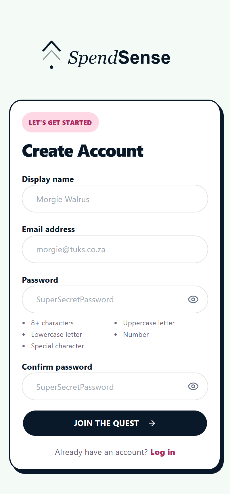

1. Open the SpendSense website and select **Get Started** on the top or bottom of the Landing page.
2. Enter your **Full name**, **Email Address**, and a **Password**, then type the same password again under **Confirm password**.
3. Tap **Join the quest** to create your account.
4. If you already have a SpendSense account, tap **Log in** at the bottom of the screen instead.

### Logging in

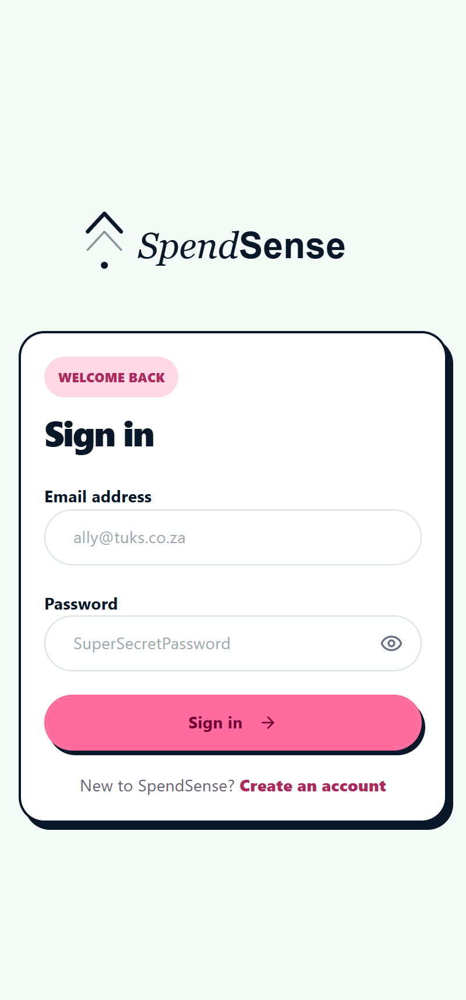

1. Open the SpendSense website and select **Get Started** on the top or bottom of the Landing page.
2. Tap **Log in** at the bottom of the screen of the Sign Up page.
3. Enter your **Email Address** and **Password**.
4. Tap **Sign in**.
5. If you do not have an account yet, tap **Sign up** at the bottom of the screen.

### Setting up your preferences

The first time you create an account, SpendSense asks a few quick questions so it can tailor itself to your needs before dropping you at the Dashboard.

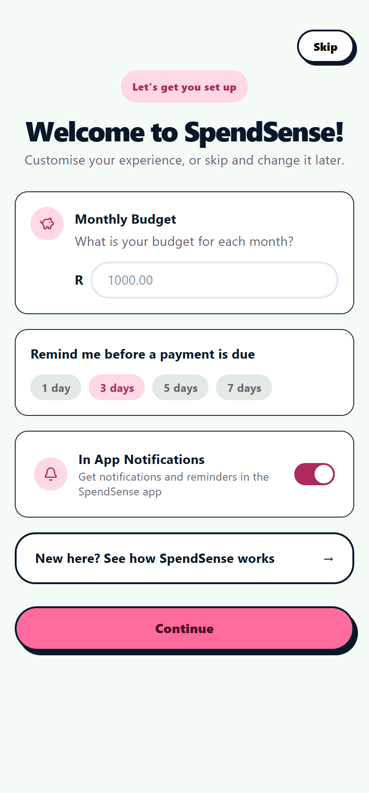

1. **What are your main goals?** Pick as many as apply: Pay on time, Save more money, Build lasting habits, Cut back on spending, or Learn about credit.
2. **Remind me before a payment is due.** Choose how much notice you want: 1, 3, 5, or 7 days.
3. **In App Notifications.** A toggle to turn in-app notifications and reminders on or off.
4. Tap **Continue** to finish setup and land on your Dashboard, or tap **Skip** in the top right at any point to go straight in and set these later from Settings.

If you want a walkthrough of how the app works before continuing, tap **New here? See how SpendSense works** to open the Getting Started guide (also covered in [Section 15](#15-help-and-support)).

Returning users who log in instead of signing up go straight to the Dashboard and will not see this setup screen again. These can, however, be changed in settings again.

---

## 3. Finding Your Way Around

Once you have logged in, a bottom navigation bar is available. It has five buttons:

| Icon | Name | What it does |
|---|---|---|
| House | Home | Takes you to the Dashboard |
| Calendar | Calendar | Opens the Calendar |
| Plus (centre, dark circle) | Add | Opens the menu to add a new obligation or log a new payment |
| Trophy | Quests | Opens your quests and quizzes |
| Person | Profile | Opens your profile, settings, and account tools |

Most of the screens also have a pink back arrow in the top left that returns you to the previous screen.

---

## 4. The Dashboard

The Dashboard is your home page. It's' the first thing you see when you log in, and it is reachable at any time by tapping **Home** in the bottom navigation.

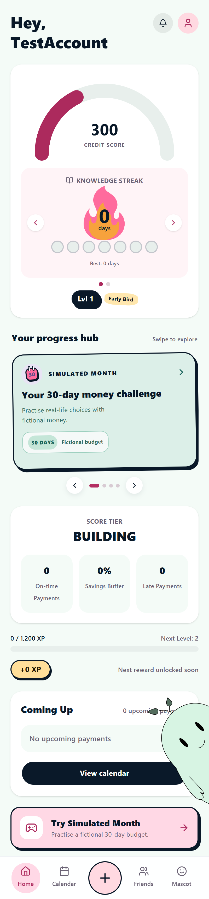

From the top of the screen down, the Dashboard shows:

- **A greeting** with your display name, a bell icon for notifications (with an unread count), and a logout button.
- **Your simulated credit score**, shown on a curved 0 to 850 gauge. This score reacts to your financial behaviour: payments that are on time push it up, late or missed payments bring it down.
- **Your Knowledge Streak**, which counts the number of days in a row you have checked in and engaged with the learning quizzes.
- **Your level and a tier badge** (for example "Early Bird").
- **A score tier card**, such as "Building", along with the number of payments on time, your savings buffer percentage, and the number of late payments.
- **Your XP progress bar**, showing progress toward the next level.
- **Coming Up**, a preview of your upcoming payments, with a button to go to the Calendar.
- **An Insights shortcut**, linking to a deeper breakdown of your spending.
- **A Friends shortcut**, linking to the Friends Hub.
- **A Stickers preview**, showing how many stickers you have collected out of the total, with a button to open the full album.
- **Try Simulated Month**, which opens the fictional budgeting game described in [Section 18](#18-simulated-month).
- **Your mascot guide**, which can open with a short daily note based on your recorded activity. You can hide it and bring it back from the tab on the side of the screen.

### How to get here

Tap **Home** in the bottom navigation from anywhere in the app.

---

## 5. Adding an Obligation

An obligation is anything you owe money on a repeating or scheduled basis: rent, a subscription, a utility bill, a "Buy Now, Pay Later" instalment, or a personal IOU. Adding one tells SpendSense to build a payment schedule for it and start reminding you about it.

### How to get here

Tap the circular **+** button in the centre of the bottom navigation, then choose to add a new obligation.

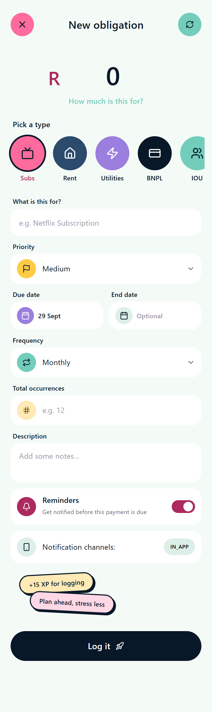

### What to fill in

1. **Amount**, the value of each payment.
2. **Type**, chosen from a row of icons: Subs, Rent, Utilities, BNPL, and some others. The Type field below the icons updates to match your choice.
3. **What is this for**, a short name such as "Showmax Subscription".
4. **Priority**, Low, Medium, High, or Critical.
5. **Due date**, when the next payment is due.
6. **End date** (optional), if the obligation has a known end.
7. **Frequency**, for example Monthly.
8. **Total occurrences** (optional), if you know how many payments there will be in total, such as with instalments.
9. **Description** (optional notes for yourself).
10. **Reminders**, a toggle to turn reminders on or off for this obligation.

Logging an obligation earns you a small amount of XP. Click **Log it** to save the obligation.

Once saved, the obligation appears on your Calendar with a payment schedule already worked out.

---

## 6. Logging a Payment

Once an obligation is due, or once you have actually paid some or all of it, you log the payment so SpendSense can update the amount still outstanding. A payment does not have to settle the full amount at once.

### How to get here

There are two paths:

- Tap the **+** button in the bottom navigation and choose to log a payment.
- From the Calendar or Scheduled Payments page, open an outstanding payment and continue to the payment form.

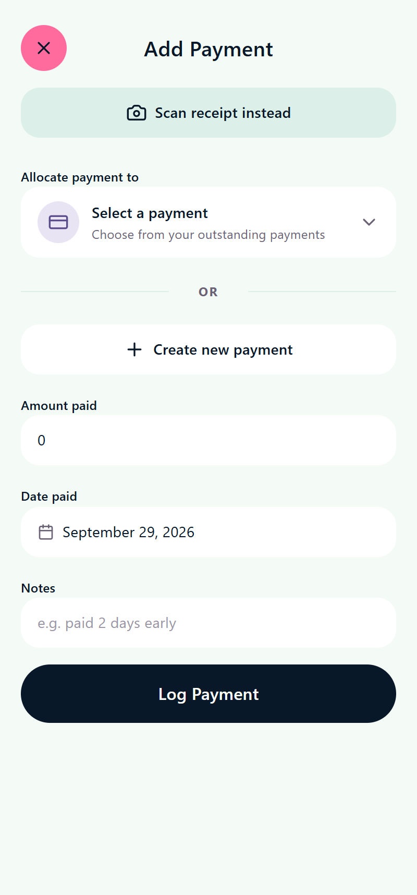

### What to fill in

1. **Allocate payment to**, choose the scheduled payment that the money belongs to. If you opened the form from a payment occurrence, it may already be selected.
2. **Amount paid**, enter the amount you are recording. It cannot be more than the balance that is still outstanding.
3. **Date paid**.
4. **Notes** (optional).

The selected payment shows the original amount, what has already been recorded, and how much is still outstanding. SpendSense also shows the expected remaining balance before you submit.

Tap **Log Payment** to save it.

### Partial payments

If the amount you enter is less than the remaining balance, SpendSense records a partial payment. The result shows **Partial payment recorded** and the amount still outstanding.

No final settlement reward is given until the full payment occurrence has been settled. A later payment can be recorded against the same occurrence until the remaining balance reaches zero.

### What happens after you complete a payment

Once the remaining balance reaches zero, SpendSense marks the payment as completed and shows the score and reward effects returned by the system.

- An on-time final payment can improve your simulated credit score and may award XP, coins, or a badge.
- A payment completed after its due date is recorded as late.
- If a payment is only partly paid after the due date, the remaining amount is still outstanding until it is completed.

You can also choose **Scan receipt instead** from the payment form. Receipt scanning is covered in [Section 16](#16-receipt-scanning-and-partial-payments).

---

## 7. The Calendar

The Calendar shows every payment you owe, laid out by day, so you can see at a glance what is paid, what is coming up, and what has been missed. You can also see all of your payments due for the month when there isn't a specific day selected.

### How to get here

Tap **Calendar** in the bottom navigation.

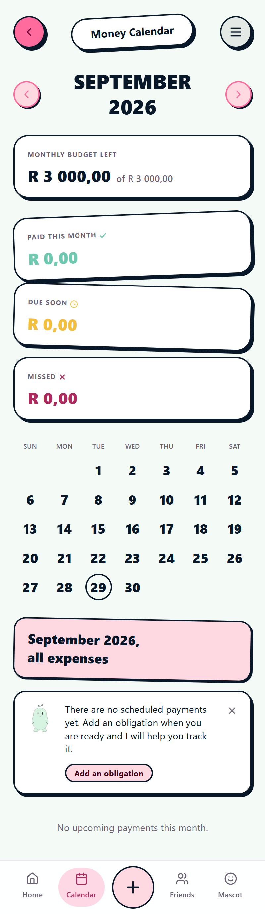

At the top of the page you can move between months using the arrows next to the name of the month. There are three summary cards taht show show:

- **Paid this month**, the total you have already settled.
- **Due soon**, upcoming payments that have not been paid yet.
- **Missed**, anything that went unpaid past the due date.

Below the summary cards is a month grid. Days with a payment due are marked with a coloured dot, and the current day is circled, while the day that you have clicked on is underlined. Underneath the calendar, a list shows every obligation that's active that month, including its due date and a status tag. Tapping **Tap to pay** on any item opens the Add Payment screen with that occurrence already selected.

### If a payment is overdue

Overdue items are clearly labelled in red. Tap the item and use **Tap to pay** to log the payment as soon as you can. Logging it stops further score damage from continuing to build up and starts your recovery.

---

## 8. Insights

Insights breaks down where your money is going and highlights patterns in your habits.

### How to get here

Tap **Insights** from the Dashboard, or navigate to it from Profile.

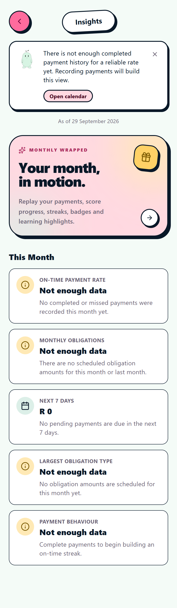

The Insights page is organised into cards covering the current month:

- **On-time payment rate**, the percentage of eligible payments made on time, with a comparison to the month before once enough history exists.
- **Monthly obligations**, your total amount due this month, with the percentage change from last month.
- **Next 7 days**, how much is due in the coming week.
- **Largest obligation type**, which category (for example BNPL) makes up the biggest share of what you owe.
- **Payment behaviour**, your current on-time streak in a row, along with a count of missed and overdue payments this month.

---

## 9. Quests and Your Knowledge Streak

Quests are how SpendSense turns good financial habits and financial literacy into a game. Completing them earns you XP, coins, and stickers.

### How to get here

Tap **Quests** in the bottom navigation.

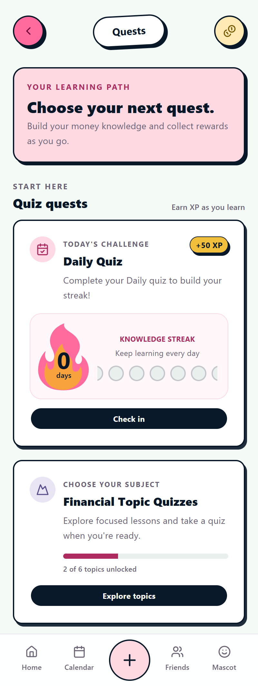

### What you will find

- **Today's Challenge**, a Daily Quiz worth XP that helps you build your Knowledge Streak. Tap **Check in** to complete it for the day.
- **Knowledge Streak**, a visual counter of how many days in a row you have checked in. Missing a day resets the counter.
- **Financial Topic Quizzes**, a set of focused lessons and quizzes grouped by topic. A progress bar shows how many topics you have unlocked. Tap **Explore topics** to open them.
- **Rewards**, where you can redeem coins you have earned for perks.

---

## 10. Sticker Album

The Sticker Album is your collection of earned badges. Every milestone in SpendSense, from logging your first obligation to hitting a payment streak, has a sticker attached to it.

### How to get here

Tap **Open album** on the Dashboard, or open it from Profile.

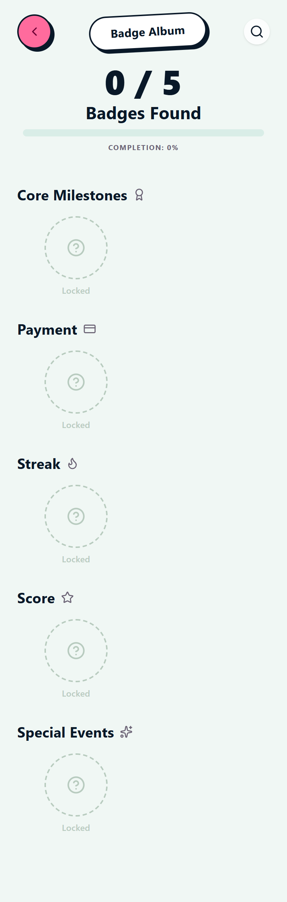

At the top, a counter shows how many stickers you have found out of the total, as well as a completion percentage bar. Below that, the stickers are grouped into categories:

- **Core Milestones**, for example First Obligation.
- **Payment**, for example On-Time Starter.
- **Streak**, for example Three Payment Streak.
- **Score**, for example Excellent Progress.
- **Special Events**, limited or seasonal stickers.

---

## 11. Friends Hub

Friends Hub is where the social side of SpendSense lives. You can manage your friends, compare progress, and challenge a friend to work on the same money habit.

### How to get here

Tap **View Friends** on the Dashboard, or open **Friends & Social** from Profile.

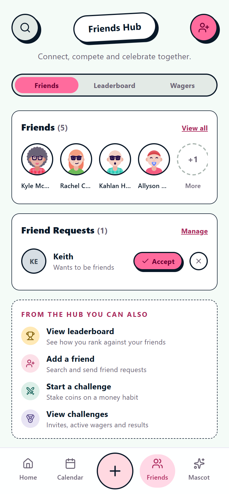

The Friends Hub has three tabs:

- **Friends**, your current friends and any friend requests waiting for you.
- **Leaderboard**, a ranking of you and your friends.
- **Wagers**, friend challenges that are waiting for a response, currently active, or already finished.

Use the search button at the top to open your friends list, or tap the person-plus button to find someone and send a friend request.

### Friends and friend profiles

Tap a friend to open their profile.

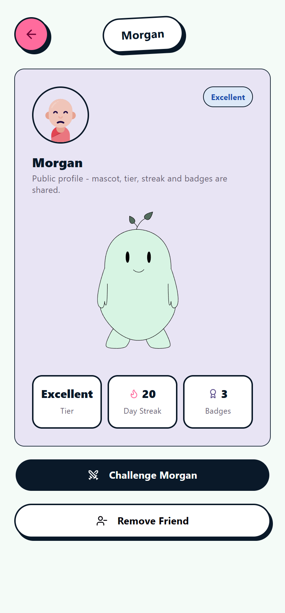

A friend's public profile shows the information they share with friends, including their mascot, score tier, payment streak, and number of badges. From here you can start a challenge with that friend. You can also remove them from your friends list if you no longer want to stay connected.

### Leaderboard

Open the **Leaderboard** tab or tap **View leaderboard** to compare your progress with your friends.

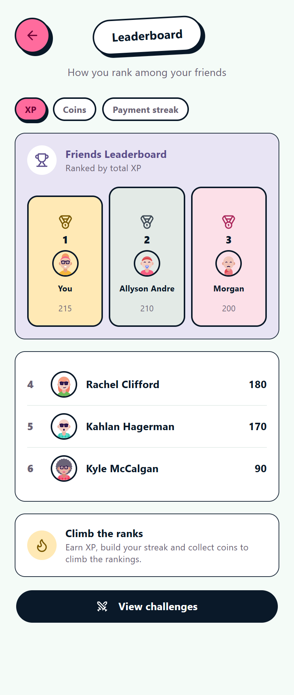

The leaderboard can be viewed by **XP**, **Coins**, or **Payment streak**. The top positions are shown first, followed by the rest of the ranking.

### Friend challenges

Open the **Wagers** tab to see your friend challenges. These are challenges where both people put down the same number of SpendSense coins and try to complete the selected money habit.

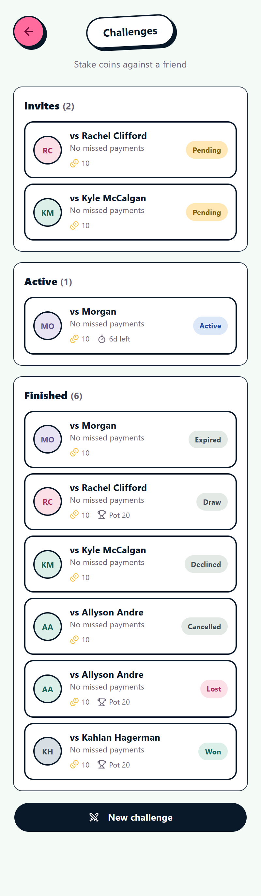

Challenges can be based on making all payments on time, having no missed payments, or maintaining a payment streak. When you create one, choose the friend, the task, how many coins each person will put in, and how long the challenge will run.

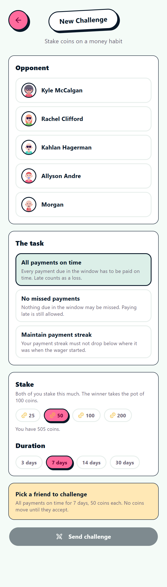

No coins move until the other person accepts the challenge. Once it is active, SpendSense tracks the selected habit automatically. When the challenge ends, the result is worked out from the activity recorded in SpendSense.

You do not need to submit proof or manually mark the challenge as complete.

---

## 12. Profile

Profile is your personal identity and settings hub. It shows who you are in the app and links out to everything account related.

### How to get here

Tap the **User** icon in the top right corner of **Home**.

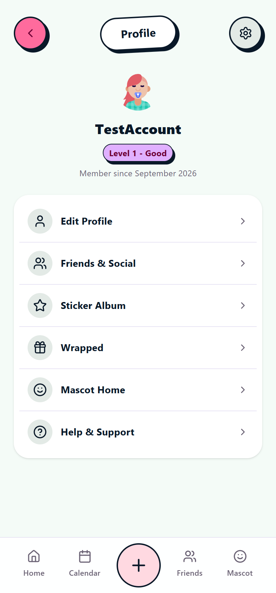

At the top you will see your avatar, display name, current level and tier (for example "Level 2, Good"), your streak in days, your coin balance, and the month and year you joined. Below that is a list of links:

- **Edit Profile**, update your display name and see basic account details.
- **Settings**, general preferences, notifications, and account tools. The **Cog** icon in the top right corner.
- **Friends & Social**, opens the Friends Hub.
- **Sticker Album**, opens your badge collection.
- **Wrapped**, a summary look back at your activity.
- **Mascot Home**, your customisable in-app mascot.
- **Help & Support**, the in-app help centre.

### Editing your profile

Tap **Edit Profile** to open the edit screen.

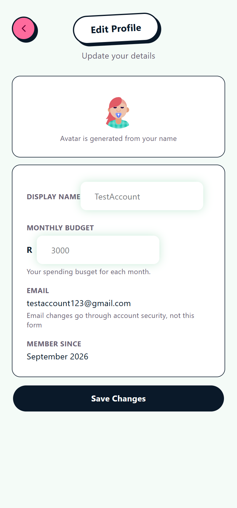

Your avatar is generated automatically from your display name. You can change your **Display Name** here. Your **Email** is shown for reference only. Changing it is not done on this screen, it goes through account security instead, since email changes affect how you log in. Your **Member Since** date is also shown for reference. Tap **Save Changes** once you are done.

---

## 13. Mascot Home

Mascot Home is where you can see your SpendSense mascot and the progress linked to it. Your mascot changes with your activity and can wear cosmetics that you collect or buy with SpendSense coins.

### How to get here

Open **Profile**, then tap **Mascot Home**.

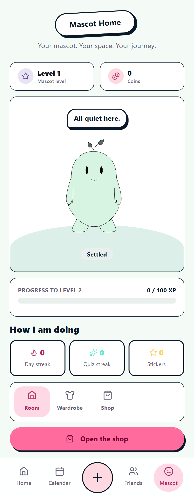

At the top of Mascot Home you can see your mascot level and current coin balance. The main card shows your mascot, its current mood, and any cosmetics it is wearing.

Below the mascot is your progress toward the next mascot level. You can also see your current payment streak, quiz streak, and how many stickers you have collected.

### Shop and wardrobe

Tap **Open the shop** to browse cosmetics for your mascot.

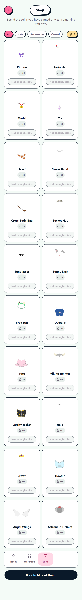

The shop can be filtered by all items, hats, accessories, or items you already own. Each item shows whether you own it and, if not, how many coins it costs.

When you choose an item, you can buy it with coins if you have enough. Items you own are kept in your wardrobe and can be equipped or taken off later.

The coins used here are SpendSense reward coins. Buying a mascot item does not affect any payment or financial record.

---

## 14. Monthly Wrapped

Monthly Wrapped is a look back at your recent SpendSense activity. It brings together your payment progress, simulated credit score, streaks, rewards, and learning activity for the month.

### How to get here

Open **Profile**, then tap **Wrapped**. Or open **Insights**, then tap **Monthly Wrapped**

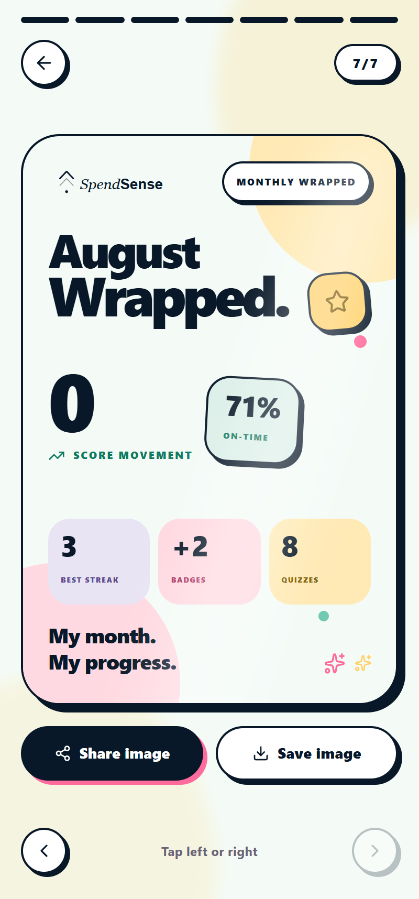

Wrapped is shown as a short set of slides. It moves through the month one section at a time, and you can also move backwards or forwards yourself.

The slides cover:

- **Credit score**, showing how your simulated score changed during the month.
- **Payments**, showing your on-time, late, and missed payments.
- **Best streak**, showing your strongest payment streak for the month.
- **Achievements**, showing badges and rewards earned during the month.
- **Learning**, showing completed quizzes and your knowledge streak.
- **Summary**, bringing the main parts of the month together at the end.

Wrapped uses the activity already recorded in SpendSense. It does not change your score, rewards, payments, or streaks.

---

## 15. Settings

Settings is where you control how SpendSense behaves for you: general preferences, what you get notified about, and account level actions.

### How to get here

Open **Profile**, then tap **Settings**, or tap the gear icon in the top right of the Profile screen.

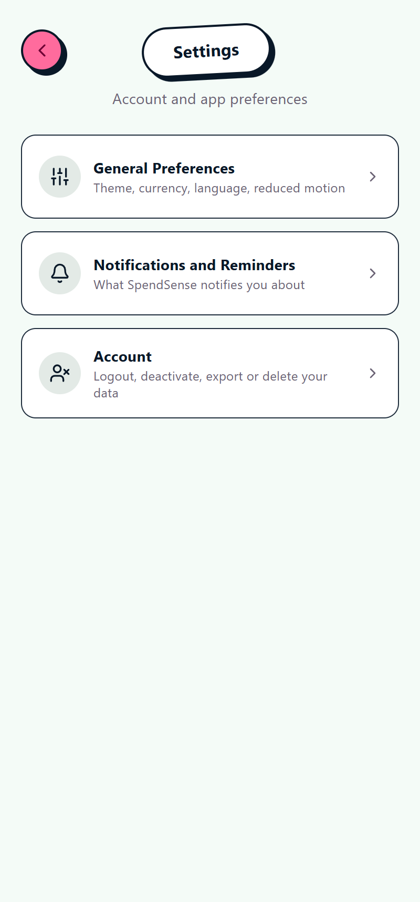

Settings is split into three sections:

- **General Preferences**, theme, currency, language, and reduced motion.
- **Notifications and Reminders**, turn on or off notifications and reminders, and choose when you want to receive them.
- **Account**, logout, deactivate your account, and export your data.
- **Mascot Guidance**, available under General Preferences, where you can turn mascot tips on or off, choose whether the daily Dashboard guide opens automatically, restart the guided tour, and show dismissed tips again.

---

## 16. Notifications

Notifications keep you informed about payments coming up, payments that were missed, and anything else that needs your attention.

### How to get here

Tap the bell icon in the top right of the Dashboard. The number badge on the bell shows how many notifications are unread.

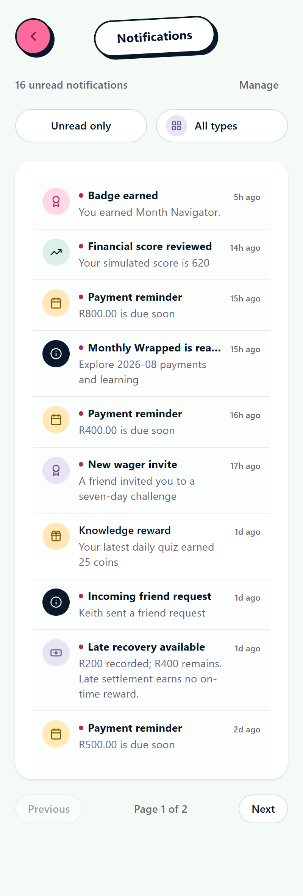

At the top of the page you can see how many notifications are unread, along with a **Manage** link. Two filters let you narrow the list: **Unread only** and **All types**. Notifications you have not read yet are marked with a small dot. Common notification types include:

- **Payment reminder**, telling you an obligation is due soon, for example "due in 3 days".
- **Payment missed**, telling you a payment was not made and has now been marked missed.
- **Payment overdue**, telling you a payment is now overdue.

The list is paginated, with **Previous** and **Next** buttons and a page indicator at the bottom.

---

## 17. Help and Support

Help and Support is the in-app help centre. It has the getting started guide, mascot guidance controls, and answers to common questions.

### How to get here

Open **Profile**, then tap **Help & Support**.

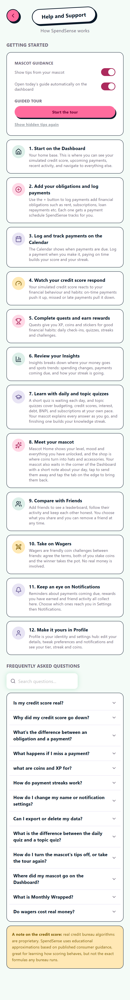

### Getting Started

The Getting Started guide covers the main parts of SpendSense:

1. **Start on the Dashboard.** Your home base, where you see your simulated credit score, upcoming payments, recent activity, and links to everything else.
2. **Add your obligations and log payments.** Use the plus button to add financial obligations and record payments against their schedules.
3. **Log and track payments on the Calendar.** The Calendar shows when payments are due and what still needs attention.
4. **Watch your credit score respond.** Your simulated credit score reacts to your recorded payment behaviour.
5. **Complete quests and earn rewards.** Quests give you XP, coins, and stickers for completing activities.
6. **Review your Insights.** Insights breaks down recorded payment patterns and upcoming pressure.
7. **Learn with daily and topic quizzes.** Daily quizzes build your Knowledge Streak, while topic quizzes let you learn about a specific subject at your own pace.
8. **Meet your mascot.** Mascot Home shows your mascot, mood, level, and cosmetics. The mascot can also give short guidance on supported pages.
9. **Compare with Friends.** Add friends, follow activity, and compare progress.
10. **Take on Wagers.** Wagers are friendly coin challenges between friends. No real money is involved.
11. **Keep an eye on Notifications.** Payment reminders, rewards, and friend activity are collected here.
12. **Make it yours in Profile.** Edit your details and open your settings, account tools, and other personal pages.

At the top of Help and Support you can also start or replay the mascot guided tour and change the mascot guidance settings.

### Frequently Asked Questions

A searchable FAQ list is provided, covering questions such as:

- Is my credit score real?
- Why did my credit score go down?
- What is the difference between an obligation and a payment?
- What happens if I miss a payment?
- What are coins and XP for?
- What is the difference between the daily quiz and a topic quiz?
- How do I turn the mascot's tips off, or take the tour again?
- Where did my mascot go on the Dashboard?
- How do I change my name or notification settings?
- Can I export or delete my data?
- What is Monthly Wrapped?
- Do wagers cost real money?

Tap any question to expand its answer, or use the search box to jump straight to a topic.

---

## 18. Receipt Scanning and Partial Payments

Receipt scanning helps you record a payment from a receipt without treating the scan as the final decision. SpendSense reads possible details from the image, then asks you to check them before anything is recorded.

### How to get here

Open **Add Payment** and tap **Scan receipt instead**. If you came from a specific payment, SpendSense can carry that payment into the scan as a suggested starting point.

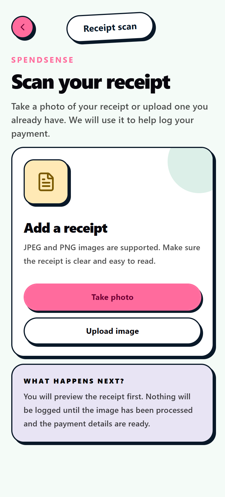

### Scanning a receipt

1. Tap **Take photo** to use your camera, or choose an image from your device.
2. Check the preview. You can remove the image or choose another one before scanning.
3. Tap the scan button to let SpendSense read the receipt.
4. If camera access is not available, you can still upload an image instead.

Receipt scanning accepts JPEG and PNG images. If the image cannot be read, you can try another photo or return to the normal payment form.

### Reviewing the result

After the scan finishes, SpendSense opens the Receipt Review page.

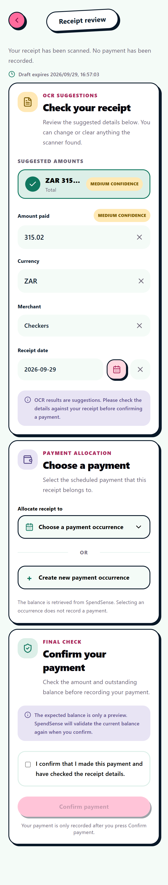

The scan can suggest details such as the amount, date, merchant, and currency. These are suggestions only. No payment has been recorded yet.

1. Check the extracted receipt details and correct anything that is wrong.
2. Choose the outstanding payment occurrence that this receipt belongs to.
3. Check the current amount due, amount already paid, and amount remaining.
4. Confirm the amount you want to record.
5. Submit the reviewed payment.

A receipt review expires after a limited time. If it has expired, scan the receipt again.

### After you confirm

If the amount is less than the outstanding balance, the result is a **Partial payment recorded** and the remaining amount stays open.

If the payment settles the full remaining balance, SpendSense completes that occurrence and shows the score and reward result returned by the system.

The uploaded receipt image is used for scanning and is not kept as a permanent receipt image in your account.

---

## 19. Mascot Guidance

Your mascot can now help explain parts of SpendSense while you use them. The guidance uses fixed in-app messages and the information already shown by SpendSense. It does not make payments, answer quizzes for you, or make financial decisions for you.

### Guided tour

The mascot guided tour can be started from the Dashboard, Help and Support, or the Mascot Guidance settings.

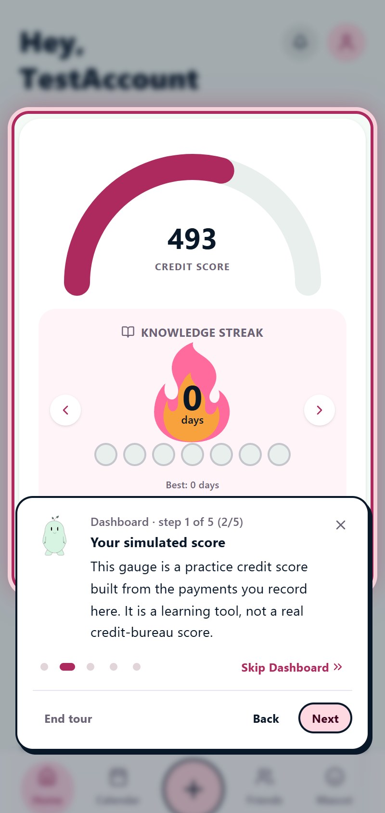

The tour moves through five main areas:

1. **Dashboard**, where you see your score, progress, upcoming payments, and daily guide.
2. **Calendar**, where scheduled payment occurrences and their statuses are shown.
3. **Payments**, where you can check balances and record full or partial payments.
4. **Quizzes**, where daily and topic quizzes are completed.
5. **Insights**, where recorded payment patterns are explained.

Use **Next** and **Back** to move through the tour. You can skip the current feature, end the tour, or close it and return later. Your progress is saved so the tour can be replayed from the beginning when you want to see it again.

### Guidance on the Dashboard

The mascot appears on the Dashboard with a short daily guide.

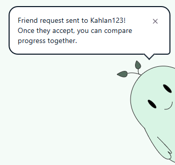

The note can point you toward things such as an available daily quiz, payments recorded today, or a page worth checking next. If automatic daily opening is enabled, the guide opens once for that day on that browser.

Tap the mascot to hide it. A small tab appears briefly at the side of the screen so you can bring the mascot back.

### Guidance on other pages

The mascot can also show short messages on the Calendar, payment flow, quizzes, and Insights.

For example, it can explain that a payment still has a balance left, remind you that an overdue payment may be marked late, explain quiz feedback after you answer, or point out what an Insights card means.

The mascot does not reveal quiz answers before you submit them, and its guidance does not change your payments, score, rewards, quiz progress, or mascot mood.

### Changing mascot guidance settings

Open **Profile**, then **Settings**, then **General Preferences**. You can also use the same controls from Help and Support.

You can:

- Turn mascot tips on or off.
- Choose whether today's Dashboard guide opens automatically.
- Start the guided tour again.
- Show tips that you previously dismissed.

Turning tips off does not remove your saved tour progress.

---

## 20. Simulated Month

Simulated Month is a fictional budgeting game where you manage one 30-day month. The money, obligations, payments, and score inside the simulation are separate from your real SpendSense records.

### How to get here

From the Dashboard, tap **Try Simulated Month**.

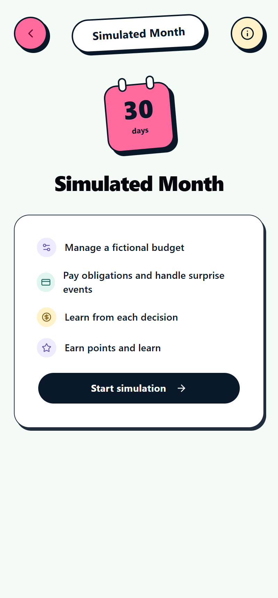

If you already have an unfinished month, the entry page shows **Resume** and **Discard**. If you have completed a month before, you can also open your last completed summary.

### Starting a month

Tap **Start simulation** to open the introduction.

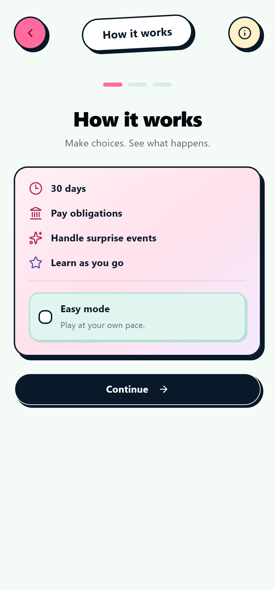

The introduction explains the basic rules:

- The month has 30 fictional days.
- You pay fictional obligations and deal with surprise events.
- Your choices change your simulation score.
- Nothing in the game changes your real payments or financial records.

The normal mode is timed. Each simulated day lasts about 15 seconds. Turn on **Easy mode** if you want to play without the automatic timer and advance the days yourself.

Tap **Continue** when you are ready.

### Setting up your budget

SpendSense gives the simulation a fictional starting budget. You then choose how to split it between **Current** and **Savings**.

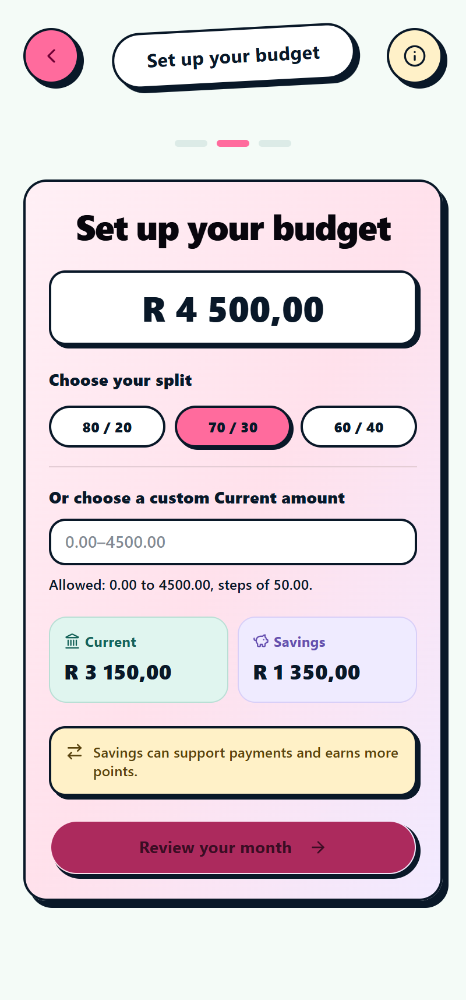

Choose one of the suggested splits, or enter a custom Current amount when the option is available. Current is used first when you make a fictional payment, and Savings is used as a backup if Current is not enough.

After choosing the split, continue to the month overview.

### Reviewing the month

The Month Overview shows your starting Current and Savings amounts and the fictional obligations that are already scheduled.

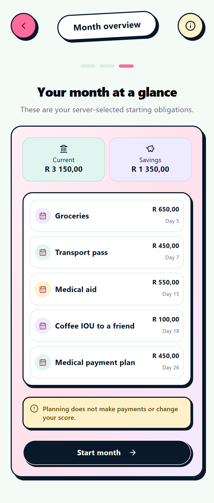

This is only a preview. No payments are made and the score does not change on this page.

Tap **Start month** when you are ready to begin.

### Playing the month

The main game board shows the current day, score, budget left, Current balance, Savings balance, and the obligations in the month.

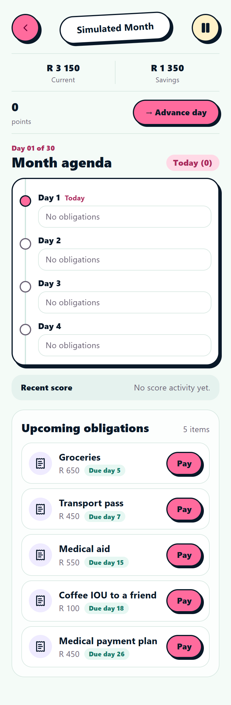

In timed mode the month moves forward automatically. In Easy mode, tap **Advance day** when the option is available.

When an obligation becomes payable, open it to see the amount, due day, and the money currently available.

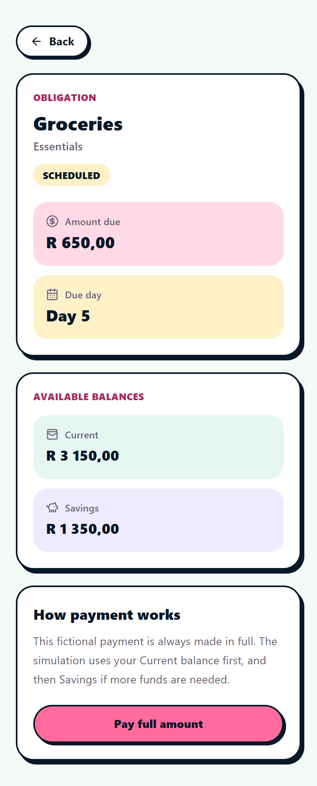

Simulation payments are always for the full amount. SpendSense uses Current first and then Savings if more money is needed. If the two balances together are not enough, the payment is not recorded.

After a successful payment, the result shows how much came from Current and Savings and how many points were awarded.

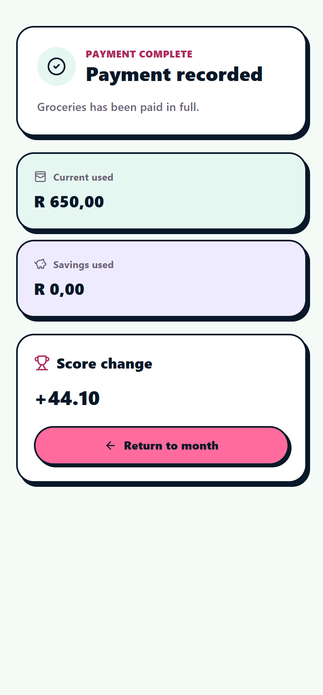

Tap **Return to month** to continue.

### Surprise events

A simulated month contains surprise events. When one appears, open it to see what has changed.

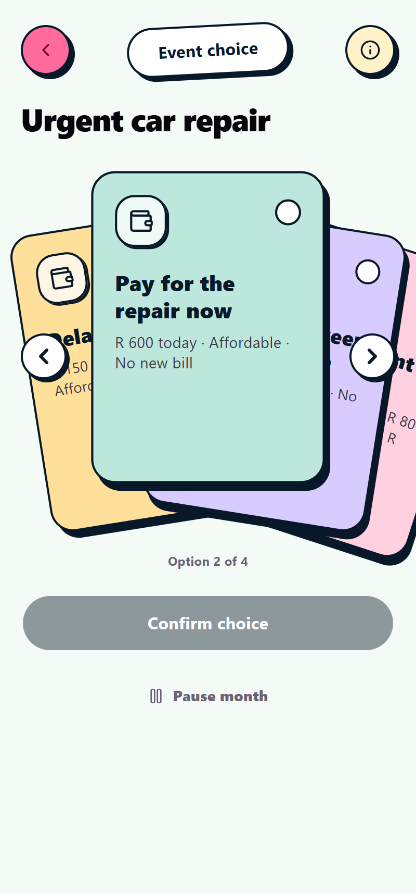

The event shows its situation and the choices that are available. In timed mode the decision has its own countdown. Easy mode has no event deadline.

Choose an option and confirm it. The result then shows the effect on your fictional balances, the points gained or lost, and a short explanation of what happened.

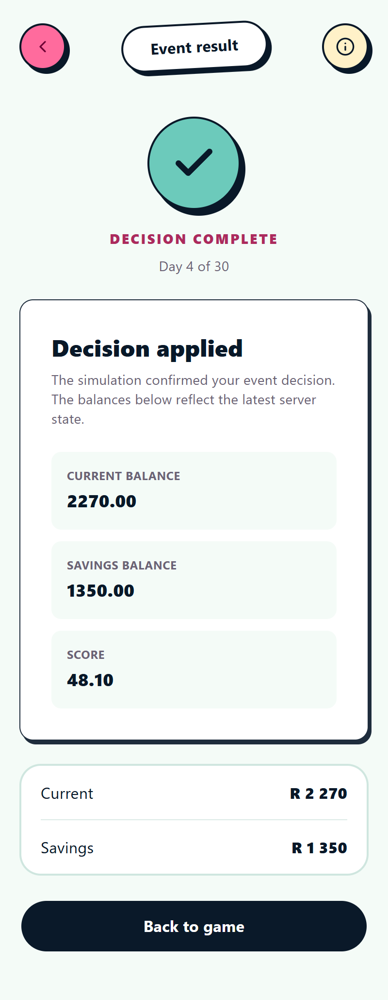

Tap **Back to game** to continue the month.

### Pausing or leaving

Use **Pause** on the game board to stop the timed simulation.

Tap **Resume month** when you are ready to continue. You can also choose to leave the simulation.

If you choose to leave, SpendSense asks whether you want to keep the run for later or discard it.

- **Keep playing** closes the message and returns to the game.
- **Save and exit** leaves the simulation available to resume later.
- **Discard run** permanently abandons that fictional run and asks for confirmation first.

If a saved run exists, SpendSense restores the latest valid simulation state when you resume it.

### Completing the month

After the final day, SpendSense shows the Month Complete screen.

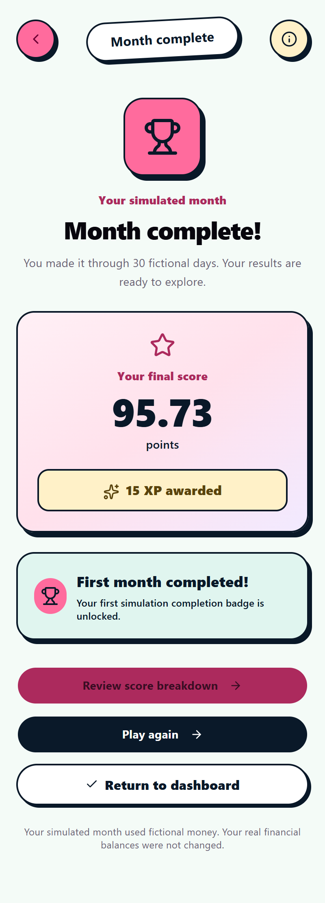

The summary shows your final score, remaining Current and Savings balances, the budget result, and how your obligations and events ended. Completing a simulated month awards 15 XP. The first completed month can also unlock the first-completion badge. The simulation does not award coins.

Tap **Review score breakdown** to see more detail.

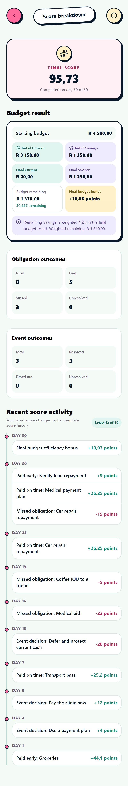

The score breakdown shows the final budget result, obligation and event outcomes, and the most recent score changes. The recent activity section is not a complete history of every score event in the month.

You can return to the Dashboard or start another fictional month from the summary.

---

## 21. Glossary

| Term | Meaning |
|---|---|
| Obligation | A recurring or scheduled amount you owe, such as rent, a subscription, or a loan instalment. |
| Occurrence | One specific scheduled instance of an obligation's payment, for example this month's rent. |
| Payment | A record that you actually paid an occurrence, including the date and amount paid. |
| Simulated credit score | An educational, 0 to 850 score that reacts to your payment behaviour. It is not a real credit bureau score. |
| Score tier | A band your score falls into, such as Building, Fair, Good, Excellent, or Elite. |
| Payment streak | The number of on-time payments in a row you have made. |
| Knowledge streak | The number of days in a row you have checked in and engaged with quizzes. |
| XP | Experience points earned from good habits, which contribute to your level. |
| Coins | An in-app currency earned from good habits, which can be spent on rewards. |
| Sticker / badge | A collectible reward unlocked by reaching a milestone. |
| Payment contribution | One amount recorded toward a payment occurrence. An occurrence can have more than one contribution before it is fully paid. |
| Partial payment | A payment contribution that leaves some of the occurrence balance still outstanding. |
| Receipt scan | A short-lived review of possible details read from an uploaded receipt before the user confirms a payment. |
| Mascot guidance | Fixed in-app tips and walkthrough messages shown by the mascot on supported pages. |
| Simulated Month | A fictional 30-day budgeting game that uses separate fictional balances, obligations, events, and points. |
| Current | The main fictional spending balance used in Simulated Month. |
| Savings | The fictional backup balance used in Simulated Month after Current when a payment needs more funds. |
| Simulation points | Points used only inside Simulated Month to show the result of fictional decisions. |

---

*This manual reflects the current state of the SpendSense application.*
