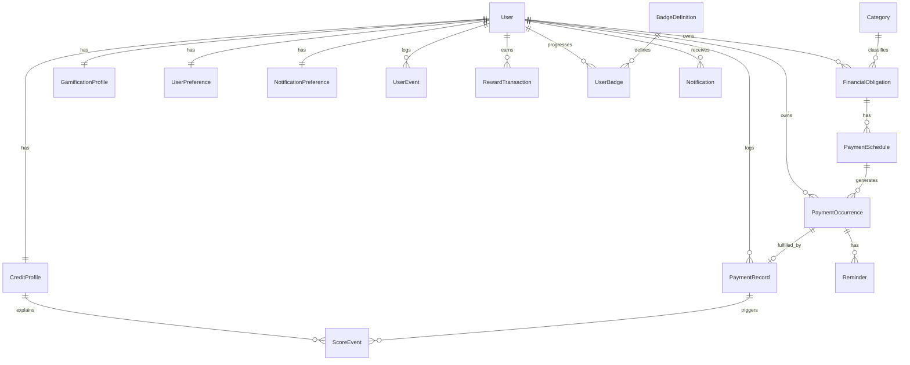

# SpendSense Domain Model
**Project:** SpendSense  
**Team:** MARK2, COS 301 Capstone 2026  
**Document location:** `docs/srs/Domain-Model-Explanation.md`

---
## 1. Overview
Everything in the SpendSense model traces back to one question: did the user pay what they were supposed to, and did they pay it on time? That gap between expected and actual payment is what drives the score, the gamification rewards, and the dashboard.

The model is split into two views — what's actually built for Demo 1, and a broader conceptual map showing where future features slot in without disrupting the core.

---
## 2. Core Design Principles

### Expected vs. actual payments are kept separate
`PaymentOccurrence` is what the system schedules. `PaymentRecord` is what the user actually logs. Keeping them apart means we can tell whether a payment was on time, late, or missed — which is what the score and streak logic depends on.

### Snapshots and history live in different tables
`CreditProfile` and `GamificationProfile` hold the current state. `ScoreEvent`, `UserEvent`, and `RewardTransaction` are append-only logs that record why that state changed. The dashboard reads the snapshot; the history screen reads the log.

### User data is always scoped to the internal user ID
Supabase Auth and the SpendSense `User` are two separate things. Every protected query resolves to an internal `User.id` from the JWT — we never trust a client-supplied ID.

### Financial records use soft deletion
Payment history needs to stay intact for scoring and analytics, so records aren't hard-deleted. We set `deletedAt` instead. Event tables (`ScoreEvent`, `UserEvent`, `RewardTransaction`) are append-only and shouldn't be deleted at all through normal flows.

### Future features extend the model, they don't rewrite it
Receipt scanning hangs off `PaymentRecord`. AI insights read from `PaymentOccurrence`. Challenges hook into `UserEvent`. The Monthly Wrapped feature reads from the existing history tables. Nothing in the future roadmap requires changing the core payment tables.

---
## 3. Demo 1 Entity Clusters

| Cluster | Entities | Purpose |
|---|---|---|
| Identity | `User`, `UserPreference`, `NotificationPreference` | App-level user record and settings, bootstrapped on first authenticated request. |
| Financial Tracking | `Category`, `FinancialObligation`, `PaymentSchedule` | What the user owes, how often, and on what schedule. |
| Payment Lifecycle | `PaymentOccurrence`, `PaymentRecord`, `Reminder` | Expected due dates, actual logged payments, and scheduled reminders. |
| Credit & Score | `CreditProfile`, `ScoreEvent` | Current simulated financial health score and the log of every change to it. |
| Gamification | `GamificationProfile`, `UserEvent`, `RewardTransaction`, `BadgeDefinition`, `UserBadge` | Coins, XP, streaks, mascot mood, and badge progress driven by payment behaviour. |
| Notifications | `Notification` | In-app notifications fired by the system when key events occur. |

---
## 4. Demo 1 Core Flow
```
User authenticates (Supabase)
  |_ GET /users/me bootstraps User, CreditProfile, GamificationProfile
       │
       \/
User creates a financial obligation
  |_ POST /obligations
       |_ creates FinancialObligation
       |_ creates PaymentSchedule
       |_ generates PaymentOccurrence rows (next 3–6 months)
       |_ creates Reminder rows if enabled
       |_ creates UserEvent: OBLIGATION_CREATED
            │
            \/
User views upcoming payments
  |_ GET /payment-occurrences/upcoming
       |_ returns PENDING and OVERDUE PaymentOccurrences
            │
            \/
User logs a payment
    |_ POST /payments/log
       |_ creates PaymentRecord
       |_ updates PaymentOccurrence.status -> PAID or PAID_LATE
       |_ creates ScoreEvent
       |_ updates CreditProfile
       |_ updates GamificationProfile (coins, XP, streak, mood)
       |_ creates RewardTransaction if coins awarded
       |_ checks/awards UserBadge progress
       |_ creates Notification
            |
            \/
Dashboard reflects current state
  |_ GET /dashboard
       |_ aggregates User, CreditProfile, GamificationProfile,
          upcomingPayments, recentScoreEvents, recentBadges, Notifications
```

---
## 5. Demo 1 Entity Reference

### User
The internal SpendSense user, linked to a Supabase Auth identity. Created on the first authenticated request. Nearly every other record in the system belongs to one.  
**Key fields:** `id`, `supabaseAuthId`, `email`, `displayName`, `avatarUrl`, `onboardingCompleted`, `createdAt`, `updatedAt`, `deletedAt`

### UserPreference
Per-user app settings (theme, currency, language, etc.), created alongside the `User` during bootstrap.  
**Key fields:** `userId`, `theme`, `currency`, `language`, `reducedMotion`

### NotificationPreference
Stores the user's default reminder channels, which are applied when new obligations are created.  
**Key fields:** `userId`, `inAppEnabled`, `emailEnabled`, `pushEnabled`, `smsEnabled`, `defaultReminderDaysBefore`

### Category
A shared reference table for classifying obligations and expenses. Not user-owned.  
**Key fields:** `id`, `name`, `type` (`OBLIGATION` | `EXPENSE` | `BOTH`), `iconKey`, `colourKey`, `isDefault`

### FinancialObligation
A recurring financial commitment the user is tracking — rent, a subscription, a loan repayment. The anchor of the whole payment loop.  
**Key fields:** `userId`, `categoryId`, `name`, `type`, `status`, `amount`, `currency`, `priority`, `startDate`, `endDate`, `deletedAt`

### PaymentSchedule
Holds the recurrence rule for an obligation and drives the generation of `PaymentOccurrence` rows.  
**Key fields:** `obligationId`, `frequency`, `interval`, `dayOfMonth`, `startDate`, `endDate`, `totalOccurrences`, `isActive`

### PaymentOccurrence
One expected payment on a specific date. The calendar view is built from these rows, and they're the target when a user logs a payment.  
**Key fields:** `userId`, `obligationId`, `scheduleId`, `dueDate`, `amountDue`, `status`, `sequenceNumber`, `paidAt`, `overdueAt`, `missedAt`, `deletedAt`  
**Status values:** `PENDING` → `PAID` / `PAID_LATE` / `OVERDUE` / `MISSED` / `CANCELLED`

### PaymentRecord
The actual payment the user logged. Compared against the linked `PaymentOccurrence.dueDate` to work out whether it was on time or late.  
**Key fields:** `userId`, `occurrenceId`, `obligationId`, `amountPaid`, `paidDate`, `paymentStatus`, `daysLate`, `simulatedInterest`, `notes`

### Reminder
A scheduled notification tied to a `PaymentOccurrence`. Created at obligation setup time if the user has reminders enabled.  
**Key fields:** `userId`, `occurrenceId`, `channel`, `scheduledFor`, `status`

### CreditProfile
The user's current simulated financial health score, plus running totals of on-time, late, and missed payments. Updated every time a payment is logged.  
**Key fields:** `userId`, `currentScore`, `previousScore`, `scoreTier`, `onTimePaymentCount`, `latePaymentCount`, `missedPaymentCount`, `lastCalculatedAt`  
**Score range:** 0–850. **Tiers:** `BUILDING` (<450) → `FAIR` → `GOOD` → `EXCELLENT` → `ELITE` (750+)

### ScoreEvent
An append-only record of every score change, with a plain-English explanation of why. Feeds the score history screen.  
**Key fields:** `userId`, `creditProfileId`, `occurrenceId`, `paymentRecordId`, `eventType`, `pointsDelta`, `scoreBefore`, `scoreAfter`, `explanation`, `calculationMetadata`

### GamificationProfile
The user's current gamification state: coins, XP, streak counts, mascot level and mood. Updated alongside the credit score when a payment is logged.  
**Key fields:** `userId`, `coinBalance`, `xp`, `mascotLevel`, `mascotMood`, `currentPaymentStreak`, `longestPaymentStreak`

### UserEvent
A general-purpose event stream for significant user actions. Keeps the core tables clean — future systems can react to events here without us having to touch payment or scoring tables.  
**Key fields:** `userId`, `eventType`, `sourceType`, `sourceId`, `metadata`  
**Demo 1 event types:** `USER_BOOTSTRAPPED`, `OBLIGATION_CREATED`, `PAYMENT_ON_TIME`, `PAYMENT_LATE`

### RewardTransaction
Append-only log of every coin and XP movement. One row per reward earned or spent, so the balance is always auditable.  
**Key fields:** `userId`, `sourceEventId`, `type` (`EARNED` | `SPENT` | `ADJUSTED`), `amount`, `balanceAfter`, `reason`

### BadgeDefinition
Reference table listing every badge the system knows about. Not user-owned.  
**Key fields:** `code`, `name`, `description`, `category`, `criteriaType`, `criteriaValue`, `iconKey`, `isActive`

### UserBadge
Tracks a user's progress toward each badge, and records when they earned it.  
**Key fields:** `userId`, `badgeDefinitionId`, `progress`, `earnedAt`, `metadata`

### Notification
In-app notifications generated by the system — payment confirmed, payment overdue, badge earned, and so on. Users read and dismiss them; they never create them directly.  
**Key fields:** `userId`, `type`, `title`, `message`, `sourceType`, `sourceId`, `readAt`, `deletedAt`

---
## 6. Demo 1 ERD



---
## 7. Full Conceptual Entity Map
Everything below that's marked `[Future]` isn't built yet, but it's mapped here to show where it would attach. None of it requires changing the core payment tables.

```
User
|
|_ Identity
|   |_ UserPreference                    [Demo 1]
|   |_ NotificationPreference            [Demo 1]
|   |_ PrivacySetting                    [Future - social features]
|
|_ Financial Visibility Loop
|   |_ Category                          [Demo 1]
|   |_ FinancialObligation               [Demo 1]
|   |   |_ PaymentSchedule               [Demo 1]
|   |       |_ PaymentOccurrence         [Demo 1]
|   |           |_ Reminder              [Demo 1]
|   |           |_ PaymentRecord         [Demo 1]
|   |_ Expense                           [Future - one-off spending]
|   |_ Receipt                           [Future - OCR receipt scanning]
|
|_ Consequence Loop
|   |_ CreditProfile                     [Demo 1]
|   |_ ScoreEvent                        [Demo 1]
|   |_ RecoveryPlan                      [Future - post-missed-payment recovery]
|   |_ RecoveryTask                      [Future]
|
|_ Reward Loop
|   |_ GamificationProfile               [Demo 1]
|   |_ UserEvent                         [Demo 1]
|   |_ RewardTransaction                 [Demo 1]
|   |_ BadgeDefinition                   [Demo 1]
|   |_ UserBadge                         [Demo 1]
|   |_ AchievementDefinition             [Future - broader milestones]
|   |_ UserAchievement                   [Future]
|   |_ StreakEvent                       [Future - detailed streak history]
|
|_ Notification Loop
|   |_ Notification                      [Demo 1]
|   |_ Reminder                          [Demo 1]
|   |_ NotificationDeliveryAttempt       [Future - email/push/SMS delivery tracking]
|
|_ AI / Analytics Loop
|   |_ Insight                           [Future - rule-based and AI recommendations]
|   |_ RecurringExpenseSuggestion        [Future - AI suggests obligations from expenses]
|   |_ AnomalyDetectionResult            [Future]
|   |_ PredictionResult                  [Future]
|
|_ Learning Loop
|   |_ QuizQuestion                      [Future]
|   |_ QuizSession                       [Future]
|   |_ QuizAnswer                        [Future]
|   |_ LearningProgress                  [Future]
|
|_ Social & Challenge Loop
|   |_ FriendRequest                     [Future]
|   |_ Friendship                        [Future]
|   |_ Challenge                         [Future]
|   |_ ChallengeParticipant              [Future]
|   |_ ChallengeStake                    [Future]
|   |_ ChallengeResult                   [Future]
|
|_ Mascot / Cosmetic Loop
|   |_ CosmeticItem                      [Future - cosmetic shop]
|   |_ UserInventoryItem                 [Future]
|   |_ MascotStateHistory                [Future]
|
|_ Reflection Loop
    |_ MonthlySnapshot                   [Future - month-end state preservation]
    |_ WrappedSummary                    [Future - Monthly Wrapped feature]
```

---
## 8. Future Extension Points

| Future feature | Attaches to | What's needed |
|---|---|---|
| Manual expense tracking | New `Expense` table → `User`, `Category` | Doesn't touch the obligation/payment tables. |
| Receipt OCR | New `Receipt` table → `Expense`, `PaymentRecord`, `FinancialObligation` | Nullable FKs keep attachment flexible. |
| AI spending insights | New `Insight` table → reads `PaymentRecord`, `PaymentOccurrence` | No changes to core tables. |
| Financial literacy quizzes | New `QuizSession` / `QuizAnswer` → `UserEvent` on completion | Rewards flow through the existing `RewardTransaction` table. |
| Social challenges | New `Challenge` / `ChallengeParticipant` → `UserEvent`, `RewardTransaction` | No core table changes needed. |
| Monthly Wrapped | New `MonthlySnapshot` → reads `ScoreEvent`, `PaymentRecord`, `RewardTransaction` | History tables are already append-only. |
| Recovery mode | New `RecoveryPlan` / `RecoveryTask` → triggered by missed `PaymentOccurrence` | Hooks into existing score and event infrastructure. |
| Cosmetic shop | New `CosmeticItem` / `UserInventoryItem` → `RewardTransaction` for coin spending | Coin balance in `GamificationProfile` is already tracked. |
| Overdue/missed detection | Background job → marks `PaymentOccurrence`, creates `ScoreEvent` | All required tables already exist in Demo 1. |

Future features either add new tables that reference existing ones, or react to records already being written to `UserEvent`. The core payment lifecycle doesn't need to change.
